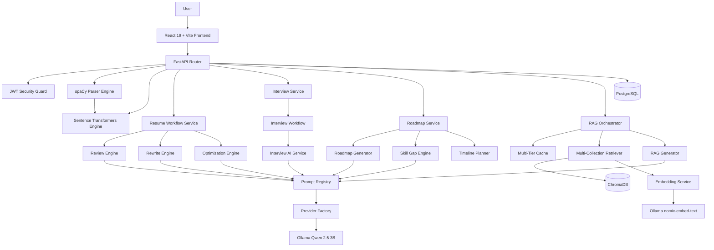

<div align="center">

# ✨ Scorelia

### The Intelligent Career Copilot

**AI-powered resume intelligence, ATS scoring, and interview prep — 100% local, 100% free.**

[](LICENSE)
[](https://react.dev/)
[](https://vitejs.dev/)
[](https://www.typescriptlang.org/)
[](https://tailwindcss.com/)
[](https://fastapi.tiangolo.com/)
[](https://ollama.com/)

[Overview](#-overview) • [Features](#-key-features) • [Tech Stack](#%EF%B8%8F-technology-stack) • [Architecture](#-system-architecture) • [Setup](#%EF%B8%8F-installation--setup) • [Docs](#-documentation)

</div>

---

## 📌 Overview

**Scorelia** is a full-stack AI career intelligence platform that helps job seekers analyze resumes, check ATS compatibility, semantically match resumes against job descriptions, prepare for interviews, and get personalized career guidance — all powered by open-source AI running entirely on your own machine.

No external API costs. No data leaving your device. Just a private, local AI career copilot.

<div align="center">

|  |  |
|:---:|:---|
| 🔒 | **Privacy-first** — resumes, credentials, and chat history never leave your device |
| 💸 | **Zero cost** — no licensing fees, no external API bills |
| 🧩 | **End-to-end platform** — resume optimization, ATS checks, job matching, mock interviews, and roadmaps in one place |
| 🏗️ | **Modular architecture** — clean separation between FastAPI backend, React frontend, and a multi-agent AI orchestration layer |

</div>

---

## 🚀 Key Features

- **📄 Resume Intelligence & Parsing** — Extracts skills, experience, and education from PDF/Word resumes using NLP.
- **✅ ATS Resume Analysis** — Deep compliance checks against applicant tracking systems, with formatting and keyword feedback.
- **🎯 Vector-Based Job Matching** — Semantic alignment scoring between resumes and job descriptions using local embeddings — beyond simple keyword matching.
- **🧠 Skill Gap Analysis** — Identifies missing skills for a target role and recommends a learning path to close the gap.
- **✍️ AI-Powered Resume Optimizer** — Interactive, LLM-driven rewriting to maximize resume impact.
- **🎤 Interactive Interview Preparation** — Real-time mock interviews with job-specific questions and constructive AI feedback.
- **🗺️ Dynamic Career Roadmap** — AI-generated, step-by-step career paths with milestones and certifications.
- **💬 AI Career Assistant (RAG)** — A persistent, context-aware chatbot that queries your resumes, job descriptions, and company data using ChromaDB + Ollama.
- **📊 Analytics Dashboard** — Visual tracking of ATS scores, skill progress, and interview performance over time.

---

## 🛠️ Technology Stack

| Layer | Technology | Details |
|:--|:--|:--|
| **Frontend** | React 19, Vite, TypeScript | Fast dev/build tooling, client-side routing via React Router |
| **Styling & UI** | Tailwind CSS, Lucide React, Sonner | Utility-first styling, iconography, and toast notifications |
| **Forms & Validation** | React Hook Form, Zod, React Dropzone | Type-safe form handling and file upload validation |
| **Data Fetching & Viz** | Axios, Recharts | API communication and dynamic dashboard charts |
| **Backend** | FastAPI, Python 3.12, Uvicorn | Async event loop, structured Pydantic schemas, performance-oriented endpoints |
| **Database** | PostgreSQL, SQLAlchemy, Alembic | Relational storage with ORM modeling and versioned migrations |
| **Vector DB** | ChromaDB | Local persistent vector storage for RAG knowledge bases |
| **Authentication** | JWT, Passlib | Secure token-based auth with hashed password storage |
| **AI LLM Engine** | Ollama (Qwen 2.5 3B Instruct) | Low-latency local model inference for content generation |
| **Embedding Engine** | Ollama (nomic-embed-text) | Local normalized 768-dimensional text embedding generation |
| **NLP & Vectors** | spaCy, Sentence Transformers, scikit-learn | Entity extraction (NER), semantic cosine similarity, vectorization |
| **Multi-Agent System** | Agent Orchestrator, Shared Memory, Tool Calling | Specialized agents — Resume, ATS, Job Match, Interview, Career Coach, Learning |
| **Testing** | Pytest, ESLint, Oxlint | Backend unit/integration tests and frontend type/lint checks |
| **Deployment** | Docker, Docker Compose, Nginx, GitHub Actions | Containerized production deployment with CI/CD pipeline |

---

## 📐 System Architecture

Scorelia follows a clean, decoupled client-server architecture designed to run efficiently on commodity developer hardware without external API expenses.



---

## 📂 Folder Structure

```
Scorelia/
├── .github/                        # CI/CD workflows & templates
├── assets/                         # Brand assets & resume templates
├── backend/                        # FastAPI server & Python ML/LLM services
├── config/                         # Setup and environment configs
├── database/                       # Relational migrations and seeds
├── docs/                           # Architecture, DB schema, and API specifications
├── frontend/                       # React + Vite SPA client
├── screenshots/                    # Documentation images
├── scripts/                        # One-click installers & downloader utilities
├── tests/                          # Backend & frontend unit, integration, and E2E tests
├── CHANGELOG.md                    # Version history and release notes
├── FRONTEND_ARCHITECTURE.md        # Frontend structure and design decisions
├── GITHUB_RELEASE_REPORT.md        # Release audit and readiness report
├── PRODUCTION_READINESS_REPORT.md  # Production deployment checklist
├── RELEASE_NOTES.md                # Per-release notes
├── LICENSE                         # MIT License
└── README.md                       # Project overview and setup guide
```

---

## 📖 Documentation

Detailed architecture and planning documents live in the [`docs/`](docs) directory:

| Document | Description |
|:--|:--|
| [Project Requirements (PRD)](docs/PROJECT_REQUIREMENTS.md) | Product requirements, functional constraints, and persona descriptions |
| [Software Architecture (SAD)](docs/SOFTWARE_ARCHITECTURE.md) | Clean architecture layers, data sequence flows, and design justifications |
| [Database Design](docs/DATABASE_DESIGN.md) | PostgreSQL schemas, index models, constraints, and GIN/JSONB details |
| [API Specification](docs/API_SPECIFICATION.md) | RESTful endpoint structures, HTTP statuses, cookie auth, and JSON payloads |
| [UI/UX Style Guide](docs/UI_UX_GUIDE.md) | Obsidian-glassmorphism styling, grid values, and Framer Motion dynamics |
| [Module Breakdown](docs/MODULE_BREAKDOWN.md) | Responsibilities, inputs/outputs, and dependencies of all 12 modules |
| [System Workflow](docs/SYSTEM_WORKFLOW.md) | User journey mappings, Mermaid charts, and error-handling flows |
| [Development Roadmap](docs/DEVELOPMENT_ROADMAP.md) | Implementation milestones, testing strategy, and Git workflow |
| [RAG Architecture](docs/RAG_ARCHITECTURE.md) | Retrieval-augmented generation design, indexing pipeline, vector storage |
| [RAG Production Guide](docs/RAG_PRODUCTION_GUIDE.md) | Production tuning, monitoring, caching, and troubleshooting |
| [Frontend Architecture](FRONTEND_ARCHITECTURE.md) | Frontend structure, component design, and state management decisions |
| [Production Readiness Report](PRODUCTION_READINESS_REPORT.md) | Deployment checklist and production audit findings |

---

## 📸 Screenshots

| Feature | Preview |
|:--|:--:|
| Dashboard | *coming soon* |
| Resume Parser | *coming soon* |
| ATS Analysis | *coming soon* |
| Job Matching | *coming soon* |
| AI Assistant | *coming soon* |

---

## ⚙️ Installation & Setup

### Prerequisites

- Python 3.12+
- Node.js 18+ & npm
- PostgreSQL 15+
- [Ollama](https://ollama.com) (installed and running as a background service)

### 1. Clone the repository

```bash
git clone https://github.com/Dipakk7/Scorelia.git
cd Scorelia
```

### 2. Backend setup

```bash
cd backend
python -m venv venv
source venv/bin/activate      # On Windows: venv\Scripts\activate
pip install -r requirements.txt
python -m spacy download en_core_web_sm
```

### 3. Frontend setup

```bash
cd frontend
npm install
```

### 4. PostgreSQL setup

Create a local database:

```sql
CREATE DATABASE scorelia_db;
```

Configure credentials in `backend/.env` (default: `postgres/postgres@localhost:5432`).

### 5. Ollama setup

Download and run [Ollama](https://ollama.com), then pull the required models:

```bash
ollama pull qwen2.5:3b
ollama pull nomic-embed-text
```

### 6. ChromaDB setup

ChromaDB runs locally in-process with the backend — no extra setup required. Storage paths are defined in `backend/app/core/config.py` and auto-initialized at `backend/storage/chromadb`.

### 7. Environment variables

**Backend:**

```bash
cp config/backend.env.example backend/.env
```

Ensure `DATABASE_URL` and `JWT_SECRET_KEY` are set.

**Frontend:**

```bash
cp config/frontend.env.example frontend/.env.development
```

Set `VITE_API_URL=http://localhost:8000/api/v1`.

### 8. Run locally

**Backend:**

```bash
cd backend
source venv/bin/activate      # On Windows: venv\Scripts\activate
uvicorn app.main:app --reload
```

**Frontend:**

```bash
cd frontend
npm run dev
```

The app will be available at `http://localhost:5173` (frontend) and `http://localhost:8000` (API).

---

## 📄 License

Distributed under the MIT License. See [LICENSE](LICENSE) for details.

---

<div align="center">

## 👨‍💻 Connect With Me

[](https://github.com/Dipakk7)
[](https://www.linkedin.com/in/dipakkhandagale/)
[](https://dipakkhandagale.vercel.app/)

⭐ If you find Scorelia useful, consider starring the repo!

</div>
