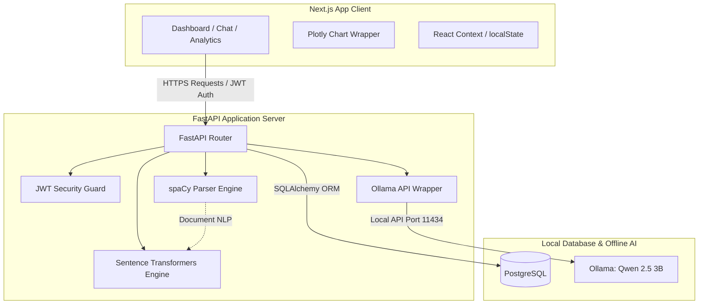

# CareerPilot AI

### *The Intelligent Career Copilot*

[](LICENSE)
[](https://nextjs.org/)
[](https://fastapi.tiangolo.com/)
[](https://ollama.com/)

CareerPilot AI is a modern, enterprise-ready, self-hosted AI SaaS platform designed to guide users through every stage of their professional journey. By combining parsing models (spaCy), vector embedding engines (Sentence Transformers), local large language models (Ollama with Qwen 2.5 3B Instruct), and a premium Next.js dashboard, CareerPilot AI offers a fully free, private, and powerful suite of career optimization tools.

---

## 🚀 Key Features

*   **Resume Intelligence & Parsing:** Direct extraction of skills, experience, and education from PDF/Word documents using advanced natural language processing.
*   **ATS Resume Analysis:** Deep compliance checks against applicant tracking systems (ATS) with specific alignment, formatting, and keyword suggestions.
*   **Vector-Based Job Matching:** Semantic alignment scores between resumes and job descriptions using local sentence embeddings, moving beyond simple keyword matching.
*   **Skill Gap Analysis:** Targeted detection of missing skills required for target job descriptions, coupled with structured learning recommendations.
*   **AI-Powered Resume Optimizer:** Interactive resume editing powered by local LLM feedback to automatically rewrite descriptions for maximum impact.
*   **Interactive Interview Preparation:** Real-time mock interview simulator that generates job-specific questions and scores user responses with constructive feedback.
*   **Dynamic Career Roadmap:** Custom step-by-step career path visuals generated by AI, defining transition milestones, certifications, and target roles.
*   **AI Career Assistant:** Persistent, context-aware chatbot capable of answering resume, interview, and general career questions.
*   **Analytics Dashboard:** Visual performance indicators including ATS match history, skill acquisition progress, and interview preparation analytics.

---

## 🛠️ Technology Stack

| Layer | Technology | Details |
| :--- | :--- | :--- |
| **Frontend** | Next.js (App Router), React, TypeScript | Premium modular layout, client-side routing, static pages |
| **Styling & UI** | Tailwind CSS, shadcn/ui, Framer Motion | Modern, glassmorphic layout with responsive micro-animations |
| **Backend** | FastAPI, Python 3.12 | Async event loop, structured schemas, performance-oriented endpoints |
| **Database** | PostgreSQL | Relational transactional storage for profiles, histories, and chats |
| **Authentication** | JSON Web Tokens (JWT) | Secure stateless session control with HttpOnly cookies |
| **AI LLM Engine** | Ollama (Qwen 2.5 3B Instruct) | Low-latency local model inference for content generation |
| **NLP & Vectors** | spaCy, Sentence Transformers, scikit-learn | Entity extraction (NER), semantic cosine similarity, vectorization |
| **Data Viz** | Plotly | Dynamic dashboard charts and skill metrics |
| **Deployment** | Vercel (Frontend), Render (Backend) | Cost-free global hosting strategy with zero cold-start configurations |

---

## 📐 System Architecture Overview

CareerPilot AI follows a clean, decoupled client-server architecture designed to run efficiently on commodity developer hardware without external API expenses.



---

## 📂 Folder Structure

The project code is organized to enforce strict separation of concerns, modular testability, and clean architecture practices.

```
CareerPilot-AI/
├── .github/                            # CI/CD Workflows & Templates
├── assets/                             # Brand assets & resume templates
├── screenshots/                        # Documentation images
├── config/                             # Setup and environment configs
├── docs/                               # Architecture, DB Schema, and API specifications
├── database/                           # Relational migrations and seeds
├── scripts/                            # One-click installers & downloader utilities
├── logs/                               # Application operation logs
├── frontend/                           # Next.js SPA Client (App Router)
├── backend/                            # FastAPI Server & Python ML/LLM services
└── tests/                              # Dual-stack unit, integration, and E2E tests
```

---

## 📸 Screenshots

*Screenshots will be populated upon completing Phase 1 UI construction.*
*   `[Dashboard Preview]` - Visualizing skill gaps and matching metrics.
*   `[Resume Parser]` - Side-by-side comparison of raw PDF and extracted entity schema.
*   `[Interview Prep]` - Audio/text console for interactive AI interview simulators.

---

## ⚙️ Installation & Setup (Placeholder)

Detailed step-by-step instructions for running the stack locally in development mode:

### Prerequisites
*   Python 3.12+
*   Node.js 18+ & npm
*   PostgreSQL 15+
*   Ollama (installed and running background service)

### 1. Download Local AI Models
```bash
# Pull the target lightweight LLM
ollama pull qwen2.5:3b

# Download the default NLP model for parsing
python -m spacy download en_core_web_sm
```

### 2. Backend Initialization
```bash
cd backend
python -m venv venv
source venv/bin/activate  # On Windows: venv\Scripts\activate
pip install -r requirements.txt
cp ../config/backend.env.example .env
# Edit your .env database connection configs
uvicorn app.main:app --reload
```

### 3. Frontend Initialization
```bash
cd frontend
npm install
cp ../config/frontend.env.example .env.local
npm run dev
```

---

## 🗺️ Development Roadmap

### Phase 1: Planning, Scaffolding & Setup (Current)
*   [x] Enterprise Folder Architecture
*   [ ] Relational Database Schema & Migrations Setup
*   [ ] Local AI Pipeline Configuration (Ollama & spaCy)

### Phase 2: Core Engineering & Parser API
*   [ ] User JWT Authentication & Security Contexts
*   [ ] PDF parser pipeline integration (spaCy & Regex fallback)
*   [ ] Sentence Transformer-based matching algorithm

### Phase 3: AI Feature Modules
*   [ ] ATS Assessment & Recommendation Engine
*   [ ] Interactive Interview Simulator with Ollama feedback loop
*   [ ] Visual roadmap builder and chart aggregators

### Phase 4: UI/UX & Polish
*   [ ] responsive Tailwind layout, sidebar navigation, and glassmorphic dashboards
*   [ ] Plotly graph components integration
*   [ ] End-to-end testing, logging, and deployment pipelines to Vercel/Render

---

## 🤝 Contribution Guide

Contributions are welcome! To maintain software quality:
1.  **Fork** the repository and create your feature branch: `git checkout -b feature/amazing-feature`.
2.  Follow **PEP 8** style guidelines for all backend Python code and run `ruff` for linting.
3.  Ensure all TypeScript/Next.js files pass strict build checks (`npm run build`).
4.  Write comprehensive Unit tests for any new business logic inside the `tests/` directory.
5.  Submit a Pull Request targeting the `main` branch with detailed descriptions of changes.

---

## 🔮 Future Scope

*   **Multi-Agent Collaborative Simulations:** Interactive panel interviews with multiple AI interviewer profiles (e.g., HR Specialist, Technical Lead, Product Manager).
*   **Resume Generative Builder:** Automated, pixel-perfect LaTeX-to-PDF export of AI-optimized resumes tailored dynamically for individual job links.
*   **Web-Crawling Job Aggregator:** Active web scraping integrations matching user skills against real-time local open-source job boards.

---

## 📄 License

Distributed under the MIT License. See [LICENSE](LICENSE) for more information.
