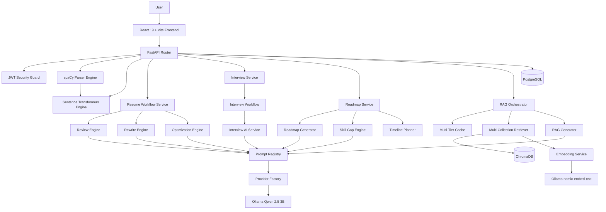

# Scorelia

### *The Intelligent Career Copilot*

[](LICENSE)
[](https://react.dev/)
[](https://vitejs.dev/)
[](https://www.typescriptlang.org/)
[](https://tailwindcss.com/)
[](https://fastapi.tiangolo.com/)
[](https://ollama.com/)

Scorelia is a full-stack AI-powered career intelligence platform that helps users analyze resumes, evaluate ATS compatibility, match resumes with job descriptions using semantic search, prepare for interviews, and receive personalized career guidance—all while running completely locally using open-source AI.

## ⭐ Why Scorelia?

*   **100% Free & Open Source:** Zero licensing fees, zero external API costs, and runs completely locally or on free cloud tiers.
*   **Privacy-first Local AI using Ollama:** Your resume, credentials, and conversation history never leave your device.
*   **End-to-End Career Intelligence Platform:** Replaces fragmented workflows with a single environment for resume optimization, ATS checks, mock interviews, and roadmap design.
*   **Enterprise-grade Modular Architecture:** Clean, decoupled design using FastAPI, Next.js, and PostgreSQL for maximum performance and scalable code maintainability.

---

## 🚀 Key Features

*   **Resume Intelligence & Parsing:** Direct extraction of skills, experience, and education from PDF/Word documents using advanced natural language processing.
*   **ATS Resume Analysis:** Deep compliance checks against applicant tracking systems (ATS) with specific alignment, formatting, and keyword suggestions.
*   **Vector-Based Job Matching:** Semantic alignment scores between resumes and job descriptions using local sentence embeddings, moving beyond simple keyword matching.
*   **Skill Gap Analysis:** Targeted detection of missing skills required for target job descriptions, coupled with structured learning recommendations.
*   **AI-Powered Resume Optimizer:** Interactive resume editing powered by local LLM feedback to automatically rewrite descriptions for maximum impact.
*   **Interactive Interview Preparation:** Real-time mock interview simulator that generates job-specific questions and scores user responses with constructive feedback.
*   **Dynamic Career Roadmap:** Custom step-by-step career path visuals generated by AI, defining transition milestones, certifications, and target roles.
*   **AI Career Assistant & RAG Platform:** Persistent, context-aware chatbot querying local document collections (resumes, job descriptions, company profiles) using ChromaDB and Ollama for factual, context-aware answers.
*   **Analytics Dashboard:** Visual performance indicators including ATS match history, skill acquisition progress, and interview preparation analytics.

---

## 🛠️ Technology Stack

| Layer | Technology | Details |
| :--- | :--- | :--- |
| **Frontend** | React 19, Vite, TypeScript | Fast dev/build tooling, client-side routing via React Router |
| **Styling & UI** | Tailwind CSS, Lucide React, Sonner | Utility-first styling, iconography, and toast notifications |
| **Forms & Validation** | React Hook Form, Zod, React Dropzone | Type-safe form handling and file upload validation |
| **Data Fetching & Viz** | Axios, Recharts | API communication and dynamic dashboard charts |
| **Backend** | FastAPI, Python 3.12, Uvicorn | Async event loop, structured Pydantic schemas, performance-oriented endpoints |
| **Database** | PostgreSQL, SQLAlchemy, Alembic | Relational storage with ORM modeling and versioned migrations |
| **Vector DB** | ChromaDB | Local persistent vector storage for RAG knowledge bases |
| **Authentication** | JWT, Passlib | Secure token-based auth with hashed password storage |
| **AI LLM Engine** | Ollama (Qwen 2.5 3B Instruct) | Low-latency local model inference for content generation |
| **Embedding Engine** | Ollama (nomic-embed-text) | Local normalized 768-dimensional text embedding generation |
| **NLP & Vectors** | spaCy, Sentence Transformers, scikit-learn | Entity extraction (NER), semantic cosine similarity, vectorization |
| **Multi-Agent System** | Agent Orchestrator, Shared Memory, Tool Calling | Specialized agents (Resume, ATS, Job Match, Interview, Career Coach, Learning) |
| **Testing** | Pytest, ESLint, Oxlint | Backend unit/integration tests and frontend type/lint checks |
| **Deployment** | Docker, Docker Compose, Nginx, GitHub Actions | Containerized production deployment with CI/CD pipeline |

---

## 📐 System Architecture Overview

Scorelia follows a clean, decoupled client-server architecture designed to run efficiently on commodity developer hardware without external API expenses.




---

## 📂 Folder Structure

The project code is organized to enforce strict separation of concerns, modular testability, and clean architecture practices.

```
Scorelia/
├── .github/                            # CI/CD Workflows & Templates
├── assets/                             # Brand assets & resume templates
├── backend/                            # FastAPI Server & Python ML/LLM services
├── config/                             # Setup and environment configs
├── database/                           # Relational migrations and seeds
├── docs/                               # Architecture, DB Schema, and API specifications
├── frontend/                           # Next.js SPA Client (App Router)
├── screenshots/                        # Documentation images
├── scripts/                            # One-click installers & downloader utilities
├── tests/                              # Dual-stack unit, integration, and E2E tests
├── CHANGELOG.md                        # Version history and release notes
├── LICENSE                             # MIT License
└── README.md                           # Project overview and setup guide
```

---

## 📖 Documentation Index

To explore the architecture and planning documents created during Phase 1, refer to the following specifications in the `docs/` directory:

*   [Project Requirements Document (PRD)](docs/PROJECT_REQUIREMENTS.md) — Product requirements, functional constraints, and persona descriptions.
*   [Software Architecture Document (SAD)](docs/SOFTWARE_ARCHITECTURE.md) — Clean architecture layers, data sequence flow diagrams, and design justifications.
*   [Database Design Specification](docs/DATABASE_DESIGN.md) — PostgreSQL schemas, index models, constraints, and GIN/JSONB details.
*   [API Specification Contract](docs/API_SPECIFICATION.md) — RESTful API endpoint structures, HTTP statuses, cookies auth, and JSON mock payloads.
*   [UI/UX Style & Design Guide](docs/UI_UX_GUIDE.md) — Obsidian-glassmorphism styling parameters, grid values, layout mockups, and Framer Motion dynamics.
*   [Module Breakdown Specification](docs/MODULE_BREAKDOWN.md) — Responsibilities, inputs, outputs, database tables, and dependencies of all 12 modules.
*   [System Workflow Specification](docs/SYSTEM_WORKFLOW.md) — Detailed user journey mappings, Mermaid charts, and systems error handling flows.
*   [Development Roadmap Specification](docs/DEVELOPMENT_ROADMAP.md) — Detailed implementation roadmap including milestones, testing strategy and Git workflow.
*   [RAG Architecture Specification](docs/RAG_ARCHITECTURE.md) — Comprehensive design of the Retrieval-Augmented Generation platform, indexing pipeline, and vector storage.
*   [RAG Production Guide](docs/RAG_PRODUCTION_GUIDE.md) — Production configuration, tuning, monitoring, caching, and troubleshooting guidelines.

---

## 📸 Screenshots

| Feature       | Preview     |
| ------------- | ----------- |
| Dashboard     | —  |
| Resume Parser | —  |
| ATS Analysis  | —  |
| Job Matching  | —  |
| AI Assistant  | —  |

---

## ⚙️ Installation & Setup

Detailed step-by-step instructions for running the stack locally in development mode:

### Prerequisites
*   Python 3.12+
*   Node.js 18+ & npm
*   PostgreSQL 15+
*   Ollama (installed and running background service)

### Backend Setup
Initialize the Python virtual environment and dependencies:
```bash
cd backend
python -m venv venv
source venv/bin/activate  # On Windows: venv\Scripts\activate
pip install -r requirements.txt
python -m spacy download en_core_web_sm
```

### Frontend Setup
Initialize Node packages:
```bash
cd frontend
npm install
```

### PostgreSQL Setup
1. Create a local PostgreSQL database named `scorelia_db`:
   ```sql
   CREATE DATABASE scorelia_db;
   ```
2. Configure credentials in backend `.env` (default connection string is postgres/postgres@localhost:5432).

### Ollama Setup
1. Download and run Ollama from [ollama.com](https://ollama.com).
2. Pull the target LLM and embedding models:
   ```bash
   ollama pull qwen2.5:3b
   ollama pull nomic-embed-text
   ```

### ChromaDB Setup
1. ChromaDB runs locally in-process with the backend.
2. The storage paths are defined in backend config (`backend/app/core/config.py`) and are automatically initialized in `backend/storage/chromadb`.

### Environment Variables
#### Backend Environment Configuration
Create a `.env` file under `backend/` from the example template:
```bash
cp config/backend.env.example backend/.env
```
Ensure variables such as `DATABASE_URL` and `JWT_SECRET_KEY` are defined.

#### Frontend Environment Configuration
Create a `.env.development` file under `frontend/` from the example template:
```bash
cp config/frontend.env.example frontend/.env.development
```
Set `VITE_API_URL` to `http://localhost:8000/api/v1`.

### Running Locally
To start the entire application in development mode:
#### 1. Run the Backend FastAPI Server
```bash
cd backend
source venv/bin/activate  # On Windows: venv\Scripts\activate
uvicorn app.main:app --reload
```
#### 2. Run the Frontend Vite Dev Server
```bash
cd frontend
npm run dev
```

---

## 🤝 Contribution Guide

Contributions are welcome! To maintain software quality:
1.  **Fork** the repository and create your feature branch: `git checkout -b feature/amazing-feature`.
2.  Follow **PEP 8** style guidelines for all backend Python code and run `ruff` for linting.
3.  Ensure all TypeScript/Next.js files pass strict build checks (`npm run build`).
4.  Write comprehensive Unit tests for any new business logic inside the `tests/` directory.
5.  Submit a Pull Request targeting the `main` branch with detailed descriptions of changes.

---

## 📄 License

Distributed under the MIT License. See [LICENSE](LICENSE) for more information.

---

## 👨‍💻 Connect With Me

[](https://github.com/Dipakk7)
[](https://www.linkedin.com/in/dipakkhandagale/)
[](https://dipakkhandagale.vercel.app/)
