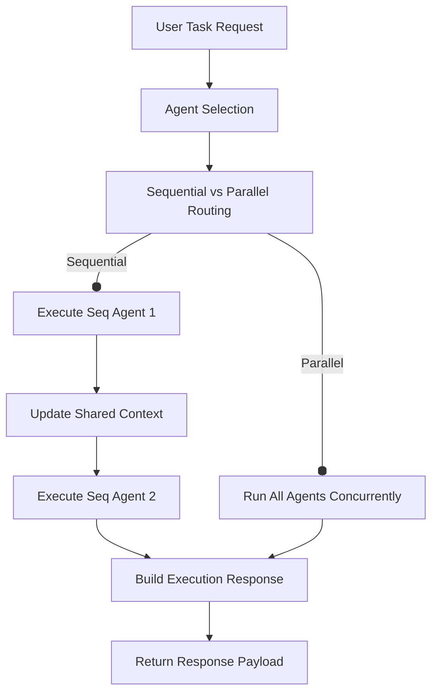

# Multi-Agent AI Architecture Guide

This document describes the foundation architecture of the CareerPilot AI Multi-Agent system. The framework coordinates multiple specialized agents utilizing tool-calling, RAG retrieval, shared memory, and event-based tracking.

---

## 1. Agent Lifecycle

Every agent in the system inherits from `BaseAgent` and goes through the following states and lifecycle transitions:

```mermaid
state_diagram
[*] --> Registered : Registry.register()
Registered --> Validation : Orchestrator invokes
Validation --> Running : validate() == True
Validation --> Failed : validate() == False
Running --> Success : execute() completes
Running --> Failed : Timeout/Exception
Success --> [*]
Failed --> [*]
```

### Lifecycle Phases:
1. **Registration**: An agent instance is instantiated and registered into the dynamic `AgentRegistry`.
2. **Validation**: Before execution, the orchestrator triggers the agent's `validate(context)` method to ensure required data fields, tools, and variables are present.
3. **Execution**: The agent runs its logical loop. If a step fails, the orchestrator wraps execution in exponential backoff retries.
4. **Completion**: The agent returns a structured `AgentResponse` indicating execution metrics and outputs.

---

## 2. Agent Registry

The `AgentRegistry` tracks all agents available to the backend. It supports:
- **Dynamic Registration**: Registry additions and removals at runtime.
- **Toggle Control**: Ability to enable/disable agents to take them out of routing consideration.
- **Aggregation**: Queries to check global or component-level health status of agents.

---

## 3. Agent Orchestrator

The `AgentOrchestrator` is the central scheduling and execution router.



### Capabilities:
- **Agent Selection**: Maps the request task to active agents supporting the capability.
- **Execution Pipeline**: Manages timeouts (using `asyncio.wait_for`) and retries for transient failure mitigation.
- **Execution Modes**:
  - **Sequential**: Executes agents one after another, automatically piping outputs of prior agents into the subsequent agents as `shared_variables`.
  - **Parallel**: Runs all selected agents concurrently.
- **Privacy Compliance**: Strictly filters outputs and input parameters from global log writers to enforce privacy rules.

---

## 4. Shared Memory & Context

### Agent Context
The `AgentContext` object encapsulates the metadata of the execution request and supports context cloning (`clone_with`) to securely forward context between agents in execution chains.

### Shared Memory
The `SharedMemory` class provides temporary scratchpad space, session variables, and metadata sharing. It incorporates:
- **Session-level segregation**: Variables are partitioned by `session_id`.
- **TTL Expiration**: Entries are automatically cleaned on read and during periodic sweeps once their Time-To-Live has expired.

---

## 5. Event Flow

The `AgentEventBus` uses a decoupled Publisher-Subscriber mechanism to track and log workflow execution.

```
[AgentOrchestrator]
       │
       ├─► (Publish: agent_started) ──────► [AgentEventBus] ──► (Log Metadata / Callbacks)
       │
       ├─► (Publish: tool_called) ────────► [AgentEventBus] ──► (Track tool usage)
       │
       ├─► (Publish: agent_finished) ─────► [AgentEventBus] ──► (Track step metrics)
       │
       └─► (Publish: workflow_completed) ─► [AgentEventBus] ──► (Final metrics write)
```

---

## 6. API Examples

### 1. List Available Agents
* **Endpoint**: `GET /api/v1/agents`
* **Response**:
  ```json
  [
    {
      "agent_id": "resume_agent",
      "name": "Resume Review Agent",
      "description": "Reviews and optimizes resumes against industry standards",
      "supported_tasks": ["resume_review", "resume_rewrite"],
      "required_tools": ["docx_parser", "pdf_parser"],
      "enabled": true
    }
  ]
  ```

### 2. Check Agents Health
* **Endpoint**: `GET /api/v1/agents/status`
* **Response**:
  ```json
  [
    {
      "agent_id": "resume_agent",
      "name": "Resume Review Agent",
      "status": "healthy",
      "message": null,
      "details": {}
    }
  ]
  ```

### 3. Execute Workflow Task
* **Endpoint**: `POST /api/v1/agents/execute`
* **Payload**:
  ```json
  {
    "task": "resume_review",
    "user_id": "1",
    "session_id": "sess_123",
    "conversation_id": "conv_456",
    "input_data": {
      "rag_context": {},
      "shared_variables": {}
    },
    "execution_mode": "sequential"
  }
  ```
* **Response**:
  ```json
  {
    "request_id": "req-987-xyz",
    "status": "success",
    "output": {
      "score": 85,
      "recommendations": ["Add skills section"]
    },
    "steps": [
      {
        "agent_id": "resume_agent",
        "status": "success",
        "output": {
          "score": 85,
          "recommendations": ["Add skills section"]
        },
        "errors": null,
        "execution_time_ms": 154.2
      }
    ],
    "events": [
      {
        "event_id": "evt-001",
        "event_type": "agent_started",
        "request_id": "req-987-xyz",
        "timestamp": "2026-07-05T09:20:00Z",
        "payload": {"task": "resume_review"}
      },
      {
        "event_id": "evt-002",
        "event_type": "workflow_completed",
        "request_id": "req-987-xyz",
        "timestamp": "2026-07-05T09:20:00.154Z",
        "payload": {"status": "success"}
      }
    ],
    "execution_time_ms": 155.6
  }
  ```

---

## 7. Developer Guide: Creating New Agents

To create a new agent:
1. Define a class inheriting from `BaseAgent`.
2. Implement `execute()`, `validate()`, and `health()`.
3. Register the agent inside the `AgentRegistry` during application startup or dynamically in your endpoint initialization.

### Example Agent Code:
```python
from app.modules.agents.base import BaseAgent
from app.modules.agents.context import AgentContext
from app.modules.agents.models import AgentResponse, AgentHealthStatus

class ATSScoreAgent(BaseAgent):
    async def validate(self, context: AgentContext) -> bool:
        # Require target job description in shared variables
        return "job_description" in context.shared_variables

    async def execute(self, context: AgentContext) -> AgentResponse:
        import time
        start = time.perf_counter()
        # Your LLM/RAG scoring logic goes here
        # output = await self.ai_service.execute(...)
        output = {"ats_match_percentage": 92}
        duration = (time.perf_counter() - start) * 1000
        return AgentResponse(
            agent_id=self.agent_id,
            status="success",
            output=output,
            execution_time_ms=duration
        )

    async def health(self) -> AgentHealthStatus:
        return AgentHealthStatus(
            agent_id=self.agent_id,
            name=self.name,
            status="healthy"
        )
```

---

## 8. Resume Agent

The Resume Agent is a dedicated AI agent specializing in all resume-related workflows in CareerPilot AI.

### Architecture

The Resume Agent (`ResumeAgent`) inherits from `BaseAgent` and delegates tasks to the core resume engines, ensuring that business logic is reused and never duplicated.

*   **Registry Key**: `resume_agent`
*   **Supported Tasks**: `review`, `rewrite`, `optimize`, `summary`, `suggestions`, `score`, `parse`, `feedback`, `improvement_plan`
*   **Dependencies Reused**:
    *   `ResumeReviewService` (Resume Review Engine)
    *   `ResumeRewriteService` (Resume Rewrite Engine)
    *   `ResumeOptimizationService` (Resume Optimization Engine)
    *   `parse_resume` (Resume Parser)
    *   `RAGOrchestrator` (RAG retrieval)
    *   `AIService` (Generic AI LLM calls)

### Workflows

The Resume Agent handles these workflows:
1.  **Resume Review**: Provides a detailed critique of formatting, grammar, and ATS compatibility using `ResumeReviewService`.
2.  **Resume Rewrite**: Tailors sections (e.g., summary, experience) with diff tracking and rollback chain using `ResumeRewriteService`.
3.  **Resume Optimization**: Enhances keyword density, missing skills suggestions, and industry alignment using `ResumeOptimizationService`.
4.  **Resume Summary**: Extracts a structured summary from the parsed resume JSON using a dedicated prompt template.
5.  **Suggestions**: Extracts priority suggestions from the optimization engine.
6.  **Score Retrieval**: Extracts ATS score details.
7.  **Parsing Integration**: Dispatches resume parsing.

### API Specifications & Examples

#### 1. GET /api/v1/agents/resume/status
*   **Description**: Retrieves the Resume Agent health status.
*   **Response**:
    ```json
    {
      "agent_id": "resume_agent",
      "name": "Resume Agent",
      "status": "healthy",
      "message": "Resume Agent is operational.",
      "details": {
        "provider": "ollama"
      }
    }
    ```

#### 2. POST /api/v1/agents/resume/review
*   **Payload**:
    ```json
    {
      "resume_id": "fd7bb0f0-e1c8-42ea-a0b5-963a1e000c66",
      "mode": "STANDARD",
      "language": "en"
    }
    ```
*   **Response**:
    ```json
    {
      "overall_score": 85,
      "overall_summary": "Solid resume overall...",
      "strengths": ["Clear formatting"],
      "weaknesses": ["Achievements lack metrics"],
      "recommendations": [],
      "missing_sections": []
    }
    ```

#### 3. POST /api/v1/agents/resume/rewrite
*   **Payload**:
    ```json
    {
      "resume_id": "fd7bb0f0-e1c8-42ea-a0b5-963a1e000c66",
      "mode": "STANDARD",
      "section_name": "summary"
    }
    ```
*   **Response**:
    ```json
    {
      "rewrite_id": "92364d1a-ff1b-470b-93f3-545608bfd11b",
      "rewritten_content": {
        "summary": "Rewritten summary text..."
      },
      "original_content": {
        "summary": "Original summary text..."
      },
      "rewrite_metadata": {}
    }
    ```

#### 4. POST /api/v1/agents/resume/optimize
*   **Payload**:
    ```json
    {
      "resume_id": "fd7bb0f0-e1c8-42ea-a0b5-963a1e000c66",
      "mode": "STANDARD"
    }
    ```
*   **Response**:
    ```json
    {
      "quality_score": {
        "overall_score": 85
      },
      "missing_skills": [],
      "ats_optimization": {},
      "keyword_optimization": {},
      "achievement_optimization": [],
      "completeness": {},
      "career_readiness": {},
      "industry_alignment": [],
      "recommendations": []
    }
    ```

#### 5. POST /api/v1/agents/resume/summary
*   **Payload**:
    ```json
    {
      "resume_id": "fd7bb0f0-e1c8-42ea-a0b5-963a1e000c66"
    }
    ```
*   **Response**:
    ```json
    {
      "professional_summary": "Overall summary of the candidate's professional profile...",
      "years_of_experience": 5.5,
      "key_expertise": ["Python", "FastAPI"],
      "education_summary": "Master of Computer Science, MIT",
      "recent_job_title": "Senior Engineer",
      "industry": "Software Engineering",
      "confidence_score": 0.95
    }
    ```

---

## 9. ATS Agent

The ATS Agent (`ATSAgent`) is a dedicated agent specializing in Applicant Tracking System (ATS) compliance, keyword density, and overall compatibility of candidate resumes.

### Architecture
*   **Registry Key**: `ats_agent`
*   **Supported Tasks**: `ats_review`, `ats_score`, `ats_improve`, `ats_keyword_analysis`, `ats_missing_skills`, `ats_readiness`, `ats_recommendations`
*   **Dependencies Reused**:
    *   `calculate_ats_score` (ATS Resume Engine)
    *   `ResumeOptimizationService` / `ResumeReviewService` (Resume Intelligence)
    *   `AIService` (Generic AI LLM calls)
    *   `RAGOrchestrator` (RAG retrieval)

### Workflows
1.  **ATS Review**: Runs structured analysis matching keyword presence, formatting readability, and overall compliance.
2.  **ATS Score**: Performs live calculation of python-based ATS scoring parameters.
3.  **ATS Improve**: Generates actionable priority-coded improvements.

### API Specifications & Examples

#### 1. GET /api/v1/agents/ats/status
*   **Description**: Retrieves the ATS Agent health status.
*   **Response**:
    ```json
    {
      "agent_id": "ats_agent",
      "name": "ATS Agent",
      "status": "healthy",
      "message": "ATS Agent is operational.",
      "details": {
        "provider": "ollama"
      }
    }
    ```

#### 2. POST /api/v1/agents/ats/review
*   **Payload**:
    ```json
    {
      "resume_id": "fd7bb0f0-e1c8-42ea-a0b5-963a1e000c66",
      "job_description": "Senior Python Backend Developer with FastAPI experience."
    }
    ```
*   **Response**:
    ```json
    {
      "overall_review": "Strong candidate matching core parameters...",
      "ats_readiness": "High",
      "keyword_analysis": ["python", "fastapi"],
      "missing_skills": ["docker"],
      "recommendations": ["Add docker details in experience section."]
    }
    ```

#### 3. POST /api/v1/agents/ats/score
*   **Payload**:
    ```json
    {
      "resume_id": "fd7bb0f0-e1c8-42ea-a0b5-963a1e000c66"
    }
    ```
*   **Response**:
    ```json
    {
      "resume_id": "fd7bb0f0-e1c8-42ea-a0b5-963a1e000c66",
      "overall_score": 85,
      "grade": "Excellent",
      "grade_summary": "Solid representation of experience...",
      "breakdown": {
        "contact": 10,
        "skills": 25,
        "education": 15,
        "experience": 20,
        "projects": 10,
        "certifications": 5
      },
      "strengths": ["Clear contact details"],
      "weaknesses": ["Quantify experience"],
      "recommendations": [],
      "parser_version": "1.0.0",
      "ats_version": "1.0.0",
      "scored_at": "2026-07-05T09:51:59Z"
    }
    ```

#### 4. POST /api/v1/agents/ats/improve
*   **Payload**:
    ```json
    {
      "resume_id": "fd7bb0f0-e1c8-42ea-a0b5-963a1e000c66",
      "job_description": "Python Developer"
    }
    ```
*   **Response**:
    ```json
    {
      "improvement_suggestions": [
        {
          "section": "experience",
          "suggestion": "Quantify bullet points.",
          "priority": "HIGH"
        }
      ]
    }
    ```

---

## 10. Job Match Agent

The Job Match Agent (`JobMatchAgent`) coordinates resume vs Job Description matching, gap assessments, and course/job recommendations.

### Architecture
*   **Registry Key**: `job_match_agent`
*   **Supported Tasks**: `job_match`, `job_matching`, `match_score`, `job_analyze`, `skill_gap`, `missing_keywords`, `missing_skills`, `education_match`, `experience_match`, `certification_match`, `job_recommend`, `job_recommendations`, `resume_vs_jd_analysis`
*   **Dependencies Reused**:
    *   `calculate_job_match` (Job Matching Engine)
    *   `analyze_resume_gap` (Skill Gap Engine)
    *   `RAGOrchestrator` (RAG retrieval)
    *   `AIService` (Generic AI LLM calls)

### Workflows
1.  **Job Matching**: Runs comparative parsing of requirements and outputs structured scores and alignments.
2.  **Gap Analysis**: Explains matched and missing features per dimension.
3.  **Recommendations**: Incorporates RAG queries to recommend jobs and skill bridges.

### API Specifications & Examples

#### 1. GET /api/v1/agents/job/status
*   **Description**: Retrieves the Job Match Agent health status.
*   **Response**:
    ```json
    {
      "agent_id": "job_match_agent",
      "name": "Job Match Agent",
      "status": "healthy",
      "message": "Job Match Agent is operational.",
      "details": {
        "provider": "ollama"
      }
    }
    ```

#### 2. POST /api/v1/agents/job/match
*   **Payload**:
    ```json
    {
      "resume_id": "fd7bb0f0-e1c8-42ea-a0b5-963a1e000c66",
      "job_description": "Looking for a Senior Python Developer with FastAPI and Postgres skills."
    }
    ```
*   **Response**:
    ```json
    {
      "resume_id": "fd7bb0f0-e1c8-42ea-a0b5-963a1e000c66",
      "match_score": 92,
      "grade": "Excellent",
      "breakdown": {
        "skills_score": 95,
        "experience_score": 90,
        "education_score": 100,
        "certifications_score": 80,
        "keywords_score": 90
      },
      "matched_skills": ["Python", "FastAPI"],
      "missing_skills": ["Docker"],
      "extra_skills": ["Javascript"],
      "recommendations": ["Add docker to your tech stack list."],
      "parser_version": "1.0.0",
      "ats_version": "1.0.0",
      "job_match_version": "1.0.0",
      "generated_at": "2026-07-05T09:51:59Z"
    }
    ```

#### 3. POST /api/v1/agents/job/analyze
*   **Payload**:
    ```json
    {
      "resume_id": "fd7bb0f0-e1c8-42ea-a0b5-963a1e000c66",
      "job_description": "We need a Senior Python Developer."
    }
    ```
*   **Response**:
    ```json
    {
      "gap_analysis": {
        "overall_match": true,
        "skill_gap": {},
        "experience_gap": {},
        "education_gap": {},
        "certification_gap": {},
        "keyword_gap": {},
        "priority_improvements": []
      },
      "ai_analysis": {
        "match_summary": "Extremely high alignment...",
        "education_match_explanation": "Perfect match...",
        "experience_match_explanation": "Meets experience requirements...",
        "skills_match_explanation": "Core skills present...",
        "certification_match_explanation": "Optional certifications missing."
      }
    }
    ```

#### 4. POST /api/v1/agents/job/recommend
*   **Payload**:
    ```json
    {
      "resume_id": "fd7bb0f0-e1c8-42ea-a0b5-963a1e000c66"
    }
    ```
*   **Response**:
    ```json
    {
      "recommendations": [
        {
          "category": "skills",
          "priority": "HIGH",
          "actionable_item": "Get certified in AWS Solutions Architect.",
          "rationale": "High density of target roles require cloud certs.",
          "reference_source": "job_kb"
        }
      ]
    }
    ```

---

## 7. Shared Memory Engine

The platform introduces a highly robust, namespace-segregated, and thread-safe Memory Engine under `app/modules/agents/workflow/memory/`.

```
                  ┌────────────────────────┐
                  │      MemoryStore       │
                  └───────────┬────────────┘
                              │
       ┌──────────────────────┼──────────────────────┐
       ▼                      ▼                      ▼
┌──────────────┐       ┌──────────────┐       ┌──────────────┐
│SessionMemory │       │Conversation  │       │ContextMemory │
│ (session:*)  │       │ (conversat:*)│       │ (context:*)  │
└──────────────┘       └──────────────┘       └──────────────┘
```

### Memory Spaces:
1. **Session Memory**: Stores session-scoped variables, cross-conversation histories, and general user-specific context. (Namespace: `session`)
2. **Conversation Memory**: Manages short-to-medium-term chat histories and dialog loops. (Namespace: `conversation`)
3. **Agent Memory**: Manages agent-specific states (e.g., `agent:resume_agent`), isolating variables per agent instance. (Namespace: `agent:<agent_id>`)
4. **Workflow Memory**: Isolates variables local to a specific workflow execution path. (Namespace: `workflow:<workflow_id>`)
5. **Context Memory**: Manages variables propagated from agent outputs and input parameter maps during chaining. (Namespace: `context`)

### Memory Utilities:
- **TTL (Time-To-Live)**: Stored keys automatically expire based on Unix epoch timestamp checking during active reads or scheduled sweeps.
- **Context Merge**: Dynamic merging of output scopes from completed execution steps into the active context memory pool.
- **Context Cleanup**: Clear or purge active session contexts dynamically to maintain workspace isolation.

---

## 8. Tool Calling Engine

The Tool Calling Engine exposes internal services as structured tools that agents can run dynamically.

### Core Capabilities:
- **Registry**: Self-registering catalog containing metadata, descriptions, and dynamic callbacks.
- **Verification & Validation**: Resolves types and performs presence verification of input arguments at runtime against schema parameter structures.
- **Telemetry & Isolation**: Enforces latency recording and wraps errors dynamically, returning clean responses to caller agents.

### Registered Tools:
1. `resume_tool`: Triggers review, rewrites, and optimizations.
2. `ats_tool`: Triggers ATS keyword checks and grading.
3. `job_match_tool`: Triggers JD gap analysis and scoring.
4. `career_tool`: Triggers roadmap creation.
5. `learning_tool`: Triggers course and study recommendations.
6. `interview_tool`: Triggers mock questions and grading.
7. `cover_letter_tool`: Triggers letter writing.
8. `rag_tool`: Direct query retrieval against Chroma Vector DB.
9. `analytics_tool`: Logs and reports usage metrics.

---

## 9. Workflow Engine

The Workflow Engine parses and runs multi-agent graphs supporting three execution topologies:

```
Sequential Mode:   [Step 1] ──► [Step 2] ──► [Step 3]

Parallel Mode:     [Step 1] ──┐
                   [Step 2] ──┼──► (Gather Results)
                   [Step 3] ──┘

Graph Mode (DAG):  [Step 1] ──┬──► [Step 2] ──► [Step 4]
                              └──► [Step 3] ──┘
```

### Features:
- **Sequential Executions**: Steps execute serially, piping outputs of a step into the inputs of subsequent steps.
- **Parallel Executions**: Unrelated execution steps run concurrently.
- **Conditional Branches**: Steps execute only if custom criteria mapped to shared memory evaluates to true.
- **Retries**: Transient step failures trigger exponential backoffs.
- **Timeouts**: Enforces execution cancellation limits on steps or workflows.
- **Saga Rollback**: Failed workflows trigger compensations, running rollback tasks in reverse order of successfully completed steps.
- **Cancellation**: Triggers premature termination of execution lists.

---

## 10. Agent Collaboration & Execution Graph

Agents collaborate in two main ways:
1. **Dynamic Task Delegation**: An agent can call another agent using `self.delegate(target_agent_id, context)` directly in its execution block.
2. **Context Propagation**: Agents read and write to the same `MemoryManager` context space. Output mapping of one agent updates shared variables, which are then mapped to the inputs of the next agent.

---

## 11. Developer Guide

### programmatic Workflow Construction:
```python
from app.modules.agents.workflow.workflow_builder import WorkflowBuilder

# Construct a workflow programmatically
workflow = (
    WorkflowBuilder("Tailored Application Prep")
    .description("Prepares resume review and generates cover letter in parallel")
    .mode("sequential")
    .variables({"resume_id": "uuid-here", "job_description": "FastAPI dev..."})
    .add_tool_step("Review", "resume_tool", {"action": "review"})
    .add_tool_step("Cover Letter", "cover_letter_tool", {"action": "generate", "company_name": "Google", "job_title": "SWE"})
    .build()
)
```

### Executing a Workflow via REST API:
* **Endpoint**: `POST /api/v1/agents/workflows/execute`
* **Payload**:
```json
{
  "name": "Quick Prep",
  "execution_mode": "sequential",
  "steps": [
    {
      "name": "ATS Grading",
      "type": "tool",
      "target": "ats_tool",
      "arguments": {
        "action": "ats_score",
        "resume_id": "fd7bb0f0-e1c8-42ea-a0b5-963a1e000c66"
      }
    }
  ]
}
```
