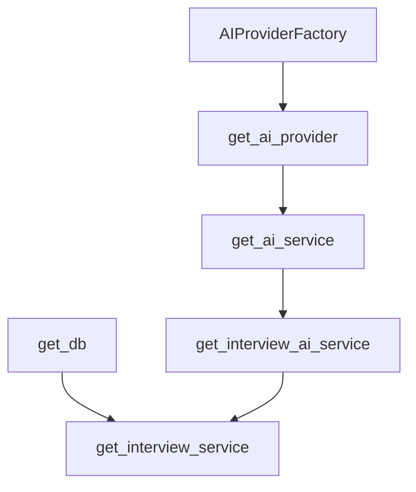
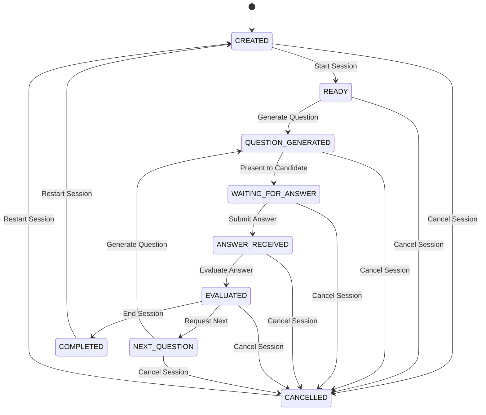

# AI Interview Module Documentation

Welcome to the AI Interview module documentation. This module establishes the backend foundation for conducting interactive AI-driven interviews.

## 1. Architecture

The AI Interview module is structured using **Clean Architecture** patterns, ensuring modularity, clear separation of concerns, and ease of maintainability.

```
+--------------------------------------------------------------+
|                          API Layer                           |
|                  (app/interview/api/router.py)               |
+------------------------------+-------------------------------+
                               |
                               v
+--------------------------------------------------------------+
|                        Service Layer                         |
|                 (app/interview/services/service.py)          |
+-------------------+----------------------+-------------------+
                    |                      |
                    v                      v
+-----------------------+              +-----------------------+
|    Context Builder    |              |       CRUD Layer      |
| (services/context.py) |              |   (crud/crud.py)      |
+-------------------+---+              +-----------+-----------+
                    |                              |
                    +---------------+--------------+
                                    |
                                    v
+--------------------------------------------------------------+
|                         Database Layer                       |
|               (app/interview/models/interview.py)            |
+--------------------------------------------------------------+
```

1. **API Router**: Exposes REST endpoints, validates inputs via Pydantic schemas, maps domain objects to JSON, and translates service exceptions to HTTP responses.
2. **Service Layer**: Coordinates business logic, manages transaction lifecycles, and loads situational/historical context.
3. **Context Builder**: Assembles a user's resume, ATS profile, recent job matches, skill gaps, and generated cover letters into a consolidated payload ready for later prompt generation.
4. **CRUD Layer**: Encapsulates raw database queries and commits.
5. **Database Models**: Declares SQLAlchemy 2.x declarative mappings for persistent sessions and turns.

---

## 2. AI Integration & Dependency Graph

The Interview module integrates with Scorelia's shared AI service infrastructure. It avoids duplication of LLM clients or Prompt Registries by resolving them through FastAPI's dependency injection container.

### Dependency Graph



- **`AIProviderFactory`**: Reused to dynamically instantiate provider implementations (such as `OllamaProvider` and future providers like `OpenAIProvider`, `AnthropicProvider`, and `GeminiProvider`).
- **`AIService`**: Consumed by the Interview module to leverage its validator, renderer, and retries/caching mechanism.
- **`InterviewAIService`**: Manages prompt selection, validation, context variables preparation, and hooks for future LLM executions.
- **`InterviewService`**: Orchestrates database CRUD transactions and is initialized with database session and `InterviewAIService`.

---

## 3. Prompt Registry Integration

The Interview module registers its prompts with the global thread-safe `PromptRegistry`. The prompt templates are located under:
`backend/app/interview/prompts/`

### Registry Templates

1. **`system_prompt.jinja`**: Defines instructions guiding the AI interviewer's persona, interview rules, and output schema.
2. **`hr.jinja`**: Customizes the prompt for HR behavioral and screening questions.
3. **`technical.jinja`**: Customizes the prompt for technical coding, database, or algorithmic questions.
4. **`behavioral.jinja`**: Customizes the prompt for scenario-based behavioral questions.
5. **`resume_based.jinja`**: Customizes the prompt to ask targeted questions about specific roles/projects in the candidate's resume.
6. **`followup.jinja`**: Customizes the prompt to ask deeper/clarifying follow-up questions based on the candidate's answers.

Each template contains front matter specifying:
- `name`
- `version`
- `author`
- `category`
- `description`
- `last_updated`

No rendering logic or prompt bodies are hardcoded in python files.

---

## 4. Workflow States

The session progression is governed by `InterviewWorkflow`, which defines standard state transitions:

- **`Created`**: Session record created in database.
- **`Context Ready`**: All user profile contexts (Resume, ATS, Cover Letter, Job Match) compiled successfully.
- **`Waiting For Questions`**: Questions generation requested from the LLM, waiting for completion.
- **`Waiting For Answers`**: Active question presented to user, waiting for candidate response.
- **`Evaluation Pending`**: User answer received, awaiting STAR analysis/feedback generation.
- **`Completed`**: Session successfully finished and scored.
- **`Cancelled`**: Session closed prematurely.

---

## 5. Context Builder

The `InterviewContext` in `services/context.py` compiles the full history of candidate assets into a single serializable object:
- **Resume**: Candidate's uploaded resume details.
- **Resume Review**: Output from the latest AI Resume Review.
- **Resume Rewrite**: Output from the latest AI Resume Rewrite.
- **Resume Optimization**: Recommendations from the latest AI Resume Optimization.
- **ATS**: Overall and category scores.
- **Job Match**: Recent match scores and metrics.
- **Skill Gap**: Missing skills and recommended learning paths.
- **Cover Letter**: Context from the latest AI-generated Cover Letter.
- **Company**: Resolved target company name.
- **Target Role**: Target job role.

Missing data is handled gracefully (fields default to `None` and are omitted safely during serialization).

---

## 6. Question Generation Engine (Phase 10 Part 2)

The question generation engine is fully implemented. It utilizes local LLM models (e.g., Qwen 2.5) via `AIService` and orchestrates structured JSON generation.

### Question Generation Flow
1. **Initialize Session**: User requests a new session or triggers question generation.
2. **Context Compilation**: `InterviewContext` aggregates resume skills, cover letters, ATS scores, and job matches.
3. **Template & Difficulty Selection**: The engine determines difficulty (Easy, Medium, Hard, or evaluates performance metrics for Adaptive difficulty) and maps the interview type to the appropriate Jinja2 template.
4. **LLM Inference**: The compiled prompt variables are validated and sent to the active LLM provider through `AIService`.
5. **Output Validation & Retry**: The response is parsed as JSON and validated against the strict Pydantic model `GeneratedQuestionBatch`. If parsing or validation fails, it triggers **exactly one retry** with the LLM.
6. **Persistence**: Questions are stored in the database as `InterviewTurn` rows and the complete serialized structure is saved in `session_metadata["questions"]`. AI latency and parameters are logged inside `session_metadata["generation_metadata"]`.

### Supported Interview Types & Prompts
Each interview type maps to a custom registered prompt template containing semantic versioning front matter:
* **HR / FIT**: `hr.jinja` — Cultural alignment, career motivation, and behavioral values.
* **TECHNICAL / SYSTEM_DESIGN**: `technical.jinja` — Direct technology querying, algorithms, concurrency, and architecture.
* **BEHAVIORAL**: `behavioral.jinja` — STAR-framework-oriented situational questioning.
* **RESUME_BASED**: `resume_based.jinja` — Deep drills on projects, tools, achievements, and gaps listed on the resume.
* **MIXED**: `mixed.jinja` — A balanced combination of all categories.
* **FOLLOW_UP**: `followup.jinja` — Multi-turn context probing based on prior answers.

### Difficulty Levels
* **EASY**: Wording is direct and friendly; focuses on basic terminology and simple scenarios.
* **MEDIUM**: Standard professional complexity; scenarios focus on typical real-world challenges and problem-solving.
* **HARD**: Extremely technical, abstract, or highly demanding leadership conflict queries.
* **ADAPTIVE**: Dynamically increases or decreases difficulty for successive turns:
  * Adjusts up if prior turn score $\ge 80$.
  * Adjusts down if prior turn score $< 60$.
  * Defaults to `MEDIUM` on start.

### API Examples

#### 1. Create Session & Generate Questions
`POST /api/v1/ai/interview/generate`
* **Request**:
```json
{
  "resume_id": "84c8a8cf-60fb-40c2-9e90-c24734891a27",
  "company_name": "Google",
  "target_role": "AI Engineer",
  "interview_type": "TECHNICAL",
  "difficulty": "ADAPTIVE",
  "total_questions": 5
}
```
* **Response (201 Created)**:
Returns the complete `InterviewSessionResponse` containing turns list and metadata.

#### 2. Generate/Regenerate Questions for Existing Session
`POST /api/v1/ai/interview/session/{id}/questions`
* **Request**:
```json
{
  "mode": "entire",
  "count": 5
}
```
* **Response (200 OK)**:
Returns a list of `InterviewTurnResponse`.

#### 3. Get Session Questions
`GET /api/v1/ai/interview/session/{id}/questions`
* **Response (200 OK)**:
Returns a list of `InterviewTurnResponse`.

#### 4. Clear/Reset Session Questions
`DELETE /api/v1/ai/interview/session/{id}/questions`
* **Response (200 OK)**:
`{"success": true, "message": "Questions cleared successfully."}`

---

## 7. AI Answer Evaluation Engine (Phase 10 Part 3)

The AI Answer Evaluation Engine evaluates candidate answers dynamically. It analyzes answers for technical correctness, clarity of expression, adherence to frameworks (like STAR), and behavioral fit.

### Evaluation Flow
```
+------------------+     +--------------------+     +-------------------+
| Candidate Answer | --> | Determine Template | --> |   Build Context   |
|   (API Request)  |     |  (Category-based)  |     | (Resume/ATS letter|
+------------------+     +--------------------+     +-------------------+
                                                              |
                                                              v
+------------------+     +--------------------+     +-------------------+
| Persist to DB    | <-- | Pydantic JSON Check| <-- |  LLM evaluation   |
| (turns & status) |     |  (Retry once check)|     |    (via AI Serv)  |
+------------------+     +--------------------+     +-------------------+
```
1. **Submission**: Candidate submits answer via API for active turn.
2. **Template Selection**: Maps question category (`TECHNICAL`, `BEHAVIORAL`, `HR`, `FOLLOWUP`) to specialized prompt templates.
3. **Inference & Retry**: `AIService` invokes local LLM. If the response is malformed or Pydantic validation fails, it triggers exactly one retry.
4. **Persistence**: Saves score, feedback, latency, provider, model, prompt version, and detailed evaluation metadata to `InterviewTurn` columns.
5. **Session Advancement**: Session's `current_question` increments, and status becomes `COMPLETED` if all questions are answered.

### Evaluation Rubrics
- **Scoring categories (0-100)**:
  - *Technical Accuracy*: Correctness of code syntax, concepts, and technical definitions.
  - *Communication*: Narrative structure, ease of explanation, and vocabulary.
  - *Problem Solving*: Algorithmic depth and trade-off analysis.
  - *Confidence*: Tone and assertiveness of reasoning.
  - *Grammar*: Phrasing and spelling accuracy.
  - *Completeness*: Directness in answering all question components.
  - *Relevance*: Direct alignment with target prompt.
  - *Professionalism*: Standard corporate tone and courtesy.
  - *Domain Knowledge*: Industry standard patterns and context.
- **STAR Framework Evaluation**:
  - Automatically assesses behavioral questions against the **STAR** (Situation, Task, Action, Result) pillars.
  - Returns `star_score` (0-100), `applicable` (true/false), missing components, and action-oriented improvement suggestions.
- **Answer Quality Analysis**:
  - Generates lists of strengths, weaknesses, missing topics, key concepts covered, and incorrect statements.
  - Performs hallucination detection, conciseness rating, and evidence quality scoring.

### API JSON Response Schema
```json
{
    "overall_score": 0,
    "technical_score": 0,
    "communication_score": 0,
    "grammar_score": 0,
    "confidence_score": 0,
    "professionalism_score": 0,
    "star_score": 0,
    "strengths": [],
    "weaknesses": [],
    "missing_topics": [],
    "improvements": [],
    "followup_questions": [],
    "summary": ""
}
```

### API Examples

#### 1. Evaluate Current Question Answer
`POST /api/v1/ai/interview/session/{id}/evaluate`
* **Request**:
```json
{
  "answer": "GIL stands for Global Interpreter Lock, which ensures only one thread executes Python bytecode at a time."
}
```
* **Response (200 OK)**: Conforms to JSON response schema.

#### 2. Ad-Hoc Answer Evaluation
`POST /api/v1/ai/interview/evaluate`
* **Request**:
```json
{
  "question": "What is Python list comprehension?",
  "answer": "It is a concise way to create lists using square brackets.",
  "interview_type": "TECHNICAL",
  "difficulty": "EASY",
  "role": "Python Developer",
  "company": "FastTech"
}
```
* **Response (200 OK)**: Conforms to JSON response schema.

#### 3. Get Aggregated Session Evaluations
`GET /api/v1/ai/interview/session/{id}/evaluation`
* **Response (200 OK)**:
```json
{
  "session_id": "84c8a8cf-60fb-40c2-9e90-c24734891a27",
  "overall_score": 85,
  "evaluations": [
    {
      "question_number": 1,
      "question_text": "...",
      "answer_text": "...",
      "overall_score": 85,
      ...
    }
  ]
}
```

#### 4. Delete Session Evaluations
`DELETE /api/v1/ai/interview/session/{id}/evaluation`
* **Response (200 OK)**:
```json
{
  "success": true,
  "message": "Evaluations cleared successfully."
}
```

---

## 8. Mock Interview Session Engine (Phase 10 Part 4)

The session engine orchestrates the end-to-end interview lifecycle by integrating the state machine, timers, sequencing, adaptive difficulty, and automatic follow-up questions.

### Session Lifecycle & State Machine
The interview session lifecycle is governed by a state machine that strictly validates all transitions. It enforces state constraints to guarantee logical flow and prevent out-of-order submissions:



Valid transitions:
* **Start**: `CREATED` $\rightarrow$ `READY` $\rightarrow$ `QUESTION_GENERATED` $\rightarrow$ `WAITING_FOR_ANSWER`
* **Answer**: `WAITING_FOR_ANSWER` $\rightarrow$ `ANSWER_RECEIVED` $\rightarrow$ `EVALUATED`
* **Next**: `EVALUATED` $\rightarrow$ `NEXT_QUESTION` $\rightarrow$ `QUESTION_GENERATED` $\rightarrow$ `WAITING_FOR_ANSWER`
* **Complete**: `EVALUATED`/`NEXT_QUESTION` $\rightarrow$ `COMPLETED`
* **Cancel**: Any active state $\rightarrow$ `CANCELLED`
* **Restart**: `COMPLETED`/`CANCELLED`/`FAILED` $\rightarrow$ `CREATED`

### Adaptive Interview Flow
If the difficulty is configured as `ADAPTIVE`, the session dynamically adjusts question complexity based on the candidate's last scored turn:
* **Score $\ge 85$**: Increase difficulty (`EASY` $\rightarrow$ `MEDIUM` $\rightarrow$ `HARD`).
* **Score $\le 55$**: Decrease difficulty (`HARD` $\rightarrow$ `MEDIUM` $\rightarrow$ `EASY`).
* **Score $56$–$84$**: Maintain current difficulty level.
* Difficulty changes are bound by limits (never exceed `HARD` or go below `EASY`).

### Question Sequencing & Resume-Awareness
* **Mixed Mode**: Alternates between `BACKGROUND` (Resume-based), `BEHAVIORAL`, `TECHNICAL`, `SITUATIONAL` (Company-specific), and `HR` categories.
* **Randomized Sections**: Shuffles the question category sequence when `randomize_sections` metadata is enabled.
* **Resume-Aware Adaptation**: Uses the ATS profile, skill gaps, resume review feedback, and optimization history from `InterviewContext` to tailor the questions and sequence. For example, technical questions specifically target skill gaps.

### Follow-up Question Logic
Follow-up questions are automatically generated when:
1. AI explicitly recommends a follow-up.
2. STAR answer is incomplete (behavioral questions with `star_score < 75` or incomplete analysis).
3. Technical answer is incomplete (technical questions with `score < 70` or missing topics).
4. Clarification is required (based on quality analysis flags).

*Follow-up Limits*: A maximum of 2 follow-ups per question is enforced, and the total interview length is capped at 15 questions. When a follow-up is triggered, the turn is inserted, subsequent questions are re-indexed, and `total_questions` increments.

---

## 9. Session API Specification

### 1. Start Session
`POST /api/v1/ai/interview/session/start`
Starts a session, initializes timers, builds the sequencing queue, and generates the first question.
* **Request**:
```json
{
  "resume_id": "84c8a8cf-60fb-40c2-9e90-c24734891a27",
  "company_name": "Google",
  "target_role": "AI Engineer",
  "interview_type": "MIXED",
  "difficulty": "ADAPTIVE",
  "total_questions": 5
}
```
* **Response (201 Created)**: Returns the started `InterviewSessionResponse` schema with status `"WAITING_FOR_ANSWER"`.

### 2. Submit Answer
`POST /api/v1/ai/interview/session/{id}/answer`
Submits the candidate's response for the current question and triggers evaluation.
* **Request**:
```json
{
  "answer": "To prevent thread contention, I implemented a distributed lock using Redis..."
}
```
* **Response (200 OK)**: Returns the `AnswerEvaluationResponse` containing scores, strengths, weaknesses, and follow-up flags.

### 3. Get Next Question
`POST /api/v1/ai/interview/session/{id}/next`
Advances the session, determines if a follow-up is needed (triggering follow-up generation), or serves the next base question.
* **Response (200 OK)**: Returns `InterviewTurnResponse`.

### 4. Pause Session
`POST /api/v1/ai/interview/session/{id}/pause`
Pauses the current question timer.
* **Response (200 OK)**: `{"success": true, "message": "..."}`

### 5. Resume Session
`POST /api/v1/ai/interview/session/{id}/resume`
Resumes the session timer and adds paused time to tracking.
* **Response (200 OK)**: `{"success": true, "message": "..."}`

### 6. Cancel Session
`POST /api/v1/ai/interview/session/{id}/cancel`
Cancels the interview, transitioning status to `"CANCELLED"`.
* **Response (200 OK)**: `{"success": true, "message": "..."}`

### 7. Complete Session
`POST /api/v1/ai/interview/session/{id}/complete`
Force completes the interview and calculates final duration metrics.
* **Response (200 OK)**: `{"success": true, "message": "..."}`

### 8. Get Status
`GET /api/v1/ai/interview/session/{id}/status`
Retrieves current timers, pause states, and estimated completion time.
* **Response (200 OK)**:
```json
{
  "session_id": "...",
  "status": "WAITING_FOR_ANSWER",
  "is_paused": false,
  "start_time": "2026-07-03T12:00:00Z",
  "end_time": null,
  "total_paused_seconds": 0.0,
  "total_duration_seconds": null,
  "estimated_completion": "2026-07-03T12:10:00Z"
}
```

### 9. Get Progress
`GET /api/v1/ai/interview/session/{id}/progress`
Retrieves live stats including question indices, completed counts, completion %, average score, response times, and difficulty trend.
* **Response (200 OK)**:
```json
{
  "current_question": 2,
  "questions_completed": 1,
  "questions_remaining": 4,
  "completion_percentage": 20,
  "average_score": 85.0,
  "average_response_time": 45.2,
  "difficulty_trend": ["MEDIUM", "HARD"],
  "session_status": "WAITING_FOR_ANSWER"
}
```

---

## 10. Interview Analytics & Reports (Phase 10 Part 5)

The Interview Analytics and Reporting Engine aggregates turn scores, response durations, and categories to compute numeric metrics, trends, and progression, while utilizing the LLM to synthesize qualitative feedback (summary, strengths, weaknesses, learning recommendations, project ideas, skill gap analysis) into a unified report.

### 10.1. Analytics Architecture

```
+--------------------------------------------------------------+
|                          API Layer                           |
|      (GET /session/{id}/analytics, GET /session/{id}/report) |
+------------------------------+-------------------------------+
                               |
                               v
+--------------------------------------------------------------+
|                   InterviewAnalyticsService                  |
|          (app/interview/services/analytics.py)               |
+---------------+------------------------------+---------------+
                |                              |
                v                              v
  Programmatic Quantitative Metrics   Qualitative Synthesis Prompt
   (Turn score aggregates, trends,     (report_generation.jinja,
    difficulty/duration statistics)    cached in session_metadata)
```

1. **Programmatic Calculations**: Numeric averages (technical, behavioral, communication, grammar, confidence, STAR, HR, problem solving) and trend lines (scores, response durations, difficulties) are calculated instantly on the server side to minimize database load, cost, and latency.
2. **AI Report Synthesis**: Qualitative analysis is triggered when a user requests the report. The engine resolves the candidate's resume (reusing existing parsed resume data for personalization) and sends the session turns context to the `report_generation` prompt template.
3. **Caching Strategy**: To avoid duplicate LLM invocations and meet zero-migration DB requirements, the parsed qualitative reports are cached directly in the `session_metadata["report"]` column of the `interview_sessions` database table. Subsequent calls retrieve the report instantly from metadata.

---

### 10.2. Report Schema

The reports are strictly validated using Pydantic. Response structures include:

- **`overall_score`**: Average overall score of turns (0-100).
- **`category_scores`**: Mapping of categories (e.g. `TECHNICAL`, `BEHAVIORAL`, `HR`) to their average scores.
- **`trend_analysis`**:
  - `performance_trend`: List of turn scores over the session.
  - `difficulty_trend`: List of difficulties per question.
  - `communication_trend`/`confidence_trend`/`star_trend`: Scores trends.
  - `response_time_trend`: Response duration (seconds) per question.
  - `session_comparison`: Quantitative improvements compared to prior session history.
- **`skill_gap_analysis`**:
  - `strong_skills`/`weak_skills`: Focus areas where scores are high ($\ge 80$) or low ($< 70$).
  - `missing_topics`: Combined from evaluation missing topics.
  - `repeated_mistakes`: Weaknesses or missing topics appearing multiple times.
  - `knowledge_gaps`, `behavioral_weaknesses`, `technical_weaknesses`, `communication_issues`.
- **`recommendations`**:
  - `learning_recommendations`, `practice_topics`, `suggested_projects`, `certification_suggestions`, `interview_tips`, `resume_improvement_suggestions`, `cover_letter_suggestions`, `career_guidance`.
- **`session_statistics`**: Distribution lists and rates.
- **`response_time_analysis`**: Timer summaries and pause statistics.
- **`strengths`/`weaknesses`/`improvement_plan`/`summary`**: Synthesized text values.

---

### 10.3. Trend Analysis & Skill Gap Logic

- **Performance Improvement Rate**: Computes growth slopes or simple delta improvements (`latest_session_score - first_session_score`) chronologically to measure development.
- **Repeated Mistakes Detection**: Scans history analytics and flags topics, syntax constructs, or framework gaps that were identified as weaknesses across multiple turns or multiple separate sessions.
- **Recommendation Personalization**: Reads candidate parsed resume experience/skills. If the LLM identifies a gap during the interview, it specifically matches this gap to suggest certifications, cover letter alignments, and resume bullet rewrites.

---

### 10.4. API Examples

#### 1. Retrieve Quantitative Analytics (Cheap/Instant)
`GET /api/v1/ai/interview/session/{id}/analytics`
* **Response (200 OK)**: Returns the Pydantic report response model containing quantitative metrics, trends, and timing statistics. Qualitative fields return placeholders if the report has not been compiled yet.

#### 2. Retrieve Full Report (AI Synthesized / Cached)
`GET /api/v1/ai/interview/session/{id}/report`
* **Response (200 OK)**: Triggers qualitative synthesis using `report_generation` prompt if missing, caches in database, and returns the full unified report.

#### 3. Retrieve Historical Analytics
`GET /api/v1/ai/interview/history/analytics`
* **Response (200 OK)**: Aggregates chronological trends, skill gaps, repeated mistakes, and recommendations across all completed user sessions.

#### 4. Force Regenerate Report
`POST /api/v1/ai/interview/report/regenerate`
* **Request**:
```json
{
  "session_id": "84c8a8cf-60fb-40c2-9e90-c24734891a27"
}
```
* **Response (200 OK)**: Re-runs qualitative LLM analysis, updates cache, and returns the refreshed report.

---

## 11. Developer Guide

### Settings & Environment
Modify properties in `.env` or `config/backend.env.example` to customize behavior:
- `INTERVIEW_DEFAULT_TYPE`: Default type (e.g. `BEHAVIORAL`)
- `INTERVIEW_DEFAULT_DIFFICULTY`: Default difficulty level (e.g. `MEDIUM`)
- `INTERVIEW_MAX_QUESTIONS`: Maximum question count (e.g. `15`)
- `INTERVIEW_MAX_SESSION_MINUTES`: Time limit configuration
- `INTERVIEW_PROMPT_VERSION`: Default prompt version (e.g. `1.0.0`)
- `INTERVIEW_CONTEXT_CACHE`: Toggle context caching (bool, default `True`)
- `INTERVIEW_WORKFLOW_VERSION`: Default workflow state engine version (e.g. `1.0.0`)

### Running Tests
Ensure all interview functionality compiles and behaves correctly:
```bash
# Run all tests
venv\Scripts\pytest ..\tests

# Run session engine tests
venv\Scripts\pytest ..\tests/test_interview_session_engine.py

# Run analytics & reports tests
venv\Scripts\pytest ..\tests/test_interview_analytics.py
```

