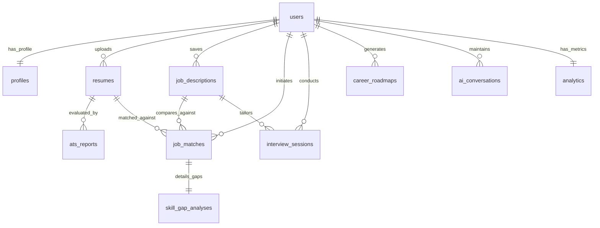

# Database Design Document

## CareerPilot AI — The Intelligent Career Copilot

---

## 1. Database Overview

CareerPilot AI utilizes **PostgreSQL** as its primary persistence layer. The database is designed using a hybrid model:
1. **Relational Model (SQL):** Standardized, structured tables enforce referential integrity, strong consistency, and transactional security for user authentication, billing outlines, analytics metrics, and session states.
2. **Semi-Structured Document Model (JSONB):** Flexible schemas accommodate deep nested data structures that evolve dynamically with AI generation. These include parsed resumes, detailed skill trees, interview transcripts, and AI-generated roadmaps.

This hybrid approach allows the application to benefit from PostgreSQL's performance, index optimizations (e.g., B-Tree and GIN indexes), and transactional reliability without requiring complex migrations for every minor update in the schema returned by local NLP models or LLM chains.

---

## 2. Design Principles

The database design adheres to these core architectural guidelines:

*   **Offline-Ready UUID Identifiers:** All primary keys utilize RFC 4122 compliant version 4 UUIDs generated via `gen_random_uuid()` at the database layer. This prevents key collisions, keeps sequence IDs obfuscated, and supports client-side ID generation.
*   **Referential Integrity with Cascaded Auditing:** Relationships are enforced with foreign key constraints. Destructive operations (like user deletions) cascade downward to clear child data, ensuring data privacy and compliance.
*   **Time-Zone Safety:** All timestamps use the `TIMESTAMP WITH TIME ZONE` (`TIMESTAMPTZ`) data type to guarantee consistent date parsing regardless of database deployment regions.
*   **Structured Metadata Auditability:** Every record tracking transactional state includes auto-populating metadata columns (`created_at`, `updated_at`).
*   **Indexing-First Design:** Search indexes are planned for foreign keys to prevent sequential scans during common joins, and specialized generalized inverted indexes (GIN) are assigned to JSONB keys representing large search arrays.

---

## 3. Normalization Strategy

To balance query speed, development velocity, and data deduplication, the database implements a selective normalization strategy:

*   **Third Normal Form (3NF) for Core Structures:** System user details, basic profile records, resumes, and target job descriptions are normalized into independent entities. A user's profile metadata is separated from authentication credentials (`users` and `profiles` table split) to improve query speed on auth checks and protect hashed security credentials from standard read operations.
*   **De-normalization via JSONB for AI Subsystems:** AI-generated roadmaps, skill gaps, and interview transcripts are de-normalized inside JSONB columns. Career maps and mock interview transcripts contain complex, multi-level hierarchies (e.g., nested milestone steps, resources, and message feedback arrays). Fully normalizing these would require creating 5–6 supplementary relational mapping tables, leading to highly complex multi-table joins. Using JSONB allows fast single-row reads and writes while leveraging PostgreSQL's GIN indexes to query nested attributes.

---

## 4. Entity Relationship Diagram (ERD)



---

## 5. Table Specifications

### 5.1 Users Table (`users`)
Stores core user authentication credentials.

| Column Name | Data Type | Constraints | Default | Description |
| :--- | :--- | :--- | :--- | :--- |
| `id` | `UUID` | `PRIMARY KEY` | `gen_random_uuid()` | Unique user identifier. |
| `email` | `VARCHAR(255)` | `UNIQUE`, `NOT NULL` | *None* | Lowercase validated unique user email. |
| `hashed_password` | `VARCHAR(255)` | `NOT NULL` | *None* | Secure bcrypt password hash. |
| `created_at` | `TIMESTAMPTZ` | `NOT NULL` | `CURRENT_TIMESTAMP` | Signup timestamp. |
| `updated_at` | `TIMESTAMPTZ` | `NOT NULL` | `CURRENT_TIMESTAMP` | Last updated timestamp. |

---

### 5.2 Profiles Table (`profiles`)
Stores demographic data, user preferences, and aggregated skill portfolios, decoupled from security credentials.

| Column Name | Data Type | Constraints | Default | Description |
| :--- | :--- | :--- | :--- | :--- |
| `id` | `UUID` | `PRIMARY KEY` | `gen_random_uuid()` | Unique profile identifier. |
| `user_id` | `UUID` | `FOREIGN KEY`, `UNIQUE`, `NOT NULL` | *None* | Refers to `users.id` (ON DELETE CASCADE). |
| `first_name` | `VARCHAR(100)` | *None* | *None* | User's first name. |
| `last_name` | `VARCHAR(100)` | *None* | *None* | User's last name. |
| `phone_number` | `VARCHAR(50)` | *None* | *None* | User's phone number. |
| `current_role` | `VARCHAR(100)` | *None* | *None* | User's current professional title. |
| `target_role` | `VARCHAR(100)` | *None* | *None* | User's target professional role. |
| `skills` | `JSONB` | `NOT NULL` | `'[]'::jsonb` | Flat array of strings listing validated skills. |
| `preferences` | `JSONB` | `NOT NULL` | `'{"theme": "dark"}'::jsonb` | Theme settings, UI preferences, etc. |
| `created_at` | `TIMESTAMPTZ` | `NOT NULL` | `CURRENT_TIMESTAMP` | Record creation timestamp. |
| `updated_at` | `TIMESTAMPTZ` | `NOT NULL` | `CURRENT_TIMESTAMP` | Record update timestamp. |

---

### 5.3 Resumes Table (`resumes`)
Persists raw resume plain text and structured JSON data returned by spaCy/NLP parser pipelines.

| Column Name | Data Type | Constraints | Default | Description |
| :--- | :--- | :--- | :--- | :--- |
| `id` | `UUID` | `PRIMARY KEY` | `gen_random_uuid()` | Unique resume identifier. |
| `user_id` | `UUID` | `FOREIGN KEY`, `NOT NULL` | *None* | Refers to `users.id` (ON DELETE CASCADE). |
| `file_name` | `VARCHAR(255)` | `NOT NULL` | *None* | Name of uploaded file. |
| `file_size` | `INTEGER` | `NOT NULL` | *None* | File size in bytes (max 5MB validation). |
| `raw_text` | `TEXT` | `NOT NULL` | *None* | Plain text extracted from PDF/DOCX. |
| `parsed_json` | `JSONB` | `NOT NULL` | `'{}'::jsonb` | Structured JSON containing parsed sections: education, experience, skills, projects, certifications. |
| `created_at` | `TIMESTAMPTZ` | `NOT NULL` | `CURRENT_TIMESTAMP` | Upload timestamp. |
| `updated_at` | `TIMESTAMPTZ` | `NOT NULL` | `CURRENT_TIMESTAMP` | Last updated timestamp. |

---

### 5.4 Job Descriptions Table (`job_descriptions`)
Maintains job requirements and role profiles targetted by users.

| Column Name | Data Type | Constraints | Default | Description |
| :--- | :--- | :--- | :--- | :--- |
| `id` | `UUID` | `PRIMARY KEY` | `gen_random_uuid()` | Unique job identifier. |
| `user_id` | `UUID` | `FOREIGN KEY`, `NOT NULL` | *None* | Refers to `users.id` (ON DELETE CASCADE). |
| `title` | `VARCHAR(255)` | `NOT NULL` | *None* | Target role title. |
| `company` | `VARCHAR(255)` | *None* | *None* | Target employer name. |
| `raw_text` | `TEXT` | `NOT NULL` | *None* | Copied/pasted raw description text. |
| `skills_list` | `JSONB` | `NOT NULL` | `'[]'::jsonb` | List of target skills parsed by backend NLP. |
| `created_at` | `TIMESTAMPTZ` | `NOT NULL` | `CURRENT_TIMESTAMP` | Creation timestamp. |
| `updated_at` | `TIMESTAMPTZ` | `NOT NULL` | `CURRENT_TIMESTAMP` | Last update timestamp. |

---

### 5.5 ATS Reports Table (`ats_reports`)
Contains detailed feedback and formatting analytics based on a resume's structure and ATS readability.

| Column Name | Data Type | Constraints | Default | Description |
| :--- | :--- | :--- | :--- | :--- |
| `id` | `UUID` | `PRIMARY KEY` | `gen_random_uuid()` | Unique report identifier. |
| `resume_id` | `UUID` | `FOREIGN KEY`, `UNIQUE`, `NOT NULL` | *None* | Refers to `resumes.id` (ON DELETE CASCADE). |
| `score` | `INTEGER` | `NOT NULL`, `CHECK (score BETWEEN 0 AND 100)` | *None* | Overall ATS readability percentage. |
| `formatting_issues` | `JSONB` | `NOT NULL` | `'[]'::jsonb` | Issues found (e.g. multi-column layouts, graphics, complex symbols). |
| `missing_sections` | `JSONB` | `NOT NULL` | `'[]'::jsonb` | List of missing standard sections (e.g., summary, projects). |
| `recommendations` | `JSONB` | `NOT NULL` | `'[]'::jsonb` | Detailed array of suggested resume adjustments. |
| `created_at` | `TIMESTAMPTZ` | `NOT NULL` | `CURRENT_TIMESTAMP` | Evaluation timestamp. |

---

### 5.6 Job Matches Table (`job_matches`)
Stores results comparing a user's resume against a specific target job description.

| Column Name | Data Type | Constraints | Default | Description |
| :--- | :--- | :--- | :--- | :--- |
| `id` | `UUID` | `PRIMARY KEY` | `gen_random_uuid()` | Unique match identifier. |
| `user_id` | `UUID` | `FOREIGN KEY`, `NOT NULL` | *None* | Refers to `users.id` (ON DELETE CASCADE). |
| `resume_id` | `UUID` | `FOREIGN KEY`, `NOT NULL` | *None* | Refers to `resumes.id` (ON DELETE CASCADE). |
| `job_description_id` | `UUID` | `FOREIGN KEY`, `NOT NULL` | *None* | Refers to `job_descriptions.id` (ON DELETE CASCADE). |
| `match_score` | `NUMERIC(5, 2)` | `NOT NULL`, `CHECK (match_score BETWEEN 0.00 AND 100.00)` | *None* | Vector-derived compatibility percentage. |
| `ats_compatibility_score` | `NUMERIC(5, 2)` | `NOT NULL`, `CHECK (ats_compatibility_score BETWEEN 0.00 AND 100.00)` | *None* | Metric combining text similarity & structural scoring. |
| `created_at` | `TIMESTAMPTZ` | `NOT NULL` | `CURRENT_TIMESTAMP` | Analysis execution timestamp. |

---

### 5.7 Skill Gap Analysis Table (`skill_gap_analyses`)
Highlights matching and missing credentials for a specific job matching instance.

| Column Name | Data Type | Constraints | Default | Description |
| :--- | :--- | :--- | :--- | :--- |
| `id` | `UUID` | `PRIMARY KEY` | `gen_random_uuid()` | Unique analysis identifier. |
| `job_match_id` | `UUID` | `FOREIGN KEY`, `UNIQUE`, `NOT NULL` | *None* | Refers to `job_matches.id` (ON DELETE CASCADE). |
| `present_skills` | `JSONB` | `NOT NULL` | `'[]'::jsonb` | Intersecting skills found in both datasets. |
| `missing_skills` | `JSONB` | `NOT NULL` | `'[]'::jsonb` | Skills specified in the JD but not found in the resume. |
| `recommended_skills` | `JSONB` | `NOT NULL` | `'[]'::jsonb` | High-value semantic matches to acquire. |
| `action_plan` | `JSONB` | `NOT NULL` | `'[]'::jsonb` | Step-by-step training guidelines. |
| `created_at` | `TIMESTAMPTZ` | `NOT NULL` | `CURRENT_TIMESTAMP` | Creation timestamp. |

---

### 5.8 Interview Sessions Table (`interview_sessions`)
Maintains text transcripts, scores, and evaluations for AI-driven mock interviews.

| Column Name | Data Type | Constraints | Default | Description |
| :--- | :--- | :--- | :--- | :--- |
| `id` | `UUID` | `PRIMARY KEY` | `gen_random_uuid()` | Unique interview session identifier. |
| `user_id` | `UUID` | `FOREIGN KEY`, `NOT NULL` | *None* | Refers to `users.id` (ON DELETE CASCADE). |
| `job_description_id` | `UUID` | `FOREIGN KEY` | `NULL` | Refers to `job_descriptions.id` (ON DELETE SET NULL). |
| `target_role` | `VARCHAR(255)` | `NOT NULL` | *None* | Intended role target (e.g. Backend Dev). |
| `company` | `VARCHAR(255)` | *None* | *None* | Intended target company. |
| `status` | `VARCHAR(50)` | `NOT NULL` | `'started'` | Current progress state: `started`, `in_progress`, `completed`. |
| `score` | `INTEGER` | `CHECK (score BETWEEN 0 AND 100)` | `NULL` | Calculated overall evaluation score (out of 100). |
| `overall_feedback` | `TEXT` | *None* | *None* | Aggregated performance critique. |
| `transcript` | `JSONB` | `NOT NULL` | `'[]'::jsonb` | Complete message history: role, user input, AI question, response score, response feedback. |
| `created_at` | `TIMESTAMPTZ` | `NOT NULL` | `CURRENT_TIMESTAMP` | Creation timestamp. |
| `updated_at` | `TIMESTAMPTZ` | `NOT NULL` | `CURRENT_TIMESTAMP` | Last updated timestamp. |

---

### 5.9 Career Roadmaps Table (`career_roadmaps`)
Stores milestones and training pathways generated by the local LLM.

| Column Name | Data Type | Constraints | Default | Description |
| :--- | :--- | :--- | :--- | :--- |
| `id` | `UUID` | `PRIMARY KEY` | `gen_random_uuid()` | Unique roadmap identifier. |
| `user_id` | `UUID` | `FOREIGN KEY`, `NOT NULL` | *None* | Refers to `users.id` (ON DELETE CASCADE). |
| `current_role` | `VARCHAR(255)` | `NOT NULL` | *None* | User's initial starting role. |
| `target_role` | `VARCHAR(255)` | `NOT NULL` | *None* | Desired endpoint role. |
| `roadmap_steps` | `JSONB` | `NOT NULL` | `'[]'::jsonb` | Ordered collection of milestones: step name, core skills, timeline, study resources. |
| `created_at` | `TIMESTAMPTZ` | `NOT NULL` | `CURRENT_TIMESTAMP` | Creation timestamp. |

---

### 5.10 AI Conversations Table (`ai_conversations`)
Maintains the context window history of the system-wide chat assistant.

| Column Name | Data Type | Constraints | Default | Description |
| :--- | :--- | :--- | :--- | :--- |
| `id` | `UUID` | `PRIMARY KEY` | `gen_random_uuid()` | Unique conversation identifier. |
| `user_id` | `UUID` | `FOREIGN KEY`, `NOT NULL` | *None* | Refers to `users.id` (ON DELETE CASCADE). |
| `title` | `VARCHAR(255)` | `NOT NULL` | `'New Chat'` | Dynamic context-derived title. |
| `messages` | `JSONB` | `NOT NULL` | `'[]'::jsonb` | Ordered array of message objects: sender (`user`, `assistant`), message text, timestamp. |
| `created_at` | `TIMESTAMPTZ` | `NOT NULL` | `CURRENT_TIMESTAMP` | Conversation start timestamp. |
| `updated_at` | `TIMESTAMPTZ` | `NOT NULL` | `CURRENT_TIMESTAMP` | Last message transaction timestamp. |

---

### 5.11 Analytics Table (`analytics`)
Acts as a high-performance pre-aggregated cache layer for displaying dashboard metrics (e.g. via Plotly graphs) to avoid computing heavy multi-row database aggregates on every page reload.

| Column Name | Data Type | Constraints | Default | Description |
| :--- | :--- | :--- | :--- | :--- |
| `id` | `UUID` | `PRIMARY KEY` | `gen_random_uuid()` | Unique dashboard metric row identifier. |
| `user_id` | `UUID` | `FOREIGN KEY`, `UNIQUE`, `NOT NULL` | *None* | Refers to `users.id` (ON DELETE CASCADE). |
| `total_resumes` | `INTEGER` | `NOT NULL`, `CHECK (total_resumes >= 0)` | `0` | Count of active resumes uploaded. |
| `total_interviews` | `INTEGER` | `NOT NULL`, `CHECK (total_interviews >= 0)` | `0` | Count of mock sessions completed. |
| `average_match_score` | `NUMERIC(5, 2)` | `CHECK (average_match_score BETWEEN 0.00 AND 100.00)` | `NULL` | Aggregated match metric. |
| `average_interview_score` | `NUMERIC(5, 2)` | `CHECK (average_interview_score BETWEEN 0.00 AND 100.00)` | `NULL` | Aggregated interview performance metric. |
| `historical_trends` | `JSONB` | `NOT NULL` | `'{"ats_trends": [], "interview_trends": []}'::jsonb` | Time-series data storing key metrics over time for easy Plotly visualization. |
| `last_calculated_at` | `TIMESTAMPTZ` | `NOT NULL` | `CURRENT_TIMESTAMP` | Last timestamp calculations were run. |

---

## 6. Relationships & Referential Integrity

Strict database relations prevent orphan records:
*   **One-to-One Relationships:**
    *   `users` ↔ `profiles`: Cascades on delete. Enforces that a profile must map to exactly one authenticated system user.
    *   `users` ↔ `analytics`: Pre-aggregated analytics records are created immediately upon user registration and cascade on deletion.
*   **One-to-Many Relationships:**
    *   `users` ↔ `resumes` / `job_descriptions` / `interview_sessions` / `career_roadmaps` / `ai_conversations`: Deleting a user wipes all historical files, roadmaps, specs, and mock configurations.
    *   `resumes` ↔ `ats_reports`: A resume can have one active ATS score check report, referencing it with a `UNIQUE` foreign key. Deleting a resume deletes its matching ATS feedback reports.
    *   `job_descriptions` ↔ `interview_sessions`: When a job description is removed, references inside `interview_sessions` are updated to `NULL` (`ON DELETE SET NULL`) rather than cascading. This preserves historical interview scores and session transcripts while breaking the link to the removed target spec.
*   **Many-to-Many Relationships:**
    *   Synthesized through the `job_matches` routing model. A single user can map a single resume (`resumes.id`) against multiple target job specs (`job_descriptions.id`), producing individual `job_matches` entries containing isolated metrics.
    *   `job_matches` ↔ `skill_gap_analyses`: Matches yield exactly one gap evaluation report (`job_match_id` is defined as a `UNIQUE` foreign key on the `skill_gap_analyses` table). Deleting a job match record cascade-wipes the corresponding skill gap report.

---

## 7. Indexing Strategy

To maintain low latency on SQL query transactions, we implement both Standard B-Tree and Generalized Inverted (GIN) database index mechanisms.

### 7.1 Standard B-Tree Indexes
B-Tree indexes optimize equality comparisons, sort queries, range checks, and primary-foreign key relationships.

```sql
-- Core User Lookup & Unique checks
CREATE UNIQUE INDEX idx_users_email_lower ON users (LOWER(email));

-- User Profile link
CREATE UNIQUE INDEX idx_profiles_user_id ON profiles (user_id);

-- Foreign Key relationship optimization
CREATE INDEX idx_resumes_user_id ON resumes (user_id);
CREATE INDEX idx_job_descriptions_user_id ON job_descriptions (user_id);
CREATE INDEX idx_ats_reports_resume_id ON ats_reports (resume_id);

-- Job Matches lookup index
CREATE INDEX idx_job_matches_user_id ON job_matches (user_id);
CREATE INDEX idx_job_matches_resume_id ON job_matches (resume_id);
CREATE INDEX idx_job_matches_job_description_id ON job_matches (job_description_id);

-- Analytics & Gap Indexes
CREATE UNIQUE INDEX idx_skill_gap_analyses_job_match_id ON skill_gap_analyses (job_match_id);
CREATE INDEX idx_interview_sessions_user_id ON interview_sessions (user_id);
CREATE INDEX idx_interview_sessions_job_desc_id ON interview_sessions (job_description_id);
CREATE INDEX idx_career_roadmaps_user_id ON career_roadmaps (user_id);
CREATE INDEX idx_ai_conversations_user_id ON ai_conversations (user_id);
```

### 7.2 JSONB GIN (Generalized Inverted) Indexes
GIN indexes allow direct querying of keys, values, and array structures inside semi-structured JSONB columns.

```sql
-- Index skills array inside profiles for fast skills matches
CREATE INDEX idx_profiles_skills_gin ON profiles USING gin (skills);

-- Index the parsed experience and skills trees in Resumes for keyword searches
CREATE INDEX idx_resumes_parsed_json_gin ON resumes USING gin (parsed_json);

-- Index Job target skills lists
CREATE INDEX idx_job_descriptions_skills_list_gin ON job_descriptions USING gin (skills_list);

-- Index mock interview transcripts for rapid text pattern search
CREATE INDEX idx_interview_sessions_transcript_gin ON interview_sessions USING gin (transcript);
```

---

## 8. Database Constraints

Data consistency is enforced through database-level rules, which prevent dirty writes:

1.  **Email Format Validation:**
    ```sql
    ALTER TABLE users ADD CONSTRAINT chk_users_email_format 
    CHECK (email ~* '^[A-Za-z0-9._%-]+@[A-Za-z0-9.-]+\.[A-Za-z]{2,4}$');
    ```
2.  **ATS & Job Matching Score Limits:**
    ```sql
    ALTER TABLE ats_reports ADD CONSTRAINT chk_ats_reports_score 
    CHECK (score BETWEEN 0 AND 100);

    ALTER TABLE job_matches ADD CONSTRAINT chk_job_matches_match_score 
    CHECK (match_score BETWEEN 0.00 AND 100.00);

    ALTER TABLE job_matches ADD CONSTRAINT chk_job_matches_ats_score 
    CHECK (ats_compatibility_score BETWEEN 0.00 AND 100.00);
    ```
3.  **Interview Scoring Constraint:**
    ```sql
    ALTER TABLE interview_sessions ADD CONSTRAINT chk_interview_sessions_score 
    CHECK (score BETWEEN 0 AND 100);
    ```
4.  **Analytics Integrities:**
    ```sql
    ALTER TABLE analytics ADD CONSTRAINT chk_analytics_resumes_count 
    CHECK (total_resumes >= 0);
    
    ALTER TABLE analytics ADD CONSTRAINT chk_analytics_interviews_count 
    CHECK (total_interviews >= 0);
    ```

---

## 9. JSONB Schema Architectures

This section outlines the internal structures of our JSONB document objects to ensure consistency across the API and persistence layers.

### 9.1 `resumes.parsed_json`
```json
{
  "personal_info": {
    "name": "Jane Doe",
    "email": "jane.doe@example.com",
    "phone": "+1-555-0199",
    "location": "New York, NY",
    "links": ["linkedin.com/in/janedoe", "github.com/janedoe"]
  },
  "skills": ["Python", "FastAPI", "PostgreSQL", "Next.js", "React", "TypeScript"],
  "experience": [
    {
      "company": "Tech Corp",
      "role": "Software Engineer",
      "location": "New York, NY",
      "start_date": "2024-01",
      "end_date": "Present",
      "bullet_points": [
        "Architected scalable backend microservices using FastAPI, reducing response latency by 20%.",
        "Developed premium front-end dashboards in Next.js, boosting customer engagement indices."
      ]
    }
  ],
  "education": [
    {
      "institution": "State University",
      "degree": "Bachelor of Science in Computer Science",
      "graduation_year": "2023"
    }
  ],
  "projects": [
    {
      "title": "Local Job Copilot",
      "description": "An open-source pipeline utilizing local AI models to parse PDF resumes.",
      "skills_used": ["Python", "Ollama", "spaCy"],
      "link": "github.com/janedoe/local-job-copilot"
    }
  ]
}
```

### 9.2 `interview_sessions.transcript`
```json
[
  {
    "speaker": "interviewer",
    "message": "Welcome, Jane. Can you explain the difference between a Clustered Index and a Non-Clustered Index in PostgreSQL?",
    "timestamp": "2026-06-27T11:45:00Z"
  },
  {
    "speaker": "candidate",
    "message": "A clustered index physically orders the rows on disk to match the index, whereas a non-clustered index uses pointers to target raw data rows without re-sorting the storage.",
    "timestamp": "2026-06-27T11:46:20Z",
    "evaluation": {
      "score": 90,
      "feedback": "Excellent explanation. The candidate highlighted physical storage implications clearly."
    }
  }
]
```

### 9.3 `career_roadmaps.roadmap_steps`
```json
[
  {
    "step_number": 1,
    "title": "Master Backend Foundations",
    "estimated_timeline": "1-2 Months",
    "focus_skills": ["SQL Performance Tuning", "FastAPI Advanced Middleware", "OAuth2 & JWT Auth flows"],
    "action_items": [
      "Build a multi-service task queue using FastAPI and PostgreSQL background workers.",
      "Optimize complex relational queries using Postgres EXPLAIN ANALYZE."
    ],
    "learning_resources": [
      {
        "title": "FastAPI Official Advanced Tutorials",
        "url": "https://fastapi.tiangolo.com/advanced/"
      },
      {
        "title": "Use The Index, Luke! - Database Performance Guide",
        "url": "https://use-the-index-luke.com/"
      }
    ]
  }
]
```

---

## 10. Future Tables Design

As the platform scales beyond Phase 1, the following database schemas will be integrated to support resume revisioning, background push systems, and security logging.

### 10.1 Resume Versions Table (`resume_versions`)
Supports version history and diff tracking, allowing users to restore previous versions of their optimized resumes.

| Column Name | Data Type | Constraints | Default | Description |
| :--- | :--- | :--- | :--- | :--- |
| `id` | `UUID` | `PRIMARY KEY` | `gen_random_uuid()` | Unique version identifier. |
| `resume_id` | `UUID` | `FOREIGN KEY`, `NOT NULL` | *None* | Refers to `resumes.id` (ON DELETE CASCADE). |
| `version_number` | `INTEGER` | `NOT NULL` | *None* | Monotonically increasing version counter. |
| `raw_text` | `TEXT` | `NOT NULL` | *None* | Plain text of this specific historical version. |
| `parsed_json` | `JSONB` | `NOT NULL` | *None* | Extracted structured data for this version. |
| `change_summary` | `VARCHAR(255)` | *None* | *None* | User description of edits (e.g., 'Optimized Tech Corp bullets'). |
| `created_at` | `TIMESTAMPTZ` | `NOT NULL` | `CURRENT_TIMESTAMP` | Version backup creation timestamp. |

*   *Unique Constraint:* `UNIQUE (resume_id, version_number)` to prevent overlapping version counts.
*   *Index:* `CREATE INDEX idx_resume_versions_lookup ON resume_versions (resume_id, version_number DESC);` to retrieve recent histories.

### 10.2 Notifications Table (`notifications`)
Stores system alerts, mock interview prompts, and tips for the user interface.

| Column Name | Data Type | Constraints | Default | Description |
| :--- | :--- | :--- | :--- | :--- |
| `id` | `UUID` | `PRIMARY KEY` | `gen_random_uuid()` | Unique alert identifier. |
| `user_id` | `UUID` | `FOREIGN KEY`, `NOT NULL` | *None* | Refers to `users.id` (ON DELETE CASCADE). |
| `title` | `VARCHAR(150)` | `NOT NULL` | *None* | Alert header text. |
| `message` | `TEXT` | `NOT NULL` | *None* | Body notification payload. |
| `type` | `VARCHAR(50)` | `NOT NULL` | `'system'` | Category classification: `system`, `interview`, `roadmap`, `matching`. |
| `is_read` | `BOOLEAN` | `NOT NULL` | `FALSE` | Toggle state for unread badges on the frontend. |
| `created_at` | `TIMESTAMPTZ` | `NOT NULL` | `CURRENT_TIMESTAMP` | Dispatch timestamp. |

*   *Index:* `CREATE INDEX idx_notifications_unread ON notifications (user_id) WHERE is_read = FALSE;` for fast notifications-badge retrieval.

### 10.3 Activity Logs Table (`activity_logs`)
Records user actions to support security audits, rate-limiting monitoring, and session metrics.

| Column Name | Data Type | Constraints | Default | Description |
| :--- | :--- | :--- | :--- | :--- |
| `id` | `UUID` | `PRIMARY KEY` | `gen_random_uuid()` | Unique log identifier. |
| `user_id` | `UUID` | `FOREIGN KEY` | `NULL` | Refers to `users.id` (ON DELETE SET NULL). Nullable for auth failures. |
| `action` | `VARCHAR(100)` | `NOT NULL` | *None* | Action key (e.g., `user.login`, `resume.upload`, `interview.start`). |
| `ip_address` | `VARCHAR(45)` | *None* | *None* | Client IP address (supports IPv4 and IPv6 string targets). |
| `user_agent` | `TEXT` | *None* | *None* | Client browser header string. |
| `metadata` | `JSONB` | `NOT NULL` | `'{}'::jsonb` | Context-specific details (e.g., `{"file_name": "resume.pdf"}`). |
| `created_at` | `TIMESTAMPTZ` | `NOT NULL` | `CURRENT_TIMESTAMP` | Action execution timestamp. |

*   *Index:* `CREATE INDEX idx_activity_logs_lookup ON activity_logs (user_id, created_at DESC);` for profile audit logs.
