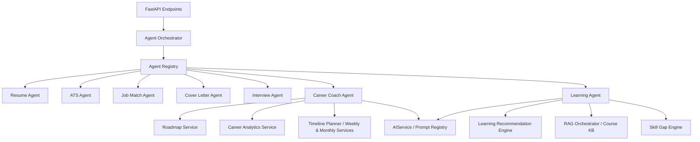
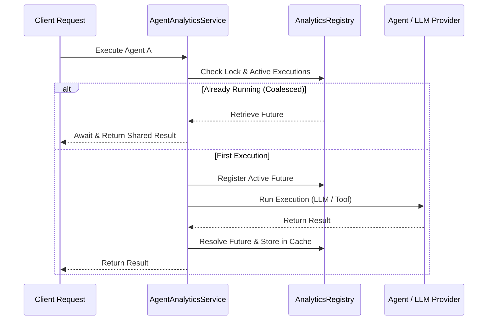

# Multi-Agent AI Platform Architecture Specification

This specification documents the Multi-Agent framework implemented in the CareerPilot AI platform, detailing the specialized agents, their tools, RAG integrations, and core workflows.

---

## Architecture Overview

The multi-agent system uses a clean, decoupled design where dedicated agents specialize in domain-specific workflows. Agents extend a unified base structure and are registered inside a centralized thread-safe registry.



---

## 1. Cover Letter Agent

The **Cover Letter Agent** (`CoverLetterAgent`) manages the generation, review, rewrite, and ATS optimization of professional cover letters.

### Responsibilities
- **Generate Cover Letter**: Creates tailored cover letters based on parsed resume details and target job descriptions.
- **Role-Specific Templates**: Selects templates dynamically tailored for Internships, Freshers, and Experienced candidates.
- **Cover Letter Review**: Generates quality ratings, strengths, weaknesses, and improvement lists.
- **Cover Letter Rewrite**: Applies targeted instructions to rewrite sections or entire letters.
- **ATS Optimization & Suggestions**: Performs ATS keyword compliance checks, estimating quality and score gains.

### Workflow & Core APIs
- `GET /api/v1/agents/cover-letter/status`: Retrieves health status.
- `POST /api/v1/agents/cover-letter/generate`: Assembly of context -> generation -> fact-checking.
- `POST /api/v1/agents/cover-letter/review`: AI review scores and strengths/weaknesses.
- `POST /api/v1/agents/cover-letter/rewrite`: Re-authoring based on instructions.

---

## 2. Interview Agent

The **Interview Agent** (`InterviewAgent`) coordinates full-length mock interview sessions, adaptive difficulties, STAR answer evaluations, and readiness reviews.

### Responsibilities
- **Mock Interview Orchestration**: Sequences technical, behavioral, and resume-based questions.
- **Adaptive Difficulty**: Dynamically adjusts follow-up difficulties based on prior question performance.
- **STAR Methodology Evaluation**: Scores answer turns across Situation, Task, Action, and Result indicators.
- **Interview Readiness Reports**: Computes performance trends, category averages, and compiles learning roadmaps.

### Workflow & Core APIs
- `GET /api/v1/agents/interview/status`: Retrieves health status.
- `POST /api/v1/agents/interview/mock`: Instantiates a mock session, generating the first question.
- `POST /api/v1/agents/interview/questions`: Generates subsequent turns in an active session.
- `POST /api/v1/agents/interview/evaluate`: Accepts and scores turn answers.
- `POST /api/v1/agents/interview/readiness`: Aggregates session metrics to formulate readiness scores.

---

## 3. Career Coach Agent

The **Career Coach Agent** (`CareerCoachAgent`) guides professional career progression, career roadmap generation, target-role alignment analysis, progress tracking, and detailed weekly/monthly planning.

### Responsibilities
- **Career Roadmap Engine**: Reuses the core roadmap generation services to construct step-by-step career path structures.
- **Alignment & Gap Analysis**: Evaluates candidate resumes against target roles, identifying critical skills, gaps, and industry specific risks.
- **Adaptive Progress Tracker**: Updates and recalculates milestone completion progress based on finished tasks.
- **Structured Scheduling Plans**: Generates action-oriented weekly and monthly scheduling plans, breaking down milestones into specific tasks.

### Tool Integrations
- `RoadmapService` & `CareerAnalyticsService` for creating roadmaps and reading user resume structures.
- `AIService` & `PromptRegistry` for prompt template rendering.

### Workflow & Core APIs
- `GET /api/v1/agents/career-coach/status`: Retrieves health status.
- `POST /api/v1/agents/career-coach/roadmap`: Generates a professional career roadmap.
- `POST /api/v1/agents/career-coach/analyze`: Runs gap and risk analytics on a profile.
- `POST /api/v1/agents/career-coach/progress`: Updates completion percentage and milestone details.
- `POST /api/v1/agents/career-coach/weekly-plan`: Generates weekly focus tasks and success criteria.
- `POST /api/v1/agents/career-coach/monthly-plan`: Breaks down milestones into structured monthly milestones.

---

## 4. Learning Agent

The **Learning Agent** (`LearningAgent`) is responsible for customized education planning, curriculum paths, RAG-augmented course search, professional certification recommendations, and hourly study schedules.

### Responsibilities
- **RAG-Augmented Recommendations**: Queries the course knowledge base (`course_kb`) using search terms to retrieve actual course documents.
- **Customized Curriculum Planning**: Formulates structural learning paths divided into sequential topic phases.
- **Certification Matchmaker**: Proposes industry-standard credentials (e.g. AWS, CKA, PMP) with cost and preparation timeframes.
- **Adaptive Study Planner**: Formulates study schedules based on weekly study capacity (hours) and overall duration constraints.

### Tool Integrations
- `RAGOrchestrator` for semantic querying of `course_kb`.
- `AIService` and `PromptRegistry` for structured JSON curriculum extraction.

### RAG Retrieval Workflow
```
[User Request / Query]
        |
        v
[Learning Agent Service]
        |
        v
[RAG Orchestrator] ---> Query "course_kb" Collection
        |
        v
[Retrieve Course Docs]
        |
        v
[Format Retrieved Context] ---> Inject into Jinja Prompt
        |
        v
[AIService / LLM] ---> Output Structured Pydantic JSON
```

### Workflow & Core APIs
- `GET /api/v1/agents/learning/status`: Retrieves health status.
- `POST /api/v1/agents/learning/recommend`: Generates target-role based study recommendations.
- `POST /api/v1/agents/learning/path`: Generates a topic-by-topic learning timeline.
- `POST /api/v1/agents/learning/courses`: Searches retrieved RAG course lists to match user queries.
- `POST /api/v1/agents/learning/certifications`: Recommends key professional certifications.
- `POST /api/v1/agents/learning/study-plan`: Provides week-by-week study goals and hourly breakdown.

---

## Developer Guide: Extending Agents

To add a new agent:
1. Create a subfolder under `app/modules/agents/<agent_name>/`.
2. Implement your specialist logic subclassing `BaseAgent`.
3. Build validation, prompts, and schema models inside the agent package.
4. Import and register the new agent inside `app/modules/agents/dependencies.py` to ensure it is registered inside `AgentRegistry`.

---

## 5. Agent Collaboration Analytics, Monitoring & Optimization

The **Collaboration Analytics & Monitoring Engine** provides a comprehensive telemetry, performance optimization, and observability layer that automatically wraps and inspects all registered multi-agent execution paths.

### 5.1 Telemetry and Metrics Collection
The system tracks telemetry across three main vectors:
* **Agent Executions**: Execution latency, success/failure status, token consumption (prompt and completion tokens via OpenAI callback hooks), error stacks, and execution coalescing occurrences.
* **Tool Executions**: Tool latency, execution success, and cache hits.
* **Workflow Executions**: Sequential or parallel workflow runs, milestone durations, retry counts, and rollback compensation triggers.

### 5.2 Performance Optimization Layer
To ensure sub-millisecond response profiles and scale throughput under concurrent workloads, the framework includes a multi-tiered performance optimization layer:
* **Singleflight Execution Coalescing**: Concurrent executions of identical agent request signatures (same agent, task, and variables) are coalesced into a single execution stream using an async lock-and-future multiplexer. This prevents redundant LLM evaluations.
* **Intelligent Telemetry Caching**: Success outcomes for agent execution states and tool calls are cached with configurable Time-To-Live (TTL) strategies to eliminate duplicate API roundtrips.



### 5.3 Observation & Monitoring APIs
* `GET /api/v1/agents/analytics`: Aggregated KPIs (total executions, overall success rate, total tokens, average latency).
* `GET /api/v1/agents/analytics/agents`: Performance statistics per individual agent.
* `GET /api/v1/agents/analytics/workflows`: Step execution statistics for sequential and parallel workflows.
* `GET /api/v1/agents/analytics/tools`: Execution and success tracking for all tool registrations.
* `GET /api/v1/agents/analytics/collaboration`: Directed adjacency graph listing delegation edges and counts.
* `GET /api/v1/agents/analytics/performance`: Detailed statistics on cache efficiency and singleflight coalesced execution.
* `GET /api/v1/agents/analytics/health`: Comprehensive system health diagnostics, startup validation, configuration checks, and active timeout tracking.
* `POST /api/v1/agents/analytics/cleanup`: Triggers background memory release and TTL expirations.

---

## 6. Production Hardening & Security Specification

### 6.1 Multi-Agent Security Controls

To ensure production safety and mitigate malicious LLM interactions, the platform implements a defense-in-depth security model:

```
[API Endpoint] ---> Input Sanitization (Strips script tags, escapes HTML)
      |
      v
[Prompt Injection Check] ---> Regex signature scanning & delimiter checks
      |
      v
[Sensitive Data Masking] ---> Scrub SSNs, Credit Cards, Credentials
      |
      v
[Orchestrator Exec] ---> Safe Delegation Checks (Verifies enabled agents)
      |
      v
[Response Output Filter] ---> Masks sensitive PII/secrets before return
```

1. **Input Sanitization**: All endpoint inputs strip HTML/script tags and escape inputs using HTML entity encoding to prevent Cross-Site Scripting (XSS) and injection attempts.
2. **Prompt Injection Detection**: Inputs are evaluated against jailbreak keywords (e.g., "ignore all previous instructions", "system override", "jailbreak") and structural delimiter anomalies. Requests triggering flags are rejected with `400 Bad Request` and log a security audit event.
3. **Sensitive Information Filtering**: A pattern-matching engine scrubs credentials, credit cards, SSNs, and email addresses from both input prompts and response outputs before returning them to client layers.
4. **Safe Agent Delegation**: Wrapped delegate channels verify that target agents are enabled and registered prior to routing executing steps. Unregistered or disabled delegations abort.

### 6.2 Telemetry & Uptime Observability

The dashboard backend aggregates execution telemetry:
- **Uptime Monitoring**: Uptime seconds and startup time tracking.
- **Queue Monitoring**: Active coalesced singleflight executions count as the task queue depth.
- **Timeout Monitoring**: Sums execution histories for tracking agents exceeding timeout limits.
- **Memory Estimation**: Approximate character and collection byte count tracking of registry structures.

---

## 7. Deployment & Operations Guide

### 7.1 Startup Validation Checklist

During app lifespan startup, the platform executes a series of production safety diagnostics:
1. **Config Verification**: Validates that critical parameters (`DATABASE_URL`, `JWT_SECRET_KEY`) are present and not matching default development placeholders when running in production environment.
2. **Database Connectivity**: Executes a query (`SELECT 1`) to ensure the Postgres engine is responding.
3. **Ollama Connectivity**: Checks default client connection configuration for LLM interactions.
4. **ChromaDB Connection**: Connects and lists registered semantic vector search collections.
5. **Agent Dependency Validation**: Checks that all registered agents have their mandatory service tools correctly instantiated and resolved.

### 7.2 API Usage Examples

#### Agent Task Execution Request
```bash
curl -X POST "http://localhost:8000/api/v1/agents/execute" \
  -H "Authorization: Bearer <token>" \
  -H "Content-Type: application/json" \
  -d '{
    "task": "sec_task",
    "user_id": "1",
    "correlation_id": "corr-uuid-12345",
    "input_data": {"query": "Translate this content"},
    "execution_mode": "sequential"
  }'
```

#### Analytics Health Check Response
```json
{
  "status": "healthy",
  "uptime_seconds": 3600.0,
  "registry_agents_count": 7,
  "registry_tools_count": 8,
  "memory_store_sessions_count": 3,
  "last_cleanup_timestamp": "2026-07-05T12:00:00Z",
  "startup_validated": true,
  "configuration_validated": true,
  "production_safety_checks_passed": true,
  "dependency_validation_status": {
    "resume_agent:ai_service": true,
    "resume_agent:rag_orchestrator": true
  },
  "queue_length": 0,
  "active_timeouts_count": 0,
  "memory_usage_bytes": 1024,
  "diagnostics": {
    "config": {
      "environment": "production",
      "db_configured": true,
      "jwt_configured": true,
      "ollama_host_configured": true,
      "ai_provider": "ollama"
    },
    "database": "healthy",
    "ollama": "configured",
    "chromadb": "configured"
  }
}
```

