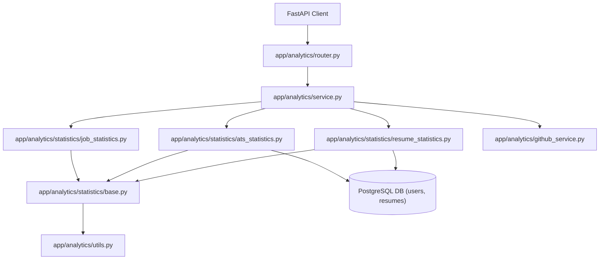

# Phase 7 — Analytics Engine Documentation

## 1. Overview

The Analytics Engine provides comprehensive, system-wide, and user-specific statistical insights for Scorelia. It operates by aggregating database models (users, resumes), querying external integrations (GitHub public API), and parsing in-memory service logs (Job Matches) into chart-ready, structured Pydantic payloads.

### Directory Structure & File Responsibilities

The directory structure is modularized to decouple API routers, validation schemas, orchestration services, and mathematical calculation layers:

```
backend/app/analytics/
├── __init__.py                  # Exports the API router
├── router.py                    # Endpoint handler (health, dashboard, resumes, ATS, jobs, GitHub, charts)
├── service.py                   # Orchestration layer (decouples routes from DB and caches)
├── utils.py                     # Centralized math calculations and normalization helpers
├── models.py                    # Domain helper models
│
├── schemas/                     # Request and response Pydantic contracts
│   ├── __init__.py              # Re-exports all schemas for clean client imports
│   ├── ats.py                   # ATS metrics schemas
│   ├── charts.py                # Charts Engine unified schemas
│   ├── dashboard.py             # Dashboard aggregates schemas
│   ├── github.py                # GitHub profile & insights schemas
│   ├── job.py                   # Job Match analytics schemas
│   └── resume.py                # Resume metrics schemas
│
└── statistics/                  # Database aggregation queries and math calculations
    ├── __init__.py              # Re-exports statistics modules and facades
    ├── base.py                  # BaseStatistics class with shared math (averages, medians, division)
    ├── ats_statistics.py        # ATS-specific statistics calculations
    ├── chart_statistics.py      # Charts Engine configuration registry
    ├── github_statistics.py     # GitHub profile & repository metrics calculations
    ├── job_statistics.py        # Job Match metrics calculations
    └── resume_statistics.py     # Resume uploads and parser metrics calculations
```

### Architecture Flow Diagram



---

## 2. Endpoint Reference

All endpoints (except health) are private, requiring a valid authenticated session cookie (`access_token`).

| Method | Path | Auth Required | Description |
| :--- | :--- | :--- | :--- |
| **GET** | `/api/v1/analytics/health` | No | Public health check. Returns module status. |
| **GET** | `/api/v1/analytics/dashboard` | Yes | Retrieves admin dashboard summaries (users, resumes, job matches, averages). |
| **GET** | `/api/v1/analytics/resumes` | Yes | Retrieves resume upload metrics, parsed content distributions, and timelines. |
| **GET** | `/api/v1/analytics/ats` | Yes | Retrieves ATS scoring averages, grade cohorts, categories, trends, and weaknesses. |
| **GET** | `/api/v1/analytics/jobs` | Yes | Retrieves Job Match averages, ranges distribution, missing skills, and history. |
| **GET** | `/api/v1/analytics/github/{username}/profile` | Yes | Fetches public GitHub profile summary and top repository stars/forks. |
| **GET** | `/api/v1/analytics/github/{username}/insights` | Yes | Fetches repository language details, topics, sizes, activity, and Developer Score. |
| **GET** | `/api/v1/analytics/charts/overview` | Yes | Curates a list of 4 dashboard charts (score/match distributions, timeline, top skills). |
| **GET** | `/api/v1/analytics/charts/{chart_id}` | Yes | Retrieves a single named chart's dataset on demand. |

---

## 3. Module-by-Module Detail

### A. Dashboard Analytics
- **Response Shape**: `DashboardAnalyticsResponse` containing `DashboardSummaryResponse`.
- **Key Fields**: `total_users`, `total_resumes`, `parsed_resumes`, `total_job_matches`, `average_ats_score`, `average_match_score`, `latest_resume`, `latest_job_match`.
- **Design Decisions**:
  - Leverages SQL count/average aggregation instead of fetching full records.
  - Decoupled from `JobMatchService` database models, querying details via public in-memory cache summaries.

### B. Resume Analytics
- **Response Shape**: `ResumeAnalyticsResponse` containing `ResumeAnalyticsData`.
- **Key Fields**: `overview` (success rate, average character length, upload speed), `skills` (top 10 skills, unique counts), `experience` (cohort distributions), `education` (degrees breakdown), `timeline` (chronological daily/weekly/monthly upload charts).
- **Design Decisions**:
  - Leverages `load_only(Resume.parsed_data)` to bypass loading large raw text fields when computing skill/education distributions.
  - Applies a centralized degree normalization mapping (e.g. Master of Science -> Master) to merge messy raw strings into standard distribution cohorts.

### C. ATS Analytics
- **Response Shape**: `ATSAnalyticsResponse` containing `ATSAnalyticsData`.
- **Key Fields**: `overview` (stats & median), `grade_distribution` (Excellent/Good/Fair/Needs Improvement counts & percentages), `category_breakdown` (contribution weights & average scores per section), `trend` (daily chronologically sorted average scores), `weaknesses` (top 5 frequencies).
- **Design Decisions**:
  - Runs scoring formulas purely in-memory using `parsed_data` to construct the section-by-section category averages without querying secondary tables.
  - Generates weakness/recommendation frequencies via occurrences counters across all candidates.

### D. Job Match Analytics
- **Response Shape**: `JobAnalyticsResponse` containing `JobAnalyticsData`.
- **Key Fields**: `distribution` (bucketed score counts with chart-ready keys), `skill_gaps` (top missing skills frequency), `trend` (timeline of match averages), `history` (repeated job matching counts, matches-per-resume ratio, match growth percentage last 30 days vs 30 days prior).
- **Design Decisions**:
  - Fully isolates calculations from the internal `_history_cache` of the Job Match module, routing through the public `JobMatchService.get_match_statistics()` method.
  - Translates nested distributions and missing skill counts into standardized `label`/`value` elements for direct frontend charting.

### E. GitHub Intelligence (Profile + Insights)
- **Response Shape**: `GitHubAnalyticsResponse` (Profile) and `GitHubRepositoryInsightsResponse` (Insights).
- **Key Fields**: `profile` (avatar, followers, bio, account age), `repository_summary` (stars, forks, most starred repo), `languages` (byte percentages, primary language), `developer_score` (subscores & composite score).
- **Design Decisions**:
  - **Caching**: Stripped lowercase usernames are cached for 15 minutes to respect GitHub API rate limits.
  - **Insights Capping**: Language details are capped to the top 10 repositories by stars to avoid API lockout.
  - **Partial Content (206)**: If a rate limit is reached mid-loop, it returns successfully gathered data with `is_partial: true` and a `206 Partial Content` HTTP status code.
  - **Developer Score**: Calculated via a weighted composite formula: Language Diversity (20%), Activity Recency (25%), Community Engagement (20%), Longevity/Consistency (25%), and Documentation (15%).

### F. Charts Engine
- **Response Shape**: `ChartOverviewResponse` (curated bundle) and `SingleChartResponse` (single chart).
- **Key Fields**: `chart_id`, `chart_type`, `title`, `data` (list of `label`/`value` objects), `metadata`.
- **Design Decisions**:
  - **Registry-driven**: Resolves chart logic via a centralized `CHART_REGISTRY` mapping.
  - **Partial-Success Behavior**: A crash inside one chart's database query will not crash the overview. The failed chart is omitted, and the error message is recorded inside the `omitted_charts` metadata dictionary, ensuring a robust user experience.

---

## 4. Shared Architecture

### BaseStatistics
The `BaseStatistics` class (defined in `backend/app/analytics/statistics/base.py`) serves as the base class for all statistics modules. It houses shared mathematical calculations and utility formatting functions, avoiding duplicate implementations of:
- `safe_divide(numerator, denominator, default)`
- `percentage(part, total)`
- `calculate_average(values)`
- `calculate_median(values)`
- `format_timeline(dt, bucket_type)`

### Response Wrapper Convention
Every endpoint response conforms to a standard wrapper layout:
```json
{
  "success": true,
  "message": "Detail response message",
  "timestamp": "2026-07-01T10:00:00Z",
  "data": { ... }
}
```
All exceptions are caught by dedicated handlers in `router.py` and wrapped in this schema, returning `success: false` and the error message as `message`, preventing unhandled backend stack trace exposure.

### Service Abstraction Pattern
To keep database query domains isolated, the system uses service wrappers. For example, `GitHubService` encapsulates all `httpx` logic, rate limit header processing, and cache lookups. The `AnalyticsService` coordinates calls across database statistics facades and external services.

---

## 5. Known Limitations

1. **GitHub Activity proxying**: Detailed activity metrics (like daily commit frequencies) are approximated using public push timestamps (`pushed_at`), as query loops for full Git events are too heavy under standard API limits.
2. **Developer Score Heuristic**: The Developer Score is a weighted heuristic representing repository metadata structure. It should not be used as a scientific grade of a programmer's skill.
3. **Synchronous DB Concurrency**: Overview charts are loaded sequentially. Executing them concurrently via `asyncio.gather` is deferred because the synchronous SQLAlchemy `Session` is not thread-safe. Implementing concurrent sessions would require migration to SQLAlchemy `AsyncSession` throughout the codebase.

---

## 6. How to Extend

### Adding a New Chart
1. **Compute statistics**: Create a calculation method inside one of the subclass files (e.g. `resume_statistics.py`).
2. **Add to Registry**: Register the config entry in `CHART_REGISTRY` inside `chart_statistics.py`:
   ```python
   "my-chart-id": ChartConfig(
       chart_type="bar",
       title="My New Chart",
       source=my_async_callable,
       requires_username=False
   )
   ```
3. **Add to Overview (Optional)**: Insert the `chart_id` to `curated_ids` inside `get_charts_overview` in `service.py`.

### Adding a New Statistics Module
1. Create `new_statistics.py` inside `app/analytics/statistics/`.
2. Make the class inherit from `BaseStatistics`.
3. Add the imports and update the backward-compatible `AnalyticsStatistics` facade in `statistics/__init__.py`:
   ```python
   class AnalyticsStatistics(ResumeStatistics, ATSStatistics, JobStatistics, GitHubStatistics, NewStatistics):
       pass
   ```

---

## 7. Performance Review

A comprehensive performance audit was performed across all analytics endpoints:

- **Aggregations**: Database endpoints (`/dashboard`, `/resumes`, `/ats`) run optimized SQL functions (`COUNT`, `AVG`, `length`, `utcnow` delta filters) directly on the PostgreSQL engine, fetching only final calculated values. No full tables are loaded into Python memory.
- **Selective Column Queries**: Large columns (like raw resume text) are explicitly deferred. `load_only()` is used to load only required fields (e.g. `parsed_data`, `ats_score`, `uploaded_at`) for skill frequency and grade analyses.
- **N+1 Avoidance**: No loop queries exist. In `ATSStatistics.calculate_ats_category_breakdown()`, the scoring rules are executed in-memory against already fetched resume `parsed_data` columns, completely avoiding additional DB network hops.
- **GitHub Optimization**: Repos are sorted and capped to the top 10 by stars before language details are loaded. Results are cached under a 15-minute TTL to reduce outbound network request latency.
- **Overview Sequential Tradeoff**: The `/charts/overview` endpoint retrieves chart data sequentially. Concurrency via `asyncio.gather` is deferred because executing concurrent operations on the same synchronous, request-bound SQLAlchemy `Session` is unsafe.

---

## 8. Test Coverage Summary

A complete unit and integration test suite covers all components of the Analytics module.

### Test Metrics
- **Total Analytics Tests**: 42
- **Analytics Test Pass Rate**: 100%
- **Total Workspace Tests**: 244
- **Workspace Test Pass Rate**: 100%

### Coverage Details
- **BaseStatistics**: Directly unit tested (`test_base_statistics_average`, `test_base_statistics_median`, `test_base_statistics_safe_divide`, `test_base_statistics_percentage`, `test_base_statistics_format_timeline`).
- **Subclass Statistics**: Directly unit tested via `TestStatisticsDirect` (testing mock inputs for `ResumeStatistics`, `ATSStatistics`, `JobStatistics`, and `GitHubStatistics` calculation logic).
- **Unauthorized Access**: Every private endpoint verifies that unauthenticated access returns `401 Unauthorized` with a standardized wrapper.
- **Empty States**: Database and chart endpoints explicitly verify correct zero-value response formatting on empty tables.
- **Error Handling Cases**: Mocks verify 400 (malformed username), 404 (user not found), 429 (rate limit), 503 (timeout), and 206 (partial data mid-loop) handle gracefully.
