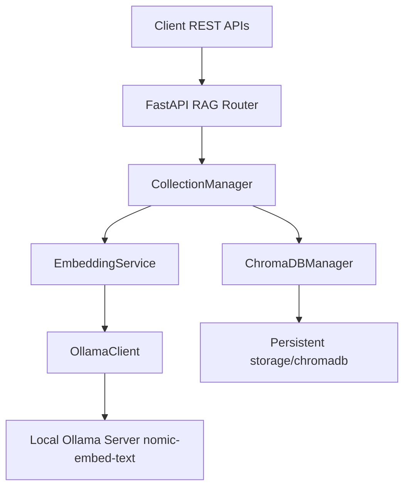
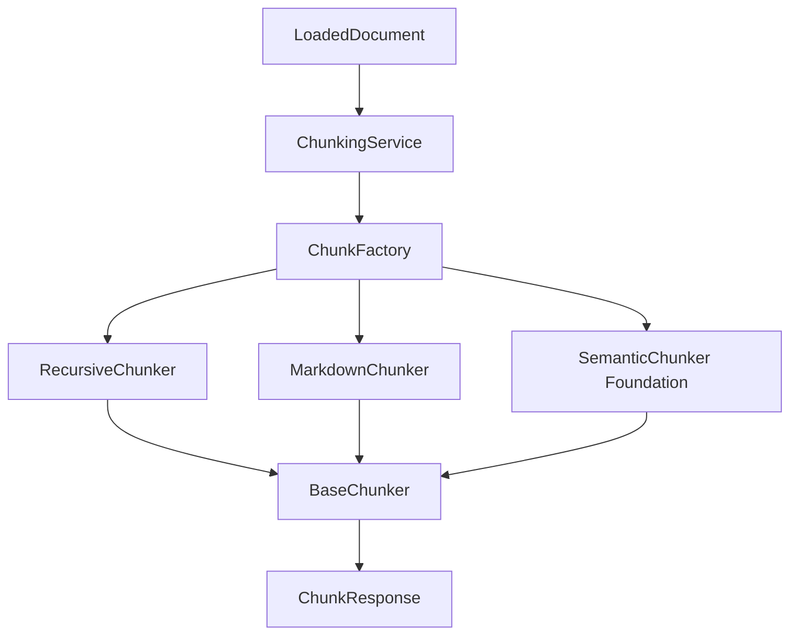
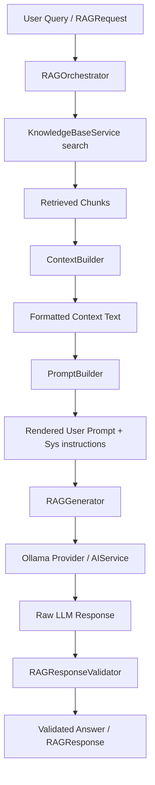
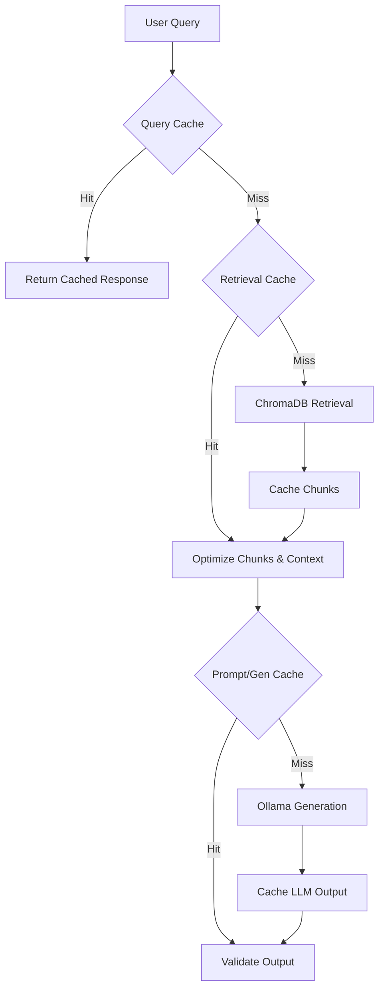

# Retrieval-Augmented Generation (RAG) Architecture

This document details the architecture, design decisions, and system structure of the Retrieval-Augmented Generation (RAG) foundation module in Scorelia.

---

## 1. Overall RAG Architecture

The RAG architecture follows a modular, scalable design adhering to **Clean Architecture** principles. It serves as the primary system of record for Scorelia's semantic knowledge, caching and indexing relevant materials to support context injection for the various AI services.



---

## 2. Module Structure

The RAG foundation components are organized within the `app/modules/rag` directory as follows:

```
rag/
├── api/
│   ├── __init__.py
│   └── router.py             # REST API endpoint handlers
├── services/
│   ├── __init__.py
│   └── collection_manager.py # Orchestrates database collections lifecycle and rules
├── repositories/
│   └── __init__.py           # Future data mapping layer
├── schemas/
│   ├── __init__.py
│   └── collection.py         # Pydantic validation schemas
├── models/
│   └── __init__.py           # Database entities/schemas if needed
├── embeddings/
│   ├── __init__.py
│   └── service.py            # Ollama embedding wrapper
├── vectorstores/
│   ├── __init__.py
│   └── chroma.py             # ChromaDB Persistent Client wrapper
├── config.py                 # RAG specific configuration
├── dependencies.py           # FastAPI dependency injectors
├── constants.py              # Constants and validation constraints
├── exceptions.py             # Custom module exceptions
├── utils/
│   └── __init__.py
└── tests/
    └── __init__.py
```

---

## 3. Vector Database (ChromaDB) Design

**ChromaDB** is configured as a local vector database running in-process using the official python library's persistent storage backend.

- **Storage Location**: Configured to write to a local directory (`storage/chromadb`).
- **Persistence**: Database entries, metadata, and index structures automatically serialize to disk.
- **Heartbeat & Monitoring**: ChromaDB's native heartbeat function is called to validate connection health.

---

## 4. Embedding Service

The **EmbeddingService** uses the local Ollama instance running the `nomic-embed-text` model to produce normalized vector embeddings.

- **Dimension**: 768 dimensions (provided by `nomic-embed-text`).
- **Endpoint**: Interacts with the local Ollama `/api/embed` endpoint.
- **Validation**: Ensures vectors do not contain `NaN` or `Infinite` entries and checks dimensions.
- **Batching**: Support list inputs to vectorize chunks concurrently.

---

## 5. Configuration

RAG settings are fully integrated into the global Pydantic Settings class `Settings` and are configurable via environment variables or a `.env` file.

Key configuration fields:
- `CHROMA_STORAGE_DIR` (e.g. `storage/chromadb`)
- `RAG_EMBEDDING_PROVIDER` (defaults to `ollama`)
- `RAG_EMBEDDING_MODEL` (defaults to `nomic-embed-text`)
- `RAG_TOP_K` (defaults to `4`)
- `RAG_SIMILARITY_THRESHOLD` (defaults to `0.7`)

---

## 6. Dependency Injection

To avoid singleton duplication and resource leaks, all RAG services are registered in `app/modules/rag/dependencies.py` using FastAPI's dependency injection mechanisms. Singletons are cached globally at the module level.

- `get_rag_config()`: Exposes `RAGConfig` settings.
- `get_chroma_manager()`: Yields the `ChromaDBManager`.
- `get_embedding_service()`: Yields the `EmbeddingService`.
- `get_collection_manager()`: Yields the `CollectionManager`.

---

## 7. Collection Management

The system restricts collection operations to pre-defined, supported knowledge bases to maintain consistency.

Allowed Collections:
1. `resume_kb`: Candidate resume records
2. `company_kb`: Company profiles and culture files
3. `course_kb`: Learning course catalogs
4. `skills_kb`: Core skills hierarchies
5. `interview_kb`: Mock interview templates
6. `ats_kb`: ATS optimization templates
7. `job_kb`: Scraped job descriptions

---

## 8. API Endpoints

All RAG REST APIs are exposed under `/api/v1/rag` prefix:

- `GET /health`: Health verification check for Ollama and ChromaDB connections (unauthenticated).
- `GET /collections`: List active collections and document count (authenticated).
- `POST /collections`: Create a new collection (authenticated).
- `DELETE /collections/{collection_name}`: Delete a collection (authenticated).

---

## 9. Document Loader & Ingestion Pipeline (Phase 12 Part 2)

The RAG module includes a production-ready, extensible document processing and ingestion pipeline responsible for reading documents, validating structures, cleaning text, and extracting metadata.

### 9.1. Document Loader Architecture
The loader framework is built using the **Strategy Pattern**. All document format loaders inherit from the common interface `BaseDocumentLoader` (`app/modules/rag/services/loaders/base.py`) which defines both:
- `load(file_path, custom_metadata)`: Fully processes and reads the file.
- `lazy_load(file_path, custom_metadata)`: Yields document pages or segments lazily to optimize memory usage.

A central registry `LOADER_REGISTRY` (`app/modules/rag/services/loaders/__init__.py`) maps extensions to their concrete loader implementations.

### 9.2. Supported Formats
The pipeline implements concrete parsers for the following extensions:
- **PDF (.pdf)**: Uses `PDFLoader` (`app/modules/rag/services/loaders/pdf.py`) backed by `PyMuPDF` (`fitz`). Processes page-by-page, supports title/author metadata extraction, validates corrupted files, and rejects encrypted PDFs.
- **Word (.docx)**: Uses `DOCXLoader` (`app/modules/rag/services/loaders/docx.py`) backed by `python-docx`. Iterates paragraphs and tables in logical block order, extracts document core properties, and renders tables to structured markdown rows.
- **Text (.txt)**: Uses `TXTLoader` (`app/modules/rag/services/loaders/txt.py`). Automatically tests encodings (`utf-8`, `latin-1`, `utf-16`, `utf-32`) to prevent decoding errors.
- **Markdown (.md)**: Uses `MarkdownLoader` (`app/modules/rag/services/loaders/markdown.py`). Parses structural YAML frontmatter blocks and indexes main heading structures.
- **HTML (.html)**: Uses `HTMLLoader` (`app/modules/rag/services/loaders/html.py`) backed by a custom HTMLParser. Safely strips scripts, stylesheets, navigation blocks, headers, and footers to retrieve clean readable text content only.

### 9.3. Validation Flow
Document validation is enforced by `DocumentValidator` (`app/modules/rag/services/validator.py`):
1. **Size check**: Verifies file size is greater than 0 and less than settings-defined limits (`MAX_FILE_SIZE_MB`).
2. **Type/MIME checking**: Restricts uploads to the supported list. Compares file extension against MIME headers, guessing MIME properties securely.
3. **Binary Sample inspection**: For text formats (TXT, MD, HTML), validates content byte buffers (e.g., checking for null bytes and control-character density) to reject executable binary uploads masquerading as text files.

### 9.4. Metadata Extraction
The `MetadataExtractor` (`app/modules/rag/services/metadata_extractor.py`) computes standard and customizable document metrics:
- Word and character counts.
- Page counts.
- Estimated reading times (calculated using a standard 200 WPM heuristic).
- Primary document language (`en`, `es`, `fr`, `de` detected via stopwords heuristics).
- Creation and modification timestamps.
- User-supplied custom metadata tags.

### 9.5. Normalization
Extracted texts are normalized by `normalize_content` (`app/modules/rag/services/normalization.py`):
- NFKC Unicode compatibility decomposition.
- Standardizes line endings (`\r` and `\r\n` -> `\n`).
- Removes formatting controls (excluding tabs/newlines).
- Replaces tabs with single spaces.
- Collapses horizontal spaces.
- Limits contiguous vertical spacing to a max of two newlines.

### 9.6. Privacy & Logs
To enforce data protection:
- The actual document content, extracted texts, personal information, and resume details are **never** logged.
- Log entries only report file name, MIME type, file size, processing duration, validation status, page count, and word count.

---

## 10. API Specifications

The ingestion pipeline exposes the following endpoints:

### 10.1. Get Supported Formats
* **Route**: `GET /api/v1/rag/documents/formats`
* **Response**:
  ```json
  {
    "supported_formats": {
      "pdf": ["application/pdf"],
      "docx": ["application/vnd.openxmlformats-officedocument.wordprocessingml.document"],
      "txt": ["text/plain"],
      "md": ["text/markdown", "text/x-markdown", "text/plain"],
      "html": ["text/html", "application/xhtml+xml"]
    }
  }
  ```

### 10.2. Validate Document (No ingestion)
* **Route**: `POST /api/v1/rag/documents/validate`
* **Content-Type**: `multipart/form-data`
* **Response (Success)**:
  ```json
  {
    "valid": true,
    "file_name": "resume.pdf",
    "file_type": "pdf",
    "file_size": 24500,
    "mime_type": "application/pdf",
    "errors": []
  }
  ```

### 10.3. Ingest/Load Document
* **Route**: `POST /api/v1/rag/documents/load`
* **Content-Type**: `multipart/form-data`
* **Parameters**:
  - `file`: Binary file upload
  - `metadata`: Optional string representing custom JSON metadata (e.g. `{"owner_id": 123}`)
* **Response**:
  ```json
  {
    "content": "Normalized text content here...",
    "metadata": {
      "file_name": "resume.pdf",
      "extension": "pdf",
      "mime_type": "application/pdf",
      "file_size": 24500,
      "upload_timestamp": "2026-07-04T12:00:00Z",
      "last_modified": "2026-07-04T11:30:00Z",
      "num_pages": 2,
      "num_characters": 3500,
      "num_words": 520,
      "estimated_reading_time": 2.6,
      "language": "en",
      "custom_metadata": {
        "owner_id": 123
      }
    },
    "pages": [
      { "content": "Normalized text page 1...", "metadata": { "page_number": 1, "total_pages": 2 } },
      { "content": "Normalized text page 2...", "metadata": { "page_number": 2, "total_pages": 2 } }
    ]
  }
  ```

---

## 11. Chunking Engine & Document Segmentation (Phase 12 Part 3)

The chunking engine is responsible for segmenting loaded documents into high-quality semantic chunks suitable for embedding and retrieval. It is designed to preserve document boundaries, hierarchy, code blocks, lists, and tables.

### 11.1. Chunking Architecture
The chunking module is organized under `app/modules/rag/chunking` following the Strategy and Factory patterns.



### 11.2. Chunk Metadata Schema
Every generated chunk is output as a structured `Chunk` schema with a comprehensive set of metadata (`ChunkMetadata`) for downstream tracking:
* **`chunk_id`**: A unique, deterministic SHA-256 hash derived from the parent `document_id`, `chunk_index`, and the chunk text content (facilitates deduplication).
* **`document_id`**: Unique reference of the parent document.
* **`chunk_index`**: 0-indexed position within the document.
* **`total_chunks`**: Total number of chunks generated for this document.
* **`source_file`**: Original filename of the document.
* **`source_type`**: Normalized extension (e.g. `pdf`, `md`, `txt`).
* **`page_number`**: 1-indexed page containing this chunk (preserved during chunking).
* **`section`**: Logical document section heading (highest level heading).
* **`heading`**: Immediate heading context (lowest level heading).
* **`character_start` & `character_end`**: Global character index boundaries of this chunk relative to the full text of `LoadedDocument.content`.
* **`word_count`**: Total word count in this chunk.
* **`token_estimate`**: Estimated number of tokens in this chunk (computed as `character_length * RAG_TOKEN_ESTIMATE_RATIO`).
* **`created_at`**: UTC creation timestamp.

### 11.3. Chunking Strategies
The system implements three distinct strategies:
1. **Recursive Chunker (`RecursiveChunker`)**:
   * Backed by LangChain's `RecursiveCharacterTextSplitter`.
   * Splits text page-by-page to preserve accurate `page_number` associations.
   * Utilizes configurable separators (`["\n\n", "\n", " ", ""]`) to break text down cleanly at paragraph, sentence, and word boundaries.
2. **Markdown Chunker (`MarkdownChunker`)**:
   * Combines LangChain's `MarkdownHeaderTextSplitter` and `MarkdownTextSplitter` to split files by Markdown headers while preserving code blocks, lists, and tables intact.
   * Inherits section and heading metadata down to sub-chunks.
3. **Semantic Chunker (`SemanticChunker`)**:
   * Architectural foundation and placeholder for future embedding-similarity-based splitting. Falls back to `RecursiveChunker` for now.

### 11.4. Chunk Factory
The `ChunkFactory` automatically determines the appropriate chunker to use based on the document type:
* **PDF (.pdf)**, **Word (.docx)**, **Text (.txt)**, **HTML (.html)** -> `RecursiveChunker`
* **Markdown (.md)** -> `MarkdownChunker`
* **Semantic (Explicit strategy override)** -> `SemanticChunker`

### 11.5. Chunking API Specifications
The chunking system exposes three endpoints under the `/api/v1/rag` prefix:

#### 11.5.1. Retrieve Configuration
* **Route**: `GET /api/v1/rag/chunks/config`
* **Response**:
  ```json
  {
    "default_chunk_size": 500,
    "default_chunk_overlap": 50,
    "max_chunk_size": 2000,
    "min_chunk_size": 50,
    "token_estimate_ratio": 0.25,
    "strip_whitespace": true,
    "keep_separator": true,
    "recursive_separators": ["\n\n", "\n", " ", ""],
    "markdown_headers": ["#", "##", "###", "####"]
  }
  ```

#### 11.5.2. Segment Loaded Document
* **Route**: `POST /api/v1/rag/chunks/create`
* **Payload**:
  ```json
  {
    "document": {
      "content": "Full normalized text content...",
      "metadata": {
        "file_name": "resume.pdf",
        "extension": "pdf",
        "mime_type": "application/pdf",
        "file_size": 24500,
        "upload_timestamp": "2026-07-04T12:00:00Z",
        "last_modified": "2026-07-04T11:30:00Z",
        "num_pages": 1,
        "num_characters": 500,
        "num_words": 80
      },
      "pages": [
        { "content": "Full normalized text content...", "metadata": { "page_number": 1 } }
      ]
    },
    "chunk_size": 300,
    "chunk_overlap": 30,
    "chunking_strategy": "recursive"
  }
  ```
* **Response**:
  ```json
  {
    "document_id": "a9f8b7c6d5e4f3a2",
    "strategy_used": "recursive",
    "total_chunks": 2,
    "chunks": [
      {
        "content": "Page 1 content here...",
        "metadata": {
          "chunk_id": "8f8c7d6e5a4b3c2d1e0f...",
          "document_id": "a9f8b7c6d5e4f3a2",
          "chunk_index": 0,
          "total_chunks": 2,
          "source_file": "resume.pdf",
          "source_type": "pdf",
          "page_number": 1,
          "section": null,
          "heading": null,
          "character_start": 0,
          "character_end": 280,
          "word_count": 45,
          "token_estimate": 70,
          "created_at": "2026-07-04T15:00:00Z"
        }
      }
    ],
    "processing_time_ms": 1.45
  }
  ```

#### 11.5.3. Preview Document Chunking
* **Route**: `POST /api/v1/rag/chunks/preview`
* **Payload**: Same as `/chunks/create`.
* **Response**: Same as `/chunks/create`. Does not execute any database changes or persistent vector generation operations.

### 11.6. Developer Guide & Privacy Rules
To protect candidate PII and maintain high logging standards:
* **Log Privacy**: Chunks text, resumes content, and parsed document text are **never** logged. Logs only report: `document_id`, `chunk_count`, `processing_duration_seconds`, `strategy_used`, and `average_chunk_size`.
* **Exception Flow**: Custom exceptions (`InvalidChunkSizeError`, `UnsupportedChunkerError`, `ChunkValidationError`, `EmptyDocumentError`) map directly to `HTTP 400 Bad Request` standardized error responses.

---

## 12. Embedding Generation & Vector Storage Pipeline (Phase 12 Part 4)

This phase implements concrete support for converting document chunks into dense vector embeddings and persisting them to the ChromaDB vector database in a structured, transactional, and performant manner.

### 12.1. Embedding Provider Architecture
The module defines a generic provider interface `EmbeddingProvider` (`app/modules/rag/embeddings/base.py`) supporting:
- `embed(text)`: Translates a single text chunk to a vector.
- `embed_batch(texts)`: Vectorizes a collection of chunks.
- `health_check()`: Verifies host connectivity and model load state.

A factory class `EmbeddingProviderFactory` resolves the configured provider from `RAGConfig`. The default implementation is `OllamaEmbeddingProvider` which communicates with the local Ollama server running the `nomic-embed-text` model. The high-level orchestrator `EmbeddingService` coordinates provider execution, validation, and exponential backoff retries on transient connections/HTTP errors.

### 12.2. Vector Store Design
To isolate the persistent store, the `VectorStore` interface (`app/modules/rag/vectorstores/base.py`) defines standard operations for inserts, updates, deletes (by chunk ID or document ID), record counts, and fetching by keys. `ChromaVectorStore` implements this interface using `ChromaDBManager`'s persistent client.

The `VectorStorageService` (`app/modules/rag/vectorstores/service.py`) acts as the user-facing service, validating inputs against `CollectionManager` policies and coordinating multi-document batches.

### 12.3. Duplicate Detection System
To maintain clean knowledge bases, a strict duplicate detection check runs before vector insertion. It supports:
- **Document-level Check**: Inspects if vectors for the given `document_id` already exist.
- **Chunk-level Check**: Inspects if specific `chunk_id` values exist.
- **Hash Comparison**: Compares SHA-256 hashes of text content (`content_hash`) stored inside the vector metadata.
- **Metadata Comparison**: Compares metadata key-values to determine if an update is needed.

The policy behavior resolves according to configuration:
- `skip`: Skip duplicate chunks/documents.
- `overwrite`/`update`: Delete old records and insert new vectors.
- `fail`: Raise a `DuplicateDetectionError` and stop execution.

### 12.4. Document Indexing Pipeline
The `DocumentIndexingService` (`app/modules/rag/services/indexing_service.py`) ties all steps together:
1. Accept `LoadedDocument` and collection name.
2. Segment document using `ChunkingService`.
3. Check and apply duplicate detection policies.
4. Concurrently generate embeddings in batches (limiting concurrency with `async_workers` semaphores).
5. Bulk insert vectors, text, and flattened metadata into ChromaDB.
6. Return `IndexingSummary` with execution time and ingestion metrics.

---

## 13. Part 4 API Specifications

All endpoints require authentication and are registered under the `/api/v1/rag` prefix:

### 13.1. Index Document
* **Route**: `POST /api/v1/rag/index`
* **Payload**:
  ```json
  {
    "document": {
      "content": "Full normalized document text...",
      "metadata": {
        "file_name": "resume.pdf",
        "extension": "pdf",
        "mime_type": "application/pdf",
        "file_size": 24500,
        "upload_timestamp": "2026-07-04T12:00:00Z",
        "last_modified": "2026-07-04T11:30:00Z",
        "num_pages": 1,
        "num_characters": 500,
        "num_words": 80
      }
    },
    "collection_name": "resume_kb",
    "duplicate_policy": "skip",
    "run_in_background": false
  }
  ```
* **Response (Success)**:
  ```json
  {
    "document_id": "a9f8b7c6d5e4f3a2",
    "chunks_indexed": 2,
    "embeddings_generated": 2,
    "processing_time_ms": 142.45,
    "collection": "resume_kb",
    "status": "completed"
  }
  ```

### 13.2. Batch Index Documents (Async Support)
* **Route**: `POST /api/v1/rag/index/batch`
* **Payload**:
  ```json
  {
    "documents": [ ... ],
    "collection_name": "resume_kb",
    "run_in_background": true
  }
  ```
* **Response (Background Scheduled)**:
  ```json
  {
    "document_ids": ["a9f8b7c6d5e4f3a2", "b8e7d6c5b4a3f2e1"],
    "status": "processing",
    "message": "Batch indexing for 2 documents scheduled in the background."
  }
  ```

### 13.3. Delete Document Index
* **Route**: `DELETE /api/v1/rag/index/{document_id}?collection_name=resume_kb`
* **Response**:
  ```json
  {
    "document_id": "a9f8b7c6d5e4f3a2",
    "status": "deleted",
    "message": "Successfully deleted vectors for document 'a9f8b7c6d5e4f3a2' from collection 'resume_kb'."
  }
  ```

### 13.4. Retrieve Index Status
* **Route**: `GET /api/v1/rag/index/status/{document_id}?collection_name=resume_kb`
* **Response**:
  ```json
  {
    "document_id": "a9f8b7c6d5e4f3a2",
    "status": "indexed",
    "chunk_count": 2,
    "collection": "resume_kb"
  }
  ```

### 13.5. Collection Statistics
* **Route**: `GET /api/v1/rag/collections/{collection_name}/stats`
* **Response**:
  ```json
  {
    "name": "resume_kb",
    "count": 42,
    "metadata": {
      "desc": "candidate profile vector kb"
    }
  }
  ```

---

## 14. Retrieval Pipeline & Semantic Search

### 14.1. Semantic Search Flow
The retrieval pipeline coordinates similarity search from query to structured chunks:
1. **Query Validation**: Inspects the search request to ensure the query text is non-empty, collection is valid, and limits are within bounds.
2. **Embedding Generation**: The query is sent to `EmbeddingService` to get its vector representation. An in-memory cache resolves repeat queries instantly.
3. **Metadata Filter Compilation**: Translates the Pydantic `MetadataFilter` parameters into a nested ChromaDB `where` query dictionary with support for list operations (`$in`) and date ranges.
4. **Vector Store Querying**: ChromaDB is queried with the generated embedding vector, compiled filter, and top-k parameter.
5. **Similarity Normalization**: Computes normalized similarity scores in `[0, 1]` based on collection distance metrics (e.g. L2 distance is converted to similarity via `1 / (1 + distance)`).
6. **Reranking & Post-processing**:
   - Performs optional reranking (defaults to `NoOpReranker`).
   - Filters out duplicates (exact chunk text/id match).
   - Enforces the similarity score threshold.
   - Slices results to `top_k`.
7. **Structured Output**: Formats results into a Pydantic `SearchResponse`.

---

## 15. Similarity Search API Reference

### 15.1. Retrieve Similar Chunks (Single Query)
* **Route**: `POST /api/v1/rag/search`
* **Payload**:
  ```json
  {
    "query": "FastAPI developer",
    "collection": "resume_kb",
    "top_k": 3,
    "similarity_threshold": 0.5,
    "filters": {
      "file_type": "pdf",
      "page_number": 1
    }
  }
  ```
* **Response (Success)**:
  ```json
  {
    "query": "FastAPI developer",
    "collection": "resume_kb",
    "chunks": [
      {
        "chunk_id": "c7a8b9c0_0",
        "document_id": "doc_123",
        "similarity_score": 0.91,
        "content": "Experienced FastAPI backend engineer specializing in python...",
        "page": 1,
        "section": "Professional Experience",
        "heading": "Backend Dev",
        "source": "john_doe_resume.pdf",
        "chunk_index": 0,
        "embedding_model": "nomic-embed-text"
      }
    ],
    "metadata": {
      "total_retrieved": 3,
      "latency_ms": 12.5,
      "embedding_model": "nomic-embed-text",
      "similarity_threshold": 0.5,
      "top_k": 3
    }
  }
  ```

### 15.2. Batch Retrieve Similar Chunks (Bulk Queries)
* **Route**: `POST /api/v1/rag/search/batch`
* **Payload**:
  ```json
  [
    {
      "query": "FastAPI developer",
      "collection": "resume_kb",
      "top_k": 2
    },
    {
      "query": "React UI skills",
      "collection": "resume_kb",
      "top_k": 2
    }
  ]
  ```
* **Response (Success)**:
  ```json
  [
    {
      "query": "FastAPI developer",
      "collection": "resume_kb",
      "chunks": [ ... ],
      "metadata": { ... }
    },
    {
      "query": "React UI skills",
      "collection": "resume_kb",
      "chunks": [ ... ],
      "metadata": { ... }
    }
  ]
  ```

### 15.3. Get Similarity Retrieval Settings
* **Route**: `GET /api/v1/rag/search/config`
* **Response**:
  ```json
  {
    "top_k": 4,
    "max_top_k": 20,
    "similarity_threshold": 0.7,
    "limit": 10,
    "score_normalization": true,
    "metadata_filtering": true,
    "duplicate_removal": true
  }
  ```

## 17. Knowledge Base Management & Registry

To support various functional domains in Scorelia, the RAG module utilizes a structured **Knowledge Base Registry** managed by `KnowledgeBaseRegistry`.

### 17.1. Registered Knowledge Bases
By default, the registry initializes the following core knowledge sources:
* **Resume KB** (`resume_kb`): Candidate resumes, CV documents, and parser entities.
* **Jobs KB** (`job_kb`): Job descriptions, requirements, and listings.
* **Companies KB** (`company_kb`): Employer profiles, market insights, and company records.
* **Courses KB** (`course_kb`): Academic curricula, course catalog listings, and syllabi.
* **Skills KB** (`skills_kb`): Standardized skills taxonomy, ontologies, and synonyms.
* **Interview KB** (`interview_kb`): Preparation questions, behavioral scenarios, and grading criteria.
* **ATS KB** (`ats_kb`): Heuristics, screening guidelines, and parsing logs.

The registry supports runtime registration of custom knowledge bases, enabling/disabling, versioning, and custom metadata tracking.

---

## 18. Multi-Collection Retrieval

The `MultiCollectionRetriever` enables unified querying across multiple vector collections.

### 18.1. Score Weighting
Each registered collection is assigned a custom weight configured via settings (`RAG_COLLECTION_WEIGHT`). Retrieved similarity scores are multiplied by the respective collection weight to normalize relevancy:
$$S_{weighted}(c) = S_{normalized}(c) \times \text{weight}(col)$$

### 18.2. Priority Sorting
When merging matching chunks, ties in scores are broken using collection-level priorities configured in settings (`RAG_COLLECTION_PRIORITY`). Chunks from higher-priority collections are sorted first.

### 18.3. Deduplication
Duplicates are identified by `chunk_id`. When the same chunk is found in multiple collections (or twice within merged results), the retriever keeps the record with the highest weighted similarity score.

---

## 19. Search Strategies

Configurable search strategies target specific collections or perform global lookups:
* **Resume Only** (`resume_only`): Queries only `resume_kb`.
* **Company Only** (`company_only`): Queries only `company_kb`.
* **Job Only** (`job_kb`): Queries only `job_kb`.
* **Course Only** (`course_only`): Queries only `course_kb`.
* **Skills Only** (`skills_only`): Queries only `skills_kb`.
* **Global Search** (`global`): Concurrently queries all active registered knowledge bases.
* **Custom Search** (`custom`): Searches a user-supplied explicit list of collections.

---

## 20. Knowledge API Reference

### 20.1. List Knowledge Bases
* **Route**: `GET /api/v1/rag/knowledge`
* **Response**: List of `KnowledgeBaseInfo` JSON models.

### 20.2. Get Knowledge Base Details
* **Route**: `GET /api/v1/rag/knowledge/{collection}`
* **Response**: `KnowledgeBaseInfo` model or `404 Not Found`.

### 20.3. Register Knowledge Base
* **Route**: `POST /api/v1/rag/knowledge/register`
* **Payload**:
  ```json
  {
    "key": "custom_kb",
    "display_name": "Custom Vector Store",
    "description": "Additional customized store",
    "collection_name": "custom_kb",
    "enabled": true,
    "version": "1.0.0",
    "metadata": {"type": "user-generated"}
  }
  ```
* **Response**: `KnowledgeBaseInfo` with `201 Created`.

### 20.4. Delete Knowledge Base
* **Route**: `DELETE /api/v1/rag/knowledge/{collection}`
* **Response**: `204 No Content`.

### 20.5. Get Collection Statistics
* **Route**: `GET /api/v1/rag/knowledge/stats`
* **Response**: List of `CollectionStatistics` objects containing collection names, record counts, and metrics.

### 20.6. Cross-Collection Search
* **Route**: `POST /api/v1/rag/knowledge/search`
* **Payload**:
  ```json
  {
    "query": "Python web backend",
    "strategy": "global",
    "top_k": 5,
    "similarity_threshold": 0.6
  }
  ```
* **Response**: `KnowledgeSearchResponse` with matched chunks and metadata.

---

## 21. Developer Guide & Extension Points

To register new default collections:
1. Define the collection keys in `app/core/config.py`.
2. Add collection default entries in `app/modules/rag/knowledge/registry.py` under `_initialize_defaults()`.
3. Configure priorities and weights in the `.env` settings.

---

## 22. RAG Generation Pipeline

The generation pipeline coordinates semantic context retrieval, formatting, prompt synthesis, Ollama execution, and validation to produce factual, contextual answers.



### 22.1. Context Builder
The `ContextBuilder` processes raw retrieved chunks:
1. **Deduplication**: Removes chunks with duplicate `chunk_id` values (preserving the one with the highest similarity score).
2. **Relevance Sorting**: Orders all unique chunks in descending order of similarity.
3. **Token Budgeting**: Computes token counts for chunks using the configured `token_estimate_ratio` (default `0.25`) and keeps only the highest relevance chunks that fit under the `max_context_tokens` limit.
4. **Grouping**: Groups the budgeted chunks by `document_id`.
5. **Ordering**: Within each document group, chunks are sorted by `chunk_index` to maintain the logical structure of the source text.
6. **Merging**: Contiguous chunks (where `current.chunk_index == previous.chunk_index + 1`) are merged into single continuous text segments to avoid sentence cutoff issues.

### 22.2. Prompt Builder & Templates
The `PromptBuilder` resolves the correct prompt template and compiles the final instructions:
- Formats the chat history list into a structured dialog block.
- Interpolates the context text, question, and history block into the template body.
- Enforces prompt size limits configured via settings, raising a `TokenLimitExceededError` if the resulting string is too large.

The module supports pre-configured templates in `app/modules/rag/generation/templates.py`:
- `resume_qa`: For analyzing candidates' experiences, skills, and certifications.
- `job_description_qa`: For querying job requirements, tools, and roles.
- `company_research`: For checking company profiles, products, and culture.
- `career_guidance`: For general role pathways and advice.
- `interview_preparation`: For question generation and prep tips.
- `skills_assessment`: For gap analysis and skills matching.
- `ats_analysis`: For compatibility evaluation.
- `general`: General-purpose semantic Q&A template.

### 22.3. Hallucination Prevention (Validator)
The `RAGResponseValidator` implements three crucial guardrails:
1. **Empty Response Check**: Raises `ResponseValidationError` if the LLM output is blank.
2. **Not-Found Phrase Normalization**: Catches LLM explanations indicating a lack of knowledge (e.g., "I don't know", "not in the context") and standardizes them to: `"Information not found in the knowledge base."`
3. **Metric & Number Hallucination Detection**: Extracts digits and significant numbers from the LLM response and ensures they are present in the context string, throwing a `HallucinationGuardError` if a number is fabricated.
4. **Strict Context Mode**: If `strict_context_mode` is enabled, queries with no retrieved context are rejected directly before LLM invocation, saving latency and computing costs.

### 22.4. Orchestrator
The `RAGOrchestrator` serves as the core coordinator:
- Accepts a `RAGRequest`.
- Performs input validation (empty queries or illegal collection names).
- Dispatches search requests to `KnowledgeBaseService` (resolving cross-collection routing or search strategies).
- Assembles context, compiles prompt, triggers generation, runs validation, calculates execution times, and formats the output into a unified `RAGResponse`.
- Enforces strict logging/privacy compliance: logs only meta properties (latency, token usage, template name) and never logs user questions, prompts, retrieved text, or responses.

---

## 23. RAG Query API Endpoints

### 23.1. Submit RAG Query
* **Route**: `POST /api/v1/rag/query`
* **Payload (`RAGRequest`)**:
  ```json
  {
    "question": "What python experience is shown in the resume?",
    "collection": "resume_kb",
    "prompt_template": "resume_qa",
    "temperature": 0.2
  }
  ```
* **Response (`RAGResponse`)**:
  ```json
  {
    "answer": "Candidate has 5 years of experience using Python, FastAPI, and Django.",
    "context_documents": [
      {
        "document_id": "doc_1",
        "source": "john_doe_resume.pdf",
        "combined_text": "...",
        "chunks": [...]
      }
    ],
    "prompt_metadata": {
      "template_name": "resume_qa",
      "system_instructions": "...",
      "prompt_size": 850,
      "variables": {
        "question": "REDACTED",
        "context_size": 250,
        "history_length": 0
      }
    },
    "generation_metadata": {
      "model": "qwen2.5:3b",
      "provider": "ollama",
      "latency_ms": 140.0,
      "temperature": 0.2,
      "top_p": 0.9
    },
    "token_usage": {
      "prompt_tokens": 200,
      "completion_tokens": 15,
      "total_tokens": 215
    },
    "retrieved_document_count": 1,
    "retrieved_chunk_count": 1,
    "context_size": 250,
    "prompt_size": 850,
    "latency_ms": 160.0,
    "model": "qwen2.5:3b"
  }
  ```

### 23.2. Batch RAG Query
* **Route**: `POST /api/v1/rag/query/batch`
* **Payload (`RAGBatchRequest`)**:
  ```json
  {
    "requests": [
      {
        "question": "What is the candidate's name?",
        "collection": "resume_kb"
      },
      {
        "question": "What skills are required for the job?",
        "collection": "job_kb"
      }
    ]
  }
  ```
* **Response**: `RAGBatchResponse` containing list of `RAGResponse` objects corresponding to input indices.

### 23.3. Get RAG Generation Configuration
* **Route**: `GET /api/v1/rag/query/config`
* **Response**:
  ```json
  {
    "max_context_tokens": 4096,
    "max_retrieved_chunks": 10,
    "max_prompt_size": 8192,
    "default_prompt_template": "general",
    "temperature": 0.3,
    "top_p": 0.9,
    "max_output_tokens": 1024,
    "hallucination_guard": true,
    "strict_context_mode": true,
    "available_templates": [
      "general",
      "resume_qa",
      "job_description_qa",
      "company_research",
      "career_guidance",
      "interview_preparation",
      "skills_assessment",
      "ats_analysis"
    ]
  }
  ```

---

## 24. Citation Engine

The **Citation Engine** maps generated model responses to the exact source chunks retrieved from persistent database collections.

- **Component Structure**:
  - `Citation` Model: Holds `document_id`, `chunk_id`, `source_file`, `page_number`, `section`, `heading`, `collection`, and `similarity_score`.
  - `CitationService`: Orchestrates the retrieval of source details, removes duplicate chunks (keeps highest score), and groups/sorts references by similarity.
  - `CitationStyle`: Supports `STANDARD` (IEEE style with details), `APA`, `IEEE`, `INLINE` (`[filename.pdf:page]`), and `NONE` format variations.
- **Request Cache Binding**: Citations generated during execution are stored in-memory in a thread-safe LRU dictionary cache keyed by `request_id`, so clients can retrieve them via separate lookup requests.

---

## 25. Response Cache Design

To achieve production-grade speed and minimize expensive LLM or Vector Store calls, a multi-tier thread-safe in-memory caching system is integrated:



- **Query Cache**: Caches full `RAGResponse` objects keyed by SHA-256 of `(question, collections, template, top_k, model)`.
- **Retrieval Cache**: Caches list of retrieved `RetrievedChunk` items to skip vector matching for identical query inputs.
- **Context Cache**: Caches constructed context string keyed by sorted chunk IDs.
- **Prompt Cache**: Caches LLM response text generated from identical prompt template structures.
- **TTL**: Configurable via `RAG_CACHE_TTL` (defaults to 300 seconds).

---

## 26. Performance Optimizer

The `PerformanceOptimizer` acts as an inline processing interceptor:
- **Embedding Cache**: Caches embedding vectors for queries to prevent local vectorization overhead on Ollama.
- **Chunk Trimming**: Removes redundant whitespaces and formatting from retrieved chunks.
- **Context Fitting**: Computes token usage using character estimates and discards lowest scoring chunks to fit target token budgets.
- **Prompt Optimization**: Cleans prompt layouts before transmission to the model.

---

## 27. Observability & Monitoring

The `RAGMetricsService` records thread-safe counts, rates, and distributions:
- **Latencies**: Tracks semantic search retrieval latency, generation latency, and e2e query time.
- **Cache Ratios**: Computes hit-to-miss ratios across query and retrieval steps.
- **Tokens**: Counts consumed prompt and completion tokens.
- **Errors**: Logs failure rates and records exceptions.
- **Averages**: Compiles rolling averages for prompt size, context size, and chunk counts.

---

## 28. Production Configuration Settings

New environment configurations added to `Settings`:
- `RAG_CACHE_TTL` (TTL for cache, default `300`s)
- `RAG_CACHE_SIZE` (Capacity limits, default `1000`)
- `RAG_MAX_RETRIEVAL_TIME` (Retrieval timeout limit, default `10.0`s)
- `RAG_MAX_GENERATION_TIME` (Generation timeout limit, default `30.0`s)
- `RAG_CITATION_MODE` (Formatting layout, default `"standard"`)
- `RAG_METRICS_ENABLED` (Enable/disable execution stats, default `True`)
- `RAG_OBSERVABILITY_ENABLED` (Enable logging, default `True`)
- `RAG_HEALTH_MONITORING` (Enable heartbeat checks, default `True`)
- `RAG_STRICT_PRODUCTION_MODE` (Toggle error rules, default `False`)

---

## 29. Production Endpoint API Examples

### 29.1. GET /api/v1/rag/status
Returns health check status for all components. Exposes operational indicators without leaking server paths or secrets.
* **Response**:
  ```json
  {
    "status": "healthy",
    "components": {
      "chromadb": "healthy",
      "ollama": "healthy",
      "embedding_service": "healthy",
      "retrieval_service": "healthy",
      "knowledge_registry": "healthy",
      "generation_pipeline": "healthy",
      "cache": "healthy",
      "citation_service": "healthy"
    }
  }
  ```

### 29.2. GET /api/v1/rag/metrics
* **Response**:
  ```json
  {
    "total_queries": 150,
    "error_rate": 0.0133,
    "cache_hit_ratio": 0.45,
    "cache_miss_ratio": 0.55,
    "average_retrieval_latency_ms": 35.4,
    "average_generation_latency_ms": 845.2,
    "average_total_latency_ms": 520.1,
    "average_prompt_size_chars": 1540.2,
    "average_context_size_chars": 3120.5,
    "average_retrieved_chunks": 4.2,
    "token_usage": {
      "prompt_tokens": 125000,
      "completion_tokens": 42000,
      "total_tokens": 167000
    }
  }
  ```

### 29.3. GET /api/v1/rag/cache
* **Response**:
  ```json
  {
    "hits": 65,
    "misses": 85,
    "total_requests": 150,
    "hit_ratio": 0.4333,
    "miss_ratio": 0.5667,
    "query_cache_size": 20,
    "retrieval_cache_size": 15,
    "context_cache_size": 15,
    "prompt_cache_size": 12
  }
  ```

### 29.4. DELETE /api/v1/rag/cache
* **Response**:
  ```json
  {
    "message": "Cache cleared successfully."
  }
  ```

### 29.5. GET /api/v1/rag/citations/{request_id}
* **Response**:
  ```json
  [
    {
      "document_id": "doc_resume_a",
      "chunk_id": "chunk_resume_1",
      "source_file": "resume_dipak.pdf",
      "page_number": 1,
      "section": "Summary",
      "heading": "Senior Software Engineer",
      "collection": "resume_kb",
      "similarity_score": 0.925
    }
  ]
  ```

