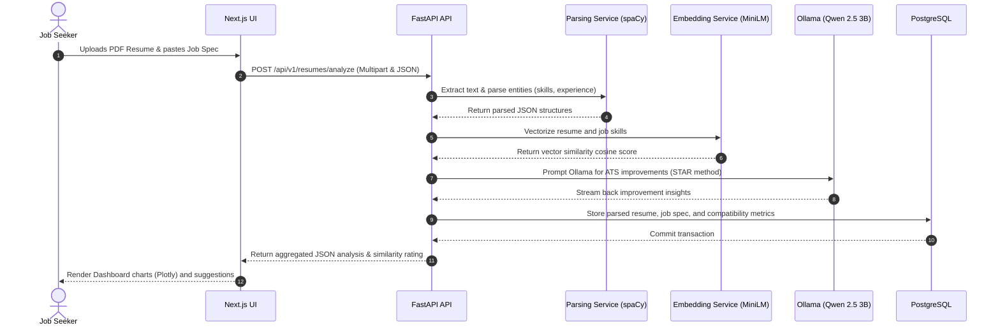
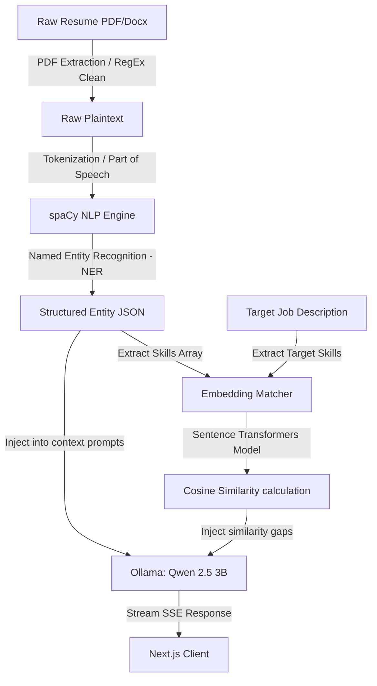
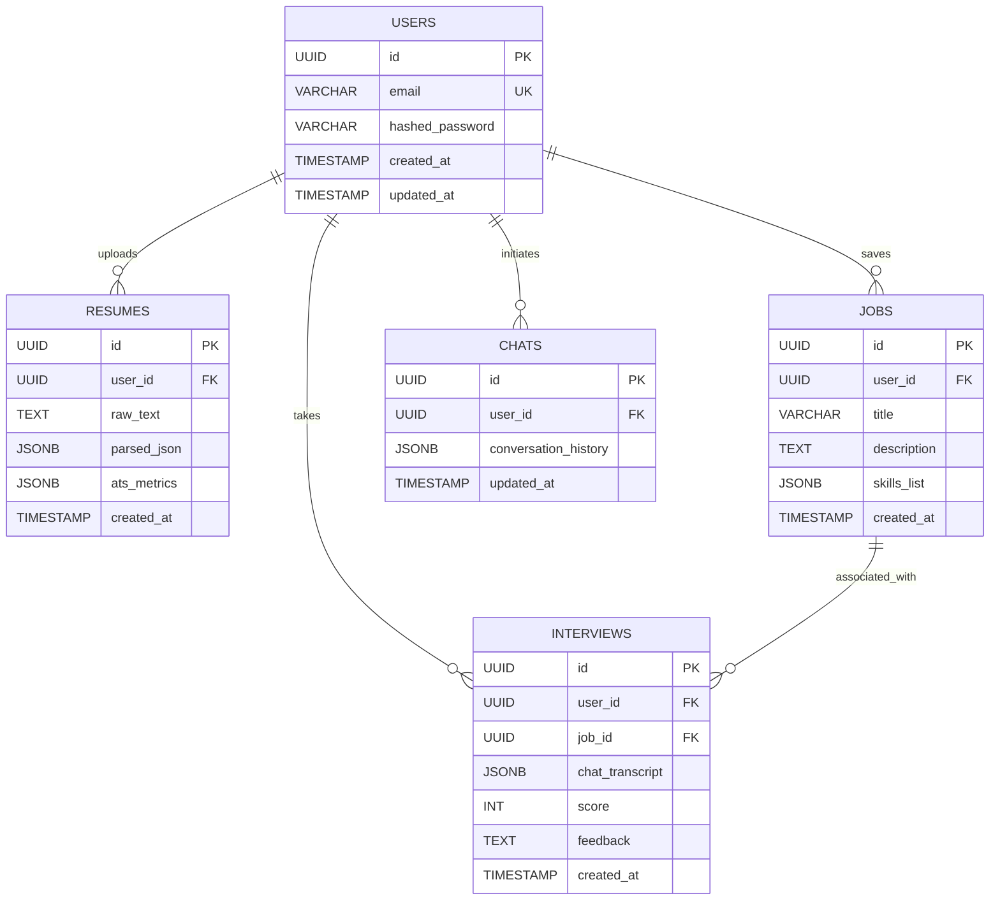
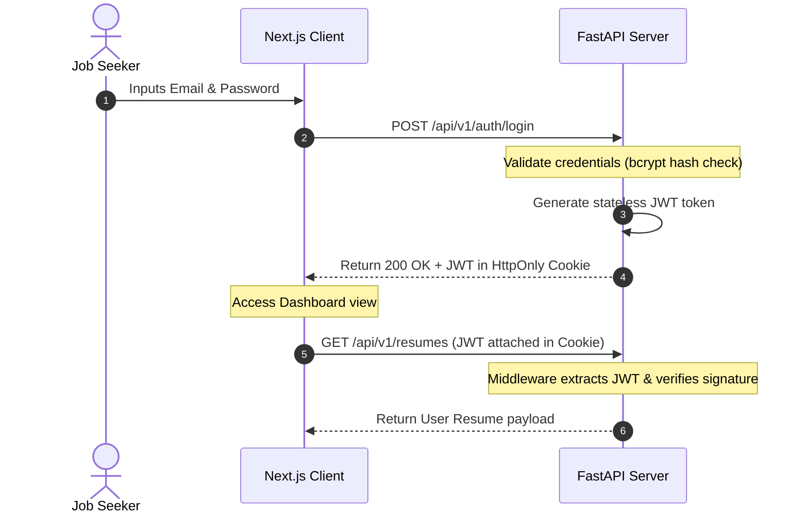

# Software Architecture Document (SAD)

## Scorelia — The Intelligent Career Copilot

---

## 1. System Overview

Scorelia is designed around a decoupled, client-server clean architecture. The primary objective is to separate presentation logic, orchestration controllers, local business services, and database layers. The frontend runs as a client-side Single Page Application (SPA) powered by Next.js, and the backend operates as a high-performance Python FastAPI service. Communication is handled via REST APIs with stateless JWT authentication payloads.

```
┌────────────────────────────────┐       JSON/REST       ┌─────────────────────────────────┐
│       Next.js Frontend         ├──────────────────────>│         FastAPI Backend         │
│  React / Tailwind / shadcn/ui  │<──────────────────────┤  Python 3.12 / SQLAlchemy ORM   │
└────────────────────────────────┘      JWT Cookie       └────────────────┬───────────────┬┘
                                                                          │               │
                                                                          ▼               ▼
                                                                 ┌────────────────┐┌──────────────┐
                                                                 │   Local DB     ││   Local AI   │
                                                                 │   PostgreSQL   ││ Ollama/spaCy│
                                                                 └────────────────┘└──────────────┘
```

---

## 2. High-Level Architecture

The system is organized into distinct logical layers, enforcing the dependency rule (inner layers do not know about outer layers):

1.  **Client Presentation Layer:** Next.js pages, client route handlers, dashboard layouts, Framer Motion animations, and Plotly graphics.
2.  **API Routing & Protection Layer:** FastAPI controllers exposing JSON endpoints, guarded by JWT authentication middleware.
3.  **Business Logic & Service Layer:** Parsing pipelines (spaCy NLP), vector computation modules (Sentence Transformers), local LLM interfaces (Ollama), and DB transactions (SQLAlchemy).
4.  **Data & Persistence Layer:** PostgreSQL database tables, storing users, resume logs, job targets, and chat histories.

### Request Flow Sequence Diagram (Resume Processing & Analysis)



---

## 3. Frontend Architecture

The frontend is constructed using **Next.js 14** (App Router) to support clean file-system-based routing, server-side layouts, and static optimization.

*   **Atomic Component Hierarchy:**
    *   `src/app/`: Defines layout templates, navigation routes, and feature views.
    *   `src/components/ui/`: Base visual primitives (inputs, buttons, overlays) styled using Tailwind CSS and structured with Radix UI via `shadcn/ui`.
    *   `src/components/shared/`: Complex global interfaces, including navigation layouts, sidebars, interactive charts, and system status monitors.
    *   `src/components/features/`: Isolated codebases containing page-specific logic, such as the resume parsing upload widget, matching visualizers, roadmap panels, and the chat terminal.
*   **State Management:** High-performance local state is managed through React Hooks (`useState`, `useReducer`), while global authentication and assistant contexts are distributed via React Context API to minimize package dependency footprint.
*   **Visual System:** Designed with dark-themed CSS glassmorphism, responsive canvas scaling, and micro-interactive elements animated dynamically by Framer Motion.

---

## 4. Backend Architecture

The backend application is structured around FastAPI's asynchronous routing layer, leveraging Python 3.12 features:

```
backend/
├── app/
│   ├── core/           # Security, environment, and DB engine setups
│   ├── models/         # SQLAlchemy declarative class mappings
│   ├── schemas/        # Type-checked data models via Pydantic v2
│   ├── api/            # API v1 routers and HTTP entrypoints
│   └── services/       # Decoupled NLP, Vector, Database, and LLM services
└── main.py             # App instantiation & middleware hooks
```

*   **Async Event Loop:** Handlers are designed as `async def` endpoints, freeing threads during database network transfers or asynchronous Ollama model streaming.
*   **Middleware:** Global CORS filters, automated database session cleanup, and security checks that intercept requests to parse and validate JWT HTTP-Only cookies.

---

## 5. AI & Natural Language Processing Architecture

The core value of Scorelia lies in its fully local machine learning and generative pipelines, ensuring privacy and offline compatibility.



### 1. Parsing Pipeline (spaCy)
*   **Text Extraction:** Raw text is extracted from PDF and Word files.
*   **Information Extraction:** spaCy performs parts-of-speech tagging and tokenization to identify sections (e.g., Work History, Qualifications). Custom rules extract dates, names, email formats, and locations, outputting clean structured JSON profiles.

### 2. Semantic Matching Engine (Sentence Transformers & scikit-learn)
*   **Vectorization:** Parsed resumes and parsed job specifications are converted into 384-dimensional dense vectors using the pre-trained model `all-MiniLM-L6-v2` via `Sentence Transformers`.
*   **Cosine Similarity:** The similarity between the resume vector ($A$) and job vector ($B$) is computed:
    $$\text{Similarity}(A, B) = \frac{A \cdot B}{\|A\| \|B\|}$$
*   **Skill Gaps:** Scikit-learn vocabulary checks compare vector representations to isolate missing skills.

### 3. Generative Engine (Ollama: Qwen 2.5 3B Instruct)
*   **Local Inference Host:** Connects to Ollama's local HTTP API socket (`127.0.0.1:11434`).
*   **Prompt Engine:** Generates structured prompts combining parsed resume context, job descriptions, and user inputs to guide the model.
*   **Response Streaming:** Leverages FastAPI's `StreamingResponse` to transmit responses directly to the frontend using Server-Sent Events (SSE).

---

## 6. Database Architecture

We implement a relational PostgreSQL database schema. SQLAlchemy is utilized for Object Relational Mapping (ORM) and Alembic for automated migrations tracking.

### Entity-Relationship Diagram (ERD)



---

## 7. Authentication Flow

Authentication follows a secure, stateless JWT token approach. The application stores the token inside an `HttpOnly`, `Secure`, `SameSite=Strict` cookie, preventing client-side Cross-Site Scripting (XSS) and mitigating Cross-Site Request Forgery (CSRF).



---

## 8. Technology Justification

| Technology | Alternative Evaluated | Justification |
| :--- | :--- | :--- |
| **Next.js (App Router)** | Vite (React SPA) | Provides built-in file-based routing, asset optimizations, and Server-Side Rendering (SSR) capabilities if SaaS deployment patterns are expanded. |
| **FastAPI** | Express.js (Node.js) | Python native async speed, automated OpenAPI/Swagger generation out of the box, and seamless interoperability with ML/NLP libraries. |
| **PostgreSQL** | MongoDB | Document parses can be stored in `JSONB` fields, while user credentials, mapping keys, and transaction history benefit from strict relational schemas and consistency. |
| **Ollama (Qwen 2.5 3B)** | OpenAI API (GPT-4o) | Eliminates API cost structures, operates entirely offline on standard laptops, secures user data privacy, and runs fast at 3B parameters with excellent instruction-following capability. |
| **spaCy** | NLTK / Regex | Offers robust, industrial-strength tokenizers and Name Entity Recognition (NER) taggers, performing faster than traditional rule-based regex pipelines. |
| **Sentence Transformers** | pgvector | Minimizes overhead and simplifies deployment. Python handles the vector similarity computation, removing the need for PG extensions or complex cloud vector databases. |

---

## 9. Security Strategy

*   **Local Privacy Boundary:** By routing all LLM prompts and vector calculations through local Ollama and local python modules, user resumes and profile data are protected from third-party data collection.
*   **Secure Cookies:** Session tokens are stored in HttpOnly cookies to block script-based extraction.
*   **Password Hashing:** Passwords are encrypted before database insertion using the `bcrypt` algorithm.
*   **SQL Injection Prevention:** SQLAlchemy's parameterized queries protect the database layer.

---

## 10. Scalability & Deployment Strategy

*   **Static Resource Caching:** The Next.js frontend is compiled into a optimized static build, which is deployed to Vercel's global Edge CDN for high-speed page delivery.
*   **Decoupled APIs:** The FastAPI application is deployed to Render's free tier, utilizing async processing to manage high volumes of concurrent requests.
*   **Database Management:** Database queries are optimized with indexing on foreign keys (e.g., `user_id` on resumes, jobs, and interviews) to maintain low query latency.
