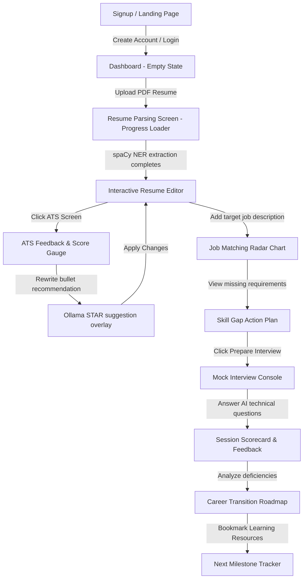

# UI/UX Style and Design Guide

## CareerPilot AI — The Intelligent Career Copilot

---

## 1. Design Philosophy

CareerPilot AI employs a **Modern Obsidian & Glassmorphic visual language** tailored for a premium, developer-grade SaaS experience. The design moves away from default, stark light modes or generic dark gray templates. Instead, it creates an immersive workspace utilizing dark deep-indigo space tones, glowing neon accents, blur backdrops, and soft ambient light cones.

### Rationale behind Design Decisions:
*   **Cognitive Relief:** Job seeking, resume editing, and mock interviewing are stressful tasks. A premium dark mode reduces visual strain during prolonged preparation sessions.
*   **AI-First Aesthetics:** Using subtle radial gradients and glassmorphism elements communicates that this is a highly advanced, modern, local AI co-pilot, rather than a static spreadsheet or traditional form entry tool.
*   **Focus-Driven UX:** High-contrast accent borders guide the user’s eyes toward high-value metrics, while card groupings segregate complex sections clearly.

---

## 2. Design Goals

1.  **Immersive Visual Polish:** Delight the user instantly with high-fidelity glassmorphism, responsive hover scales, and clean font scaling.
2.  **High Information Density with Clarity:** Resumes and skill profiles contain massive datasets. The UI must present this density without looking cluttered, using tabular cards and collapsible drawers.
3.  **Low Latency Perception:** Since local LLM execution has natural processing steps, the interface uses smooth progressive stream renderings and micro-interactions (like pulsing dots) to reduce perceived wait times.
4.  **Flawless Accessibility (A11y):** Maintain AAA or AA contrast levels on text fields, ensure keyboard navigation, and provide robust screen-reader indicators.

---

## 3. Visual Identity & Base Variables

### 3.1 Color Palette (HSL Design System)
We construct our color scheme using HSL tokens to support smooth transparency overlays (`rgba` equivalents) and theme configurations.

```css
:root {
  /* Core Base - Deep Dark Space Obsidian */
  --background: 240 25% 4%;      /* #08080c - Pure dark obsidian */
  --foreground: 210 40% 98%;     /* #f8fafc - High contrast off-white */
  
  /* Muted Surface Cards - Dark Glassmorphism */
  --card: 240 20% 8%;            /* #0d0d12 - Subtle card background */
  --card-foreground: 210 40% 98%;
  --popover: 240 20% 6%;         /* #0a0a0f */
  --popover-foreground: 210 40% 98%;

  /* Accents - Neon Indigo Glow */
  --primary: 250 95% 64%;        /* #6366f1 - Electric Indigo */
  --primary-foreground: 210 40% 98%;
  
  /* Secondary Accents - Cyber Teal Glow */
  --secondary: 180 100% 50%;     /* #00ffff - Cyber Cyan/Teal */
  --secondary-foreground: 240 25% 4%;

  /* System States */
  --muted: 240 10% 16%;          /* Slate grey for borders and icons */
  --muted-foreground: 215 15% 65%;
  
  --accent: 250 95% 15%;         /* Dark purple glow for hover states */
  --accent-foreground: 210 40% 98%;

  /* Validation Colors */
  --success: 142 70% 45%;        /* #10b981 - Emerald Green */
  --warning: 38 92% 50%;         /* #f59e0b - Warm Amber */
  --destructive: 350 80% 55%;    /* #ef4444 - Rose Red */
  
  /* Borders and Dividers */
  --border: 240 10% 16%;
  --input: 240 10% 18%;
  --ring: 250 95% 64%;
}
```

*   **Design Choice:** Electric Indigo is selected as the primary color because it represents intelligence, automation, and trust. Cyber Teal is used as the secondary highlight to emphasize key match rates and critical metrics (e.g. ATS Score) against the dark background.

---

### 3.2 Typography

*   **Font Families:**
    *   *Primary System Font:* **Inter** or **Outfit** (Google Fonts). Sans-serif with modern geometric curves and excellent readability at small font sizes.
    *   *Code & Metrics Font:* **JetBrains Mono** or **Fira Code**. Used for displaying match percentages, JSON schemas, code blocks, and timeline statistics.
*   **Font Scale:**
    *   `h1`: `2.25rem` (36px) | Leading: `2.5rem` | Tracking: `-0.02em` (Semi-Bold)
    *   `h2`: `1.75rem` (28px) | Leading: `2rem` | Tracking: `-0.01em` (Semi-Bold)
    *   `h3`: `1.25rem` (20px) | Leading: `1.75rem` (Medium)
    *   `body`: `0.875rem` (14px) | Leading: `1.25rem` (Regular)
    *   `caption` / `small`: `0.75rem` (12px) | Leading: `1rem` (Regular)

---

### 3.3 Grid & Spacing System
We utilize a base **8-pixel grid system** for consistent padding, margins, and sizing across components.

*   **Tailwind Spacing Classes:**
    *   `px-2` / `py-2` (8px): Micro-spacing for inside menu cells.
    *   `px-4` / `py-4` (16px): Content card padding and list spacings.
    *   `px-6` / `py-6` (24px): Layout margins, card interiors, panel gaps.
    *   `gap-8` (32px): Primary gaps between main sections.
*   **Layout Grid System:**
    *   **Desktop:** 12-column layout with 24px gutters, max-width 1440px.
    *   **Tablet:** 6-column layout with 16px gutters.
    *   **Mobile:** 2-column/1-column stacked layout with 12px gutters.

---

### 3.4 Icon Library
To maintain visual consistency, CareerPilot AI strictly uses **Lucide React** icons. All icons feature a consistent line weight of `1.75px` to match the geometric curves of the Inter font.

*   `UploadCloud`: Resume upload dropzone.
*   `Sparkles`: AI parse and rewrite suggestions.
*   `Activity`: ATS scores, analytical reports.
*   `Zap`: Job matching and similarity calculations.
*   `Map`: Roadmap navigation milestones.
*   `MessageSquare`: System chat assistant console.
*   `Award`: Mock interview grading and feedback.

---

## 4. UI Components Specification

### 4.1 Layout Structures

#### 4.1.1 Sidebar Navigation
The sidebar acts as the primary navigational control for the desktop layout.

*   **Design Specifications:**
    *   **Width:** Fixed at `260px` (or collapsible to `72px`).
    *   **Visual Style:** Glassmorphic background (`backdrop-blur-md`), dark gradient borders (`1px border-r border-white/5`), and ambient overlay backdrops.
    *   **Active States:** Active route buttons display an electric indigo highlight bar on the left border, a subtle background tint (`bg-white/5`), and high contrast white text.
    *   **Hover States:** Dynamic transition shifts menu items by `x: 4px` alongside a change in font color (`text-foreground`).
*   **Mockup Outline:**
    ```
    ┌──────────────────────────┐
    │ 🛩️ CareerPilot AI        │  <- Brand Header
    ├──────────────────────────┤
    │  📊 Dashboard            │  <- Nav Item (Active: Indigo left bar)
    │  📄 My Resumes           │  <- Nav Item
    │  🎯 Job Matches          │  <- Nav Item
    │  🏆 Mock Interview       │  <- Nav Item
    │  🗺️ Career Roadmap       │  <- Nav Item
    ├──────────────────────────┤
    │  ⚙️ Profile & Settings   │  <- Footer Items
    │  👤 User Profile Details │
    └──────────────────────────┘
    ```

#### 4.1.2 Header Navbar
A sticky header containing route breadcrumbs and profile avatars.

*   **Design Specifications:**
    *   **Height:** `64px` with a fixed position.
    *   **Aesthetics:** Solid obsidian transparent overlay (`bg-background/80`) with `backdrop-blur-md` and a thin bottom divider (`border-b border-white/5`).
    *   **Interactive Targets:** Popover user menu (avatar circle displaying initials) that drops down profile update commands and logouts.

---

### 4.2 Interactive Elements

#### 4.2.1 Cards
Cards are the primary container elements for displaying information in the dashboard.

*   **Aesthetics:** Dark charcoal surface (`bg-card`), rounded corners (`rounded-xl`), and thin borders (`border border-white/5`).
*   **Interactive Behavior:** Responsive card hovers execute a scale transition (`scale-102`), box-shadow glow increases, and active glow rings fade in.
*   **Code Example (Tailwind Mapping):**
    ```html
    <div class="rounded-xl border border-white/5 bg-card/50 p-6 backdrop-blur-md transition-all duration-300 hover:border-primary/20 hover:shadow-[0_0_20px_rgba(99,102,241,0.1)]">
      <!-- Card Content -->
    </div>
    ```

#### 4.2.2 Buttons
Buttons use distinct styles depending on their role in the interface.

*   **Primary Button:**
    *   *Visuals:* Solid gradient background (Electric Indigo to Violet) with white text.
    *   *Micro-interaction:* Soft hover glow expansions (`shadow-[0_0_15px_rgba(99,102,241,0.4)]`).
*   **Secondary Button:**
    *   *Visuals:* Transparent background, thin border (`border-white/10`), and hover background transition (`bg-white/5`).
*   **Destructive Button:**
    *   *Visuals:* Rose red fill or outline with warning icons.
*   **Micro-scale:** On click transitions use a scale reduction (`scale-98`) via Framer Motion to mimic physical button behavior.

#### 4.2.3 Forms & Inputs
Form design focuses on high-contrast focus indicators to support accessibility.

*   **Standard Input Field:**
    *   *Default:* Background `bg-input/50`, border `border-white/10`, text `text-foreground`.
    *   *Active Focus:* Border transitions to `border-primary` with a focus ring (`ring-1 ring-primary`).
*   **Dropzone Inputs (Uploads):**
    *   Dashed borders (`border-dashed border-white/15`) with a pulsing hover zone. Supports dragging files directly into the active browser panel.

#### 4.2.4 Data Tables
Tables present comparisons (e.g. matched jobs lists).

*   **Styling:** Zebra-striping (`even:bg-white/1`), highlighted header rows, and text alignments.
*   **Performance:** Truncated strings use tooltips on hover to reveal long career titles or file paths without disrupting layout alignments.

---

### 4.3 Advanced Dashboard Analytics (Plotly Integration)

Dashboard graphs are designed using custom configuration arrays to match the application's overall dark mode aesthetic.

*   **Chart Config Specifications:**
    *   **Theme:** Black paper layouts (`paper_bgcolor: 'rgba(0,0,0,0)'`, `plot_bgcolor: 'rgba(0,0,0,0)'`).
    *   **Text & Grids:** Off-white legend labels (`font: { color: '#f8fafc' }`) and dark muted gridlines (`gridcolor: 'rgba(255,255,255,0.05)'`).
    *   **Glow Trace Colors:** Match traces use primary indigo (`rgba(99, 102, 241, 1)`) and target profiles use secondary cyan gradients.

---

## 5. Screen Layouts & Flows

### 5.1 Landing Page
Designed to immediately convey the application's premium value proposition.

*   **Hero Visuals:** High-contrast centered headers accompanied by glowing gradient backdrops. A "Start Free Now" primary button transitions to the signup drawer.
*   **Features Grid:** 3-column interactive layout detailing local parsing, vector similarity analytics, and offline-capable mock consoles.

### 5.2 Authentication Pages
A unified side-by-side design interface.

*   **Left Half (Visual):** Interactive space art backdrop with testimonials or system statistics (e.g., "100% Secure. Files are parsed locally on your device").
*   **Right Half (Auth Form):** Centered login/signup form fields on an obsidian canvas. Includes clear error banner animations.

### 5.3 Resume Upload & Parsing Screen
The initial interface for new users to import their profile data.

*   **The Widget:** A centered dropzone containing an upload icon and format limits.
*   **Loading State:** After a user drops a file, the screen displays a parsing progress bar with text overlays explaining the extraction steps:
    1.  `Extracting plain text...`
    2.  `Tokenizing syntax entities via spaCy...`
    3.  `Saving profile model...`
*   **The Finish:** A slide transition replaces the dropzone with a summary card showing the parsed skills and education tags.

### 5.4 ATS Analysis Console
An actionable feedback panel.

*   **Left Panel (The Resume):** Rendered plain text displaying highlight overlays. Hovering over a highlighted section opens a tooltip detailing the formatting error (e.g., "Non-standard bullet format").
*   **Right Panel (Feedback List):** The ATS Score is displayed at the top using a circular radial progress gauge (Cyber Teal, 0-100). Below the gauge, formatting recommendations are grouped by priority (High, Medium, Low).
*   **Interactive Optimization:** Clicking a recommendation (e.g., "Rewrite Experience Bullet Point") highlights the relevant line in the resume viewer and opens the AI suggestion card.

### 5.5 AI Chat Assistant Drawer
A slide-out dashboard overlay accessible from any screen in the portal.

*   **Visual Style:** Side panel sliding out from the right (`380px` width) with a blur backdrop.
*   **Message Bubbles:**
    *   *User:* Deep charcoal background aligned to the right.
    *   *AI Assistant:* Transparent background with an Indigo border, left-aligned.
*   **Streaming Animation:** When the AI is streaming a response, a blinking cursor remains pinned to the end of the text.

### 5.6 Interactive Mock Interview Console
A distraction-free, terminal-style dashboard viewport.

*   **Visual Style:** Full screen overlay with all sidebar navigations faded. Displays a step counter (e.g. `Question 3 of 5`).
*   **Candidate Form:** An input field with a character count indicator (min 30 chars).
*   **The Finish Screen:** The console transitions to a performance scorecard showing:
    *   A list of questions, the user's answers, and the AI's feedback.
    *   A radar chart comparing category scores (e.g., system design, communication).
    *   An "Optimal Answer" toggle showing the ideal response for each question.

### 5.7 Career Roadmap UI
An interactive, graphical career milestone map.

*   **Visual Model:** A vertical node timeline using glowing step connections.
*   **Node Details:** Clicking a milestone card expands it to reveal:
    *   An estimated completion timeline.
    *   Action items and study topics.
    *   A curated list of free learning resources and external certification links.

---

## 6. Feedback States & Loaders

### 6.1 Skeleton Loaders
The interface uses modern skeleton loaders to maintain visual hierarchy during content fetch states.

*   **Visuals:** Standard cards and lists are replaced with matching grey shapes (`bg-muted/40`) containing a linear gradient sheen that pulses horizontally (`animate-pulse`).

```
┌──────────────────────────────────────┐
│  ██████████████                      │  <- Title Skeleton
│                                      │
│  ██████████████████████████████      │  <- Description Line 1
│  ██████████████████████              │  <- Description Line 2
└──────────────────────────────────────┘
```

### 6.2 Empty States
Clear graphics that explain how to populate an empty dashboard view.

*   **Visuals:** Muted vector icons accompanied by a headline (e.g., "No Saved Jobs Yet") and a primary action button (e.g., "Add Target Job").

### 6.3 Alert Notifications (Toasts)
Short messages that slide in to confirm actions.

*   **Visuals:** Glassmorphic toast panels that slide in from the bottom-right corner.
*   **Status Indicators:**
    *   *Success:* Green left border and tick icon (e.g., "Resume updated successfully").
    *   *Error:* Rose red left border and warning icon (e.g., "Failed to parse document").

---

## 7. Motion & Animation Guidelines (Framer Motion)

Animations use spring physics to make the interface feel responsive and natural.

*   **Layout Transitions (Page Swaps):**
    ```javascript
    const pageTransition = {
      initial: { opacity: 0, y: 15 },
      animate: { opacity: 1, y: 0 },
      exit: { opacity: 0, y: -15 },
      transition: { type: "spring", stiffness: 260, damping: 20 }
    };
    ```
*   **List Item Pop-ins:** Staggered load transitions make arrays (like parsed skills) slide in sequentially.
    ```javascript
    const container = {
      hidden: { opacity: 0 },
      show: {
        opacity: 1,
        transition: { staggerChildren: 0.05 }
      }
    };
    ```
*   **Pulse Speed Rules:** Infinite loading loops use a soft, linear fade transition (e.g. `duration: 1.5`, `repeat: Infinity`).

---

## 8. Accessibility (A11y)

The application is built to follow W3C WCAG 2.1 AA standards:

1.  **Color Contrast Requirements:** Check color pairings to ensure all text elements maintain at least a 4.5:1 contrast ratio against card backdrops.
2.  **Focus States:** Interactive controls feature a highly visible, contrasting focus outline (`focus-visible:ring-2 focus-visible:ring-primary`).
3.  **ARIA Labels:** Form fields, buttons, and custom components include proper descriptive aria attributes (e.g. `aria-expanded` on drawers, `aria-live` on streaming chat panels).
4.  **Keyboard Control:** Modal popups and dropdowns can be navigated and closed using standard keyboard shortcuts (e.g. `Tab`, `Enter`, `Escape`).

---

## 9. Typical User Journey (UI Step-by-Step Flow)

The diagram below outlines the standard flow of a job seeker using CareerPilot AI to optimize their application materials.


